# Accounts Production Module - Knowledge Base & Feature Index

> Total Articles: **108** | Module Directory: `d:/sansuite/Accounts Production`

## Articles List & Local Assets

### 1. Accounts Production Dashboard
- **Folder:** Accounts Production Help Guide
- **Article ID:** `9000165477` | **Slug:** `accounts-production-dashboard`
- **Markdown File:** [raw_articles/9000165477_accounts-production-dashboard.md](../raw_articles/9000165477_accounts-production-dashboard.md)
- **Images Count:** 1
- **Screenshots:**
  - 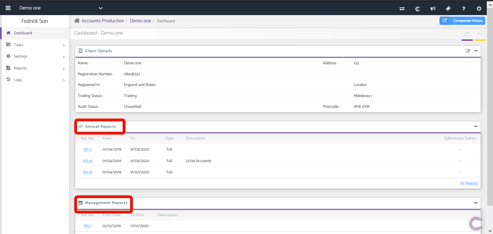

---

### 2. How to prepare a set of Accounts
- **Folder:** Accounts Production Help Guide
- **Article ID:** `9000186950` | **Slug:** `how-to-prepare-a-set-of-accounts`
- **Markdown File:** [raw_articles/9000186950_how-to-prepare-a-set-of-accounts.md](../raw_articles/9000186950_how-to-prepare-a-set-of-accounts.md)
- **Images Count:** 5
- **Screenshots:**
  - 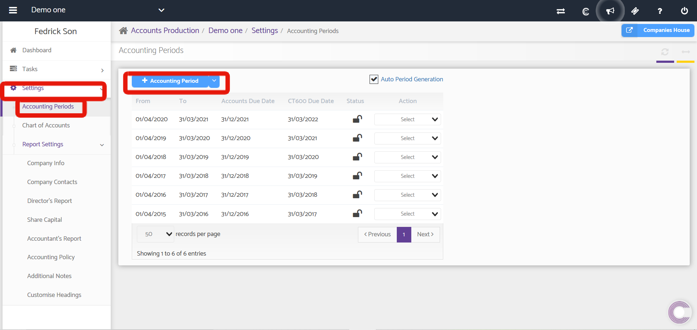
  - 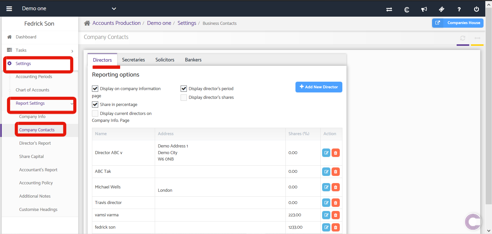
  - 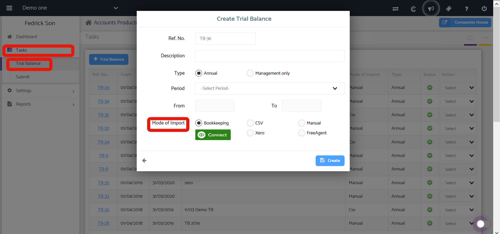
  - 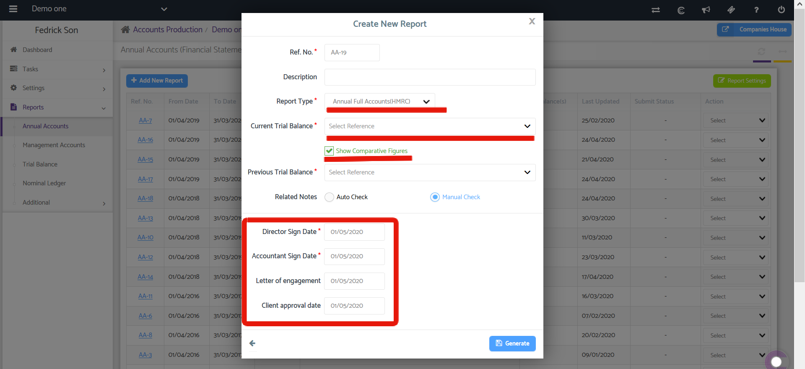
  - 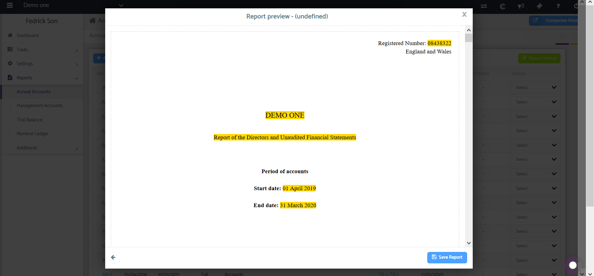

---

### 3. General Settings in Accounts Production
- **Folder:** Accounts Production Help Guide
- **Article ID:** `9000204344` | **Slug:** `general-settings-in-accounts-production`
- **Markdown File:** [raw_articles/9000204344_general-settings-in-accounts-production.md](../raw_articles/9000204344_general-settings-in-accounts-production.md)
- **Images Count:** 8
- **Screenshots:**
  - 
  - 
  - 
  - 
  - 
  - 
  - 
  - 

---

### 4. Add Accounting Periods
- **Folder:** Accounts Production Help Guide
- **Article ID:** `9000165483` | **Slug:** `add-accounting-periods`
- **Markdown File:** [raw_articles/9000165483_add-accounting-periods.md](../raw_articles/9000165483_add-accounting-periods.md)
- **Images Count:** 2
- **Screenshots:**
  - 
  - 

---

### 5. Charts of Accounts
- **Folder:** Accounts Production Help Guide
- **Article ID:** `9000165484` | **Slug:** `charts-of-accounts`
- **Markdown File:** [raw_articles/9000165484_charts-of-accounts.md](../raw_articles/9000165484_charts-of-accounts.md)
- **Images Count:** 3
- **Screenshots:**
  - 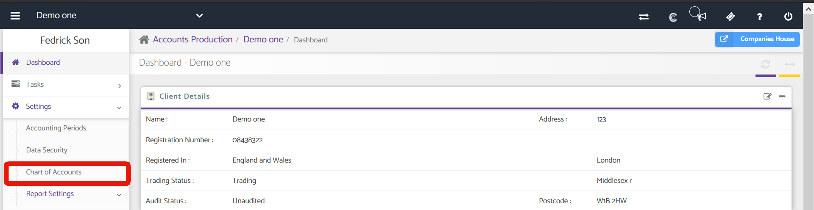
  - 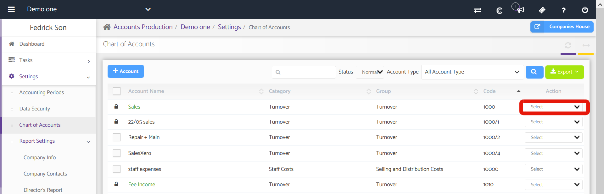
  - 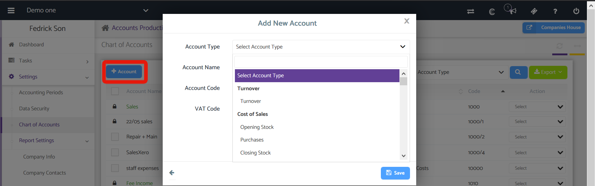

---

### 6. How  to add Trial Balance
- **Folder:** Accounts Production Help Guide
- **Article ID:** `9000165478` | **Slug:** `how-to-add-trial-balance`
- **Markdown File:** [raw_articles/9000165478_how-to-add-trial-balance.md](../raw_articles/9000165478_how-to-add-trial-balance.md)
- **Images Count:** 3
- **Screenshots:**
  - 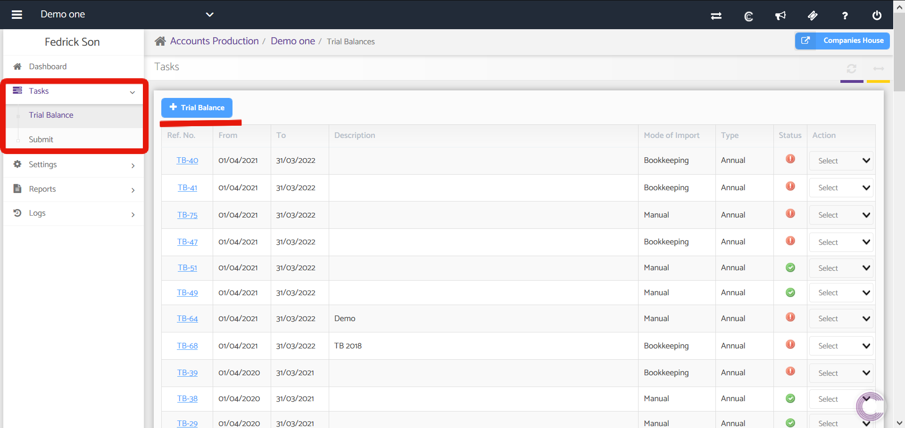
  - 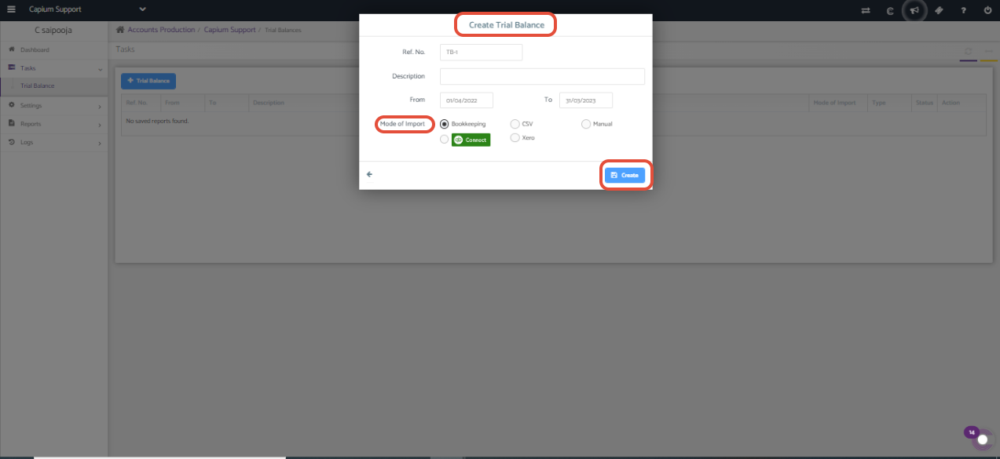
  - 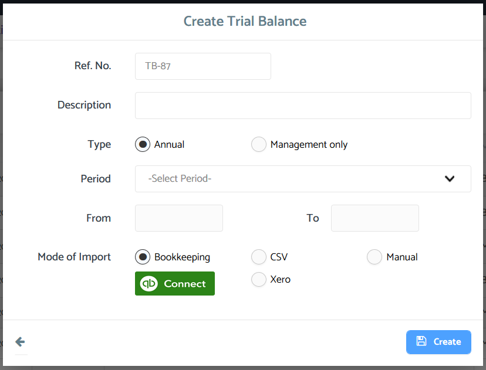

---

### 7. How to Import a Trial Balance from Xero 
- **Folder:** Accounts Production Help Guide
- **Article ID:** `9000174314` | **Slug:** `how-to-import-a-trial-balance-from-xero-`
- **Markdown File:** [raw_articles/9000174314_how-to-import-a-trial-balance-from-xero-.md](../raw_articles/9000174314_how-to-import-a-trial-balance-from-xero-.md)
- **Images Count:** 3
- **Screenshots:**
  - 
  - 
  - 

---

### 8. How to import a Trial Balance from QuickBooks Online
- **Folder:** Accounts Production Help Guide
- **Article ID:** `9000173182` | **Slug:** `how-to-import-a-trial-balance-from-quickbooks-online`
- **Markdown File:** [raw_articles/9000173182_how-to-import-a-trial-balance-from-quickbooks-online.md](../raw_articles/9000173182_how-to-import-a-trial-balance-from-quickbooks-online.md)
- **Images Count:** 4
- **Screenshots:**
  - 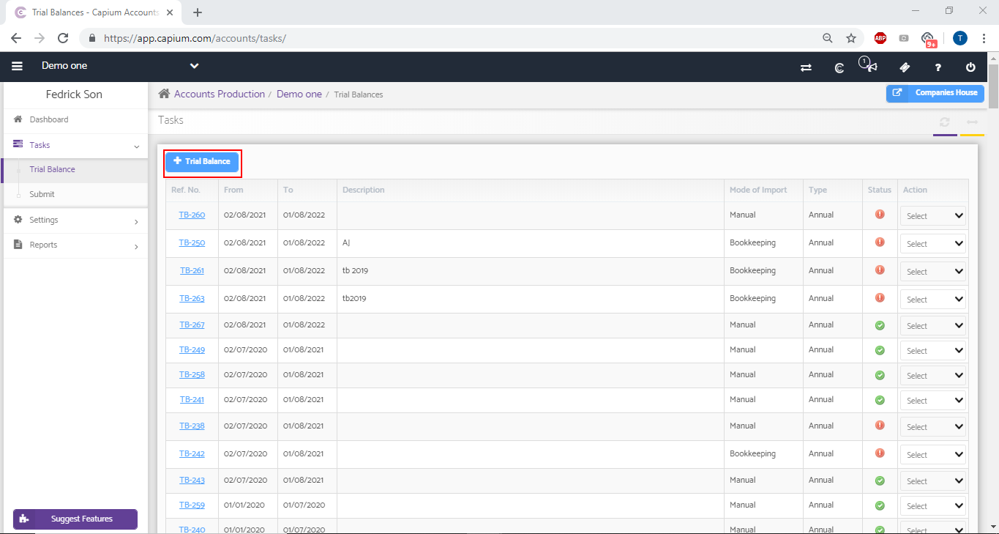
  - 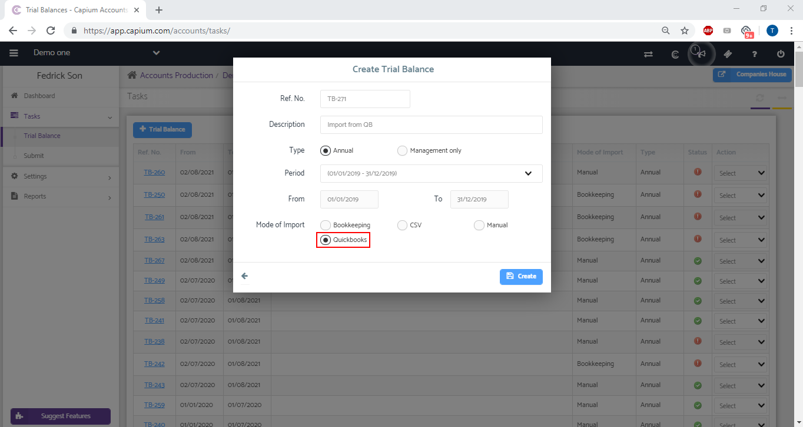
  - 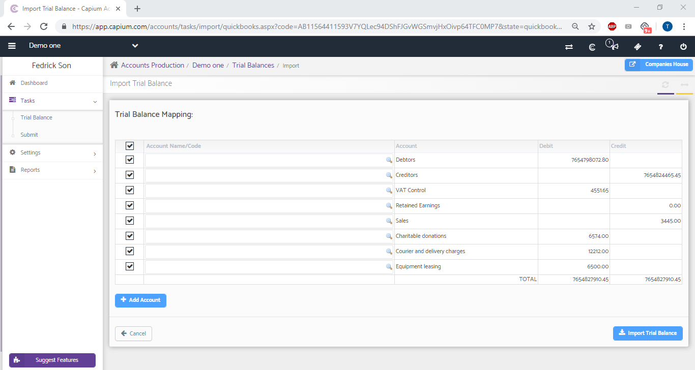
  - 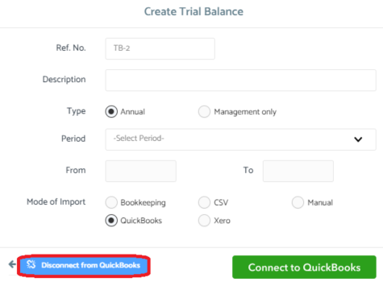

---

### 9. Trial Balance Automated Mapping from Xero and QuickBooks
- **Folder:** Accounts Production Help Guide
- **Article ID:** `9000204524` | **Slug:** `trial-balance-automated-mapping-from-xero-and-quickbooks`
- **Markdown File:** [raw_articles/9000204524_trial-balance-automated-mapping-from-xero-and-quickbooks.md](../raw_articles/9000204524_trial-balance-automated-mapping-from-xero-and-quickbooks.md)
- **Images Count:** 5
- **Screenshots:**
  - 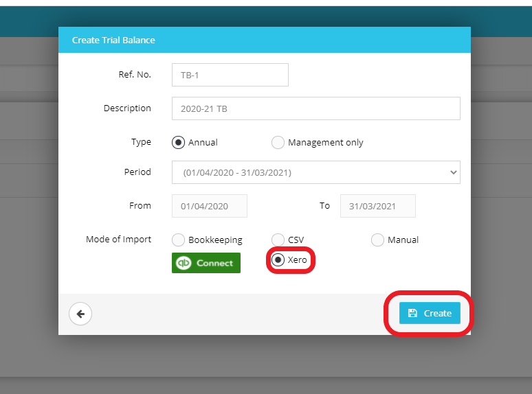
  - 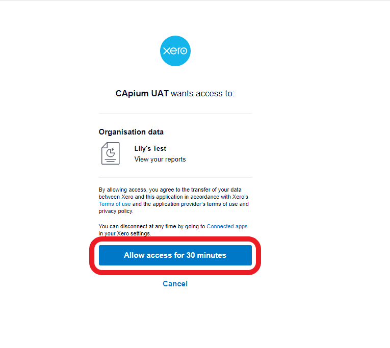
  - 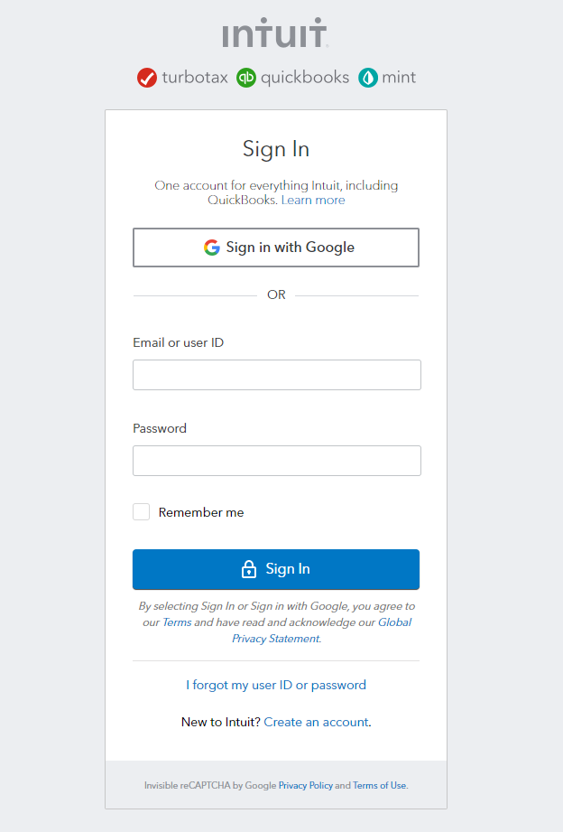
  - 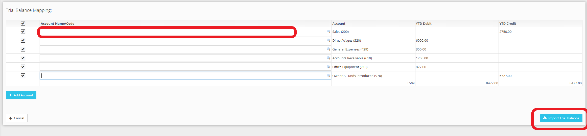
  - 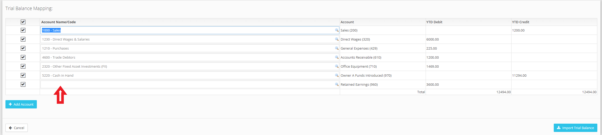

---

### 10. Submit
- **Folder:** Accounts Production Help Guide
- **Article ID:** `9000165480` | **Slug:** `submit`
- **Markdown File:** [raw_articles/9000165480_submit.md](../raw_articles/9000165480_submit.md)
- **Images Count:** 2
- **Screenshots:**
  - 
  - 

---

### 11. Submit iXBRL
- **Folder:** Accounts Production Help Guide
- **Article ID:** `9000165481` | **Slug:** `submit-ixbrl`
- **Markdown File:** [raw_articles/9000165481_submit-ixbrl.md](../raw_articles/9000165481_submit-ixbrl.md)
- **Images Count:** 2
- **Screenshots:**
  - 
  - 

---

### 12. Report Settings in Accounts
- **Folder:** Accounts Production Help Guide
- **Article ID:** `9000165485` | **Slug:** `report-settings-in-accounts`
- **Markdown File:** [raw_articles/9000165485_report-settings-in-accounts.md](../raw_articles/9000165485_report-settings-in-accounts.md)
- **Images Count:** 1
- **Screenshots:**
  - 

---

### 13. Company Info - Accounts Production
- **Folder:** Accounts Production Help Guide
- **Article ID:** `9000165486` | **Slug:** `company-info-accounts-production`
- **Markdown File:** [raw_articles/9000165486_company-info-accounts-production.md](../raw_articles/9000165486_company-info-accounts-production.md)
- **Images Count:** 1
- **Screenshots:**
  - 

---

### 14. AP: Adding Company Contacts
- **Folder:** Accounts Production Help Guide
- **Article ID:** `9000165487` | **Slug:** `ap-adding-company-contacts`
- **Markdown File:** [raw_articles/9000165487_ap-adding-company-contacts.md](../raw_articles/9000165487_ap-adding-company-contacts.md)
- **Images Count:** 2
- **Screenshots:**
  - 
  - 

---

### 15. AP: Adding Company Directors
- **Folder:** Accounts Production Help Guide
- **Article ID:** `9000165488` | **Slug:** `ap-adding-company-directors`
- **Markdown File:** [raw_articles/9000165488_ap-adding-company-directors.md](../raw_articles/9000165488_ap-adding-company-directors.md)
- **Images Count:** 3
- **Screenshots:**
  - 
  - 
  - 

---

### 16. AP: Adding Company Secretaries
- **Folder:** Accounts Production Help Guide
- **Article ID:** `9000165489` | **Slug:** `ap-adding-company-secretaries`
- **Markdown File:** [raw_articles/9000165489_ap-adding-company-secretaries.md](../raw_articles/9000165489_ap-adding-company-secretaries.md)
- **Images Count:** 3
- **Screenshots:**
  - 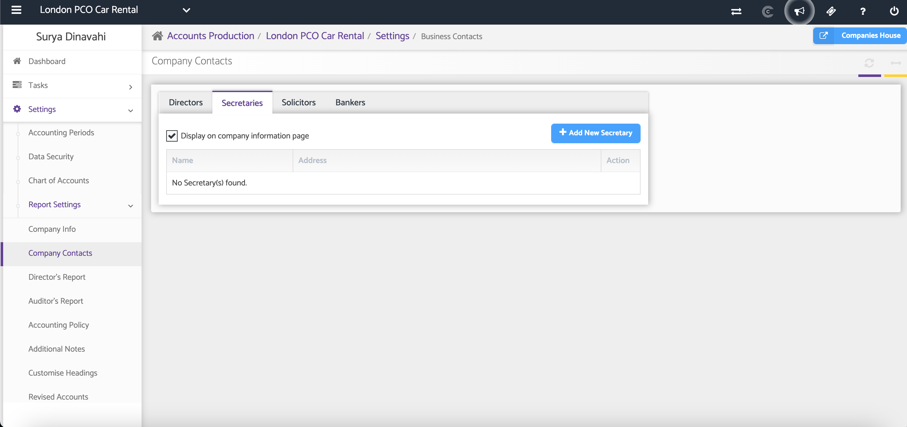
  - 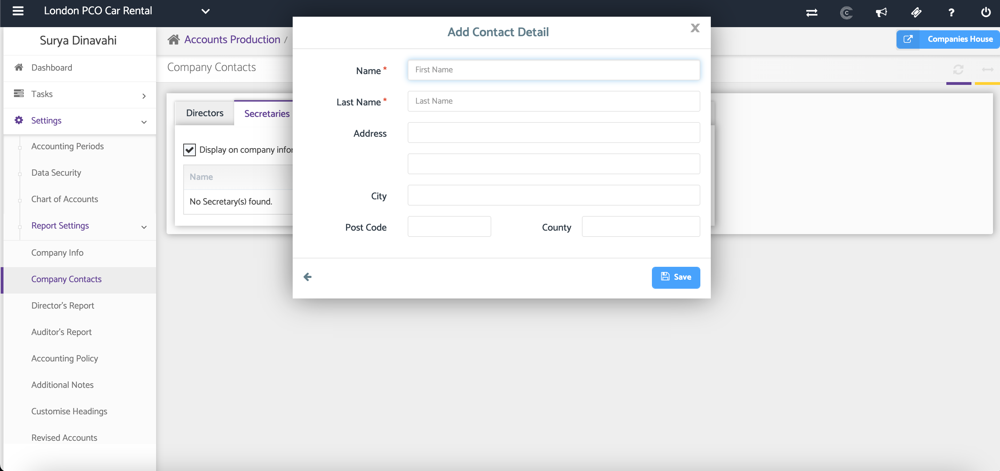
  - 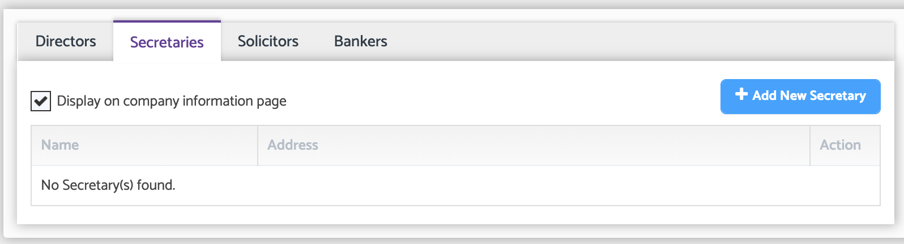

---

### 17. Solicitors
- **Folder:** Accounts Production Help Guide
- **Article ID:** `9000165490` | **Slug:** `solicitors`
- **Markdown File:** [raw_articles/9000165490_solicitors.md](../raw_articles/9000165490_solicitors.md)
- **Images Count:** 1
- **Screenshots:**
  - 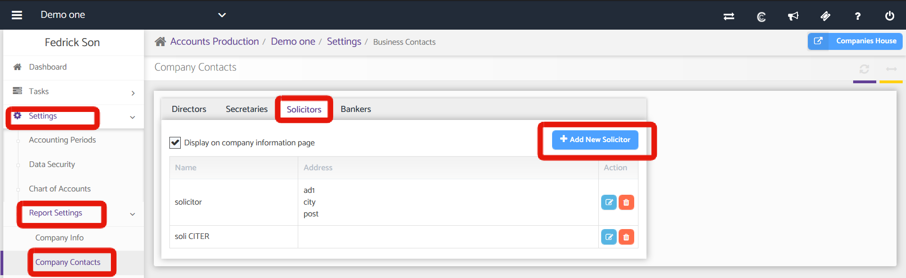

---

### 18. Bankers
- **Folder:** Accounts Production Help Guide
- **Article ID:** `9000165491` | **Slug:** `bankers`
- **Markdown File:** [raw_articles/9000165491_bankers.md](../raw_articles/9000165491_bankers.md)
- **Images Count:** 1
- **Screenshots:**
  - 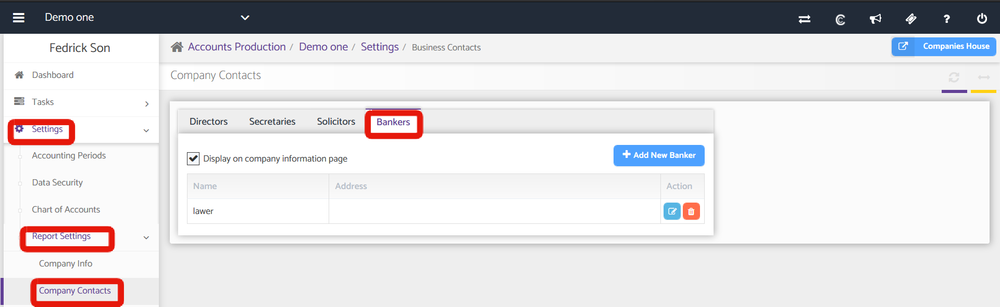

---

### 19. Directors Report
- **Folder:** Accounts Production Help Guide
- **Article ID:** `9000165493` | **Slug:** `directors-report`
- **Markdown File:** [raw_articles/9000165493_directors-report.md](../raw_articles/9000165493_directors-report.md)
- **Images Count:** 1
- **Screenshots:**
  - 

---

### 20. Auditors Report
- **Folder:** Accounts Production Help Guide
- **Article ID:** `9000165495` | **Slug:** `auditors-report`
- **Markdown File:** [raw_articles/9000165495_auditors-report.md](../raw_articles/9000165495_auditors-report.md)
- **Images Count:** 1
- **Screenshots:**
  - 

---

### 21. Accounting Policy
- **Folder:** Accounts Production Help Guide
- **Article ID:** `9000165496` | **Slug:** `accounting-policy`
- **Markdown File:** [raw_articles/9000165496_accounting-policy.md](../raw_articles/9000165496_accounting-policy.md)
- **Images Count:** 1
- **Screenshots:**
  - 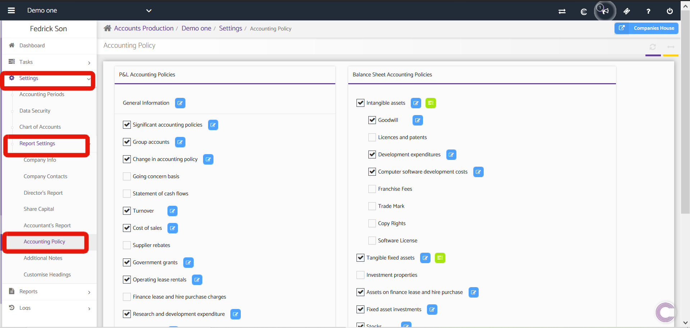

---

### 22. Additional Notes
- **Folder:** Accounts Production Help Guide
- **Article ID:** `9000165497` | **Slug:** `additional-notes`
- **Markdown File:** [raw_articles/9000165497_additional-notes.md](../raw_articles/9000165497_additional-notes.md)
- **Images Count:** 2
- **Screenshots:**
  - 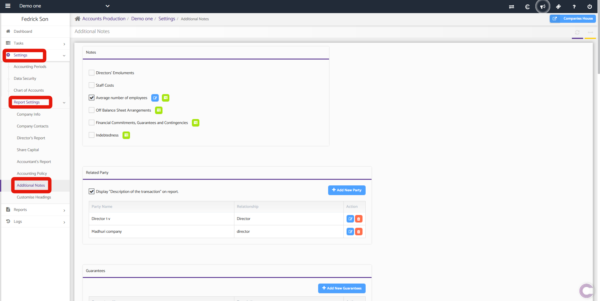
  - 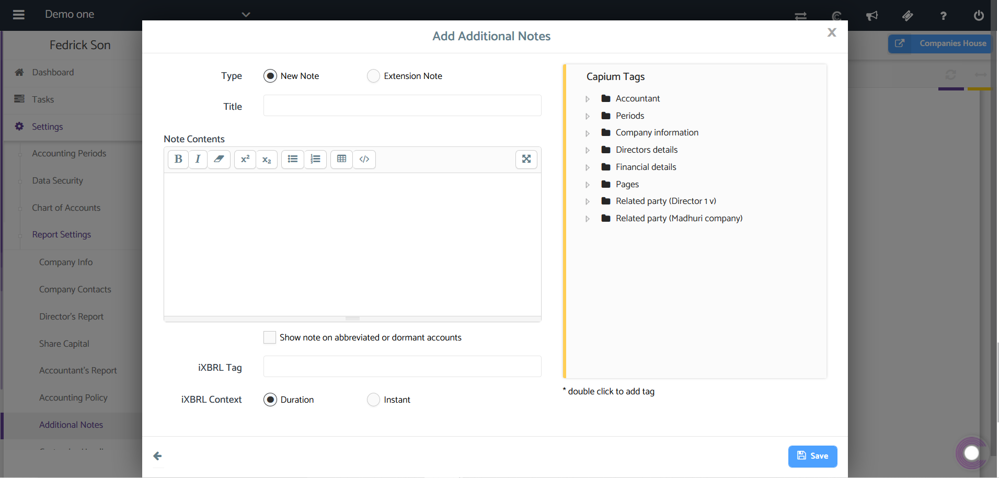

---

### 23. AP: Formatting Additional Notes
- **Folder:** Accounts Production Help Guide
- **Article ID:** `9000165498` | **Slug:** `ap-formatting-additional-notes`
- **Markdown File:** [raw_articles/9000165498_ap-formatting-additional-notes.md](../raw_articles/9000165498_ap-formatting-additional-notes.md)
- **Images Count:** 2
- **Screenshots:**
  - 
  - 

---

### 24. Annual Reports
- **Folder:** Accounts Production Help Guide
- **Article ID:** `9000165499` | **Slug:** `annual-reports`
- **Markdown File:** [raw_articles/9000165499_annual-reports.md](../raw_articles/9000165499_annual-reports.md)
- **Images Count:** 0

---

### 25. Management Reports
- **Folder:** Accounts Production Help Guide
- **Article ID:** `9000165500` | **Slug:** `management-reports`
- **Markdown File:** [raw_articles/9000165500_management-reports.md](../raw_articles/9000165500_management-reports.md)
- **Images Count:** 3
- **Screenshots:**
  - 
  - 
  - 

---

### 26. AP: Comparative Trial Balance
- **Folder:** Accounts Production Help Guide
- **Article ID:** `9000165501` | **Slug:** `ap-comparative-trial-balance`
- **Markdown File:** [raw_articles/9000165501_ap-comparative-trial-balance.md](../raw_articles/9000165501_ap-comparative-trial-balance.md)
- **Images Count:** 4
- **Screenshots:**
  - 
  - 
  - 
  - 

---

### 27. Nominal Ledger
- **Folder:** Accounts Production Help Guide
- **Article ID:** `9000165502` | **Slug:** `nominal-ledger`
- **Markdown File:** [raw_articles/9000165502_nominal-ledger.md](../raw_articles/9000165502_nominal-ledger.md)
- **Images Count:** 1
- **Screenshots:**
  - 

---

### 28. Profit and Loss Appropriation Account
- **Folder:** Accounts Production Help Guide
- **Article ID:** `9000165503` | **Slug:** `profit-and-loss-appropriation-account`
- **Markdown File:** [raw_articles/9000165503_profit-and-loss-appropriation-account.md](../raw_articles/9000165503_profit-and-loss-appropriation-account.md)
- **Images Count:** 2
- **Screenshots:**
  - 
  - 

---

### 29. How to change the year end date
- **Folder:** Accounts Production Help Guide
- **Article ID:** `9000165633` | **Slug:** `how-to-change-the-year-end-date`
- **Markdown File:** [raw_articles/9000165633_how-to-change-the-year-end-date.md](../raw_articles/9000165633_how-to-change-the-year-end-date.md)
- **Images Count:** 0

---

### 30. How to delete a trial balance
- **Folder:** Accounts Production Help Guide
- **Article ID:** `9000165635` | **Slug:** `how-to-delete-a-trial-balance`
- **Markdown File:** [raw_articles/9000165635_how-to-delete-a-trial-balance.md](../raw_articles/9000165635_how-to-delete-a-trial-balance.md)
- **Images Count:** 0

---

### 31. How to remove a section from annual accounts reports
- **Folder:** Accounts Production Help Guide
- **Article ID:** `9000165636` | **Slug:** `how-to-remove-a-section-from-annual-accounts-reports`
- **Markdown File:** [raw_articles/9000165636_how-to-remove-a-section-from-annual-accounts-reports.md](../raw_articles/9000165636_how-to-remove-a-section-from-annual-accounts-reports.md)
- **Images Count:** 2
- **Screenshots:**
  - 
  - 

---

### 32. How to change the basis of accounting
- **Folder:** Accounts Production Help Guide
- **Article ID:** `9000165637` | **Slug:** `how-to-change-the-basis-of-accounting`
- **Markdown File:** [raw_articles/9000165637_how-to-change-the-basis-of-accounting.md](../raw_articles/9000165637_how-to-change-the-basis-of-accounting.md)
- **Images Count:** 0

---

### 33. Accounts Production and Corporation Tax (CT600) preparation
- **Folder:** Accounts Production Help Guide
- **Article ID:** `9000165722` | **Slug:** `accounts-production-and-corporation-tax-ct600-preparation`
- **Markdown File:** [raw_articles/9000165722_accounts-production-and-corporation-tax-ct600-preparation.md](../raw_articles/9000165722_accounts-production-and-corporation-tax-ct600-preparation.md)
- **Images Count:** 0

---

### 34. Document Password Protection - Accounts Production
- **Folder:** Accounts Production Help Guide
- **Article ID:** `9000191275` | **Slug:** `document-password-protection-accounts-production`
- **Markdown File:** [raw_articles/9000191275_document-password-protection-accounts-production.md](../raw_articles/9000191275_document-password-protection-accounts-production.md)
- **Images Count:** 1
- **Screenshots:**
  - 

---

### 35. How to add the Average Number of Employees
- **Folder:** Accounts Production Help Guide
- **Article ID:** `9000194343` | **Slug:** `how-to-add-the-average-number-of-employees`
- **Markdown File:** [raw_articles/9000194343_how-to-add-the-average-number-of-employees.md](../raw_articles/9000194343_how-to-add-the-average-number-of-employees.md)
- **Images Count:** 2
- **Screenshots:**
  - 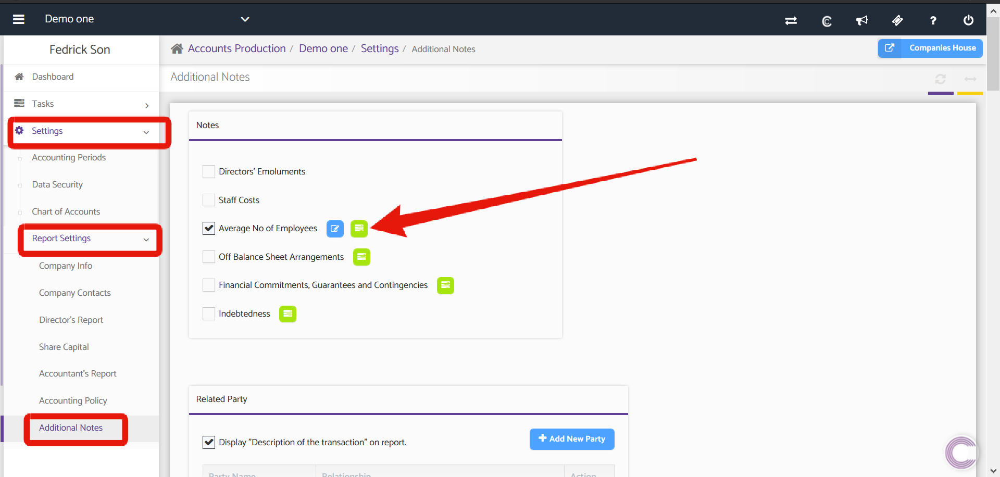
  - 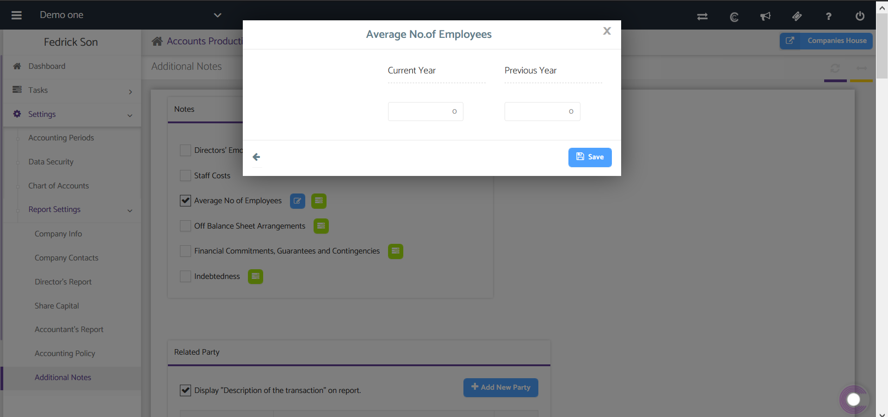

---

### 36. Accounts Production Companies House integration
- **Folder:** Accounts Production Help Guide
- **Article ID:** `9000216147` | **Slug:** `accounts-production-companies-house-integration`
- **Markdown File:** [raw_articles/9000216147_accounts-production-companies-house-integration.md](../raw_articles/9000216147_accounts-production-companies-house-integration.md)
- **Images Count:** 4
- **Screenshots:**
  - 
  - 
  - 
  - 

---

### 37. How to send Annual Accounts from Accounts Production to Capisign
- **Folder:** Accounts Production Help Guide
- **Article ID:** `9000221316` | **Slug:** `how-to-send-annual-accounts-from-accounts-production-to-capisign`
- **Markdown File:** [raw_articles/9000221316_how-to-send-annual-accounts-from-accounts-production-to-capisign.md](../raw_articles/9000221316_how-to-send-annual-accounts-from-accounts-production-to-capisign.md)
- **Images Count:** 2
- **Screenshots:**
  - 
  - 

---

### 38. How to sign Annual Accounts in Capisign
- **Folder:** Accounts Production Help Guide
- **Article ID:** `9000221320` | **Slug:** `how-to-sign-annual-accounts-in-capisign`
- **Markdown File:** [raw_articles/9000221320_how-to-sign-annual-accounts-in-capisign.md](../raw_articles/9000221320_how-to-sign-annual-accounts-in-capisign.md)
- **Images Count:** 6
- **Screenshots:**
  - 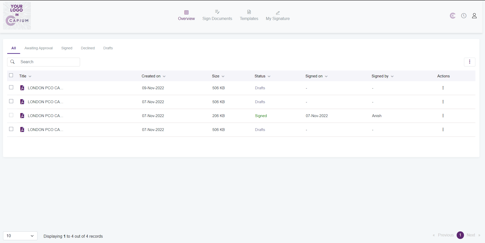
  - 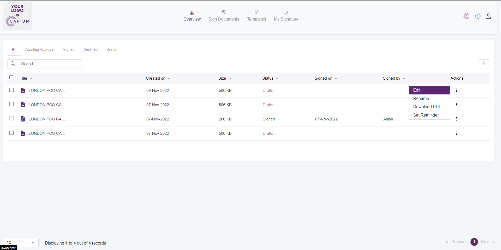
  - 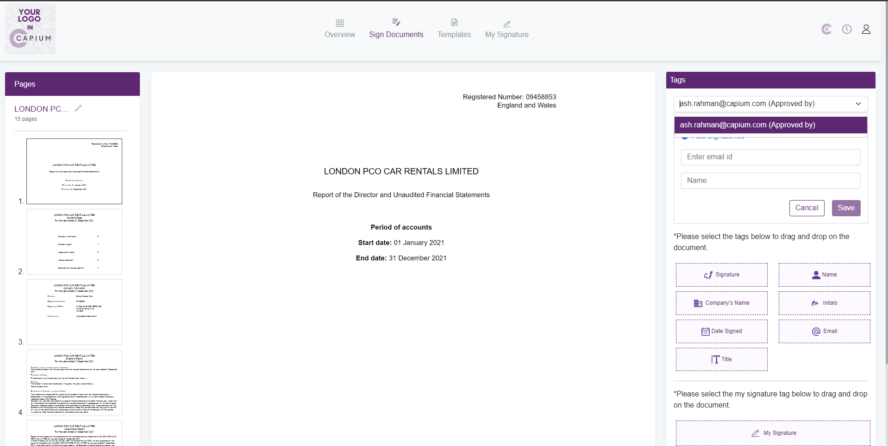
  - 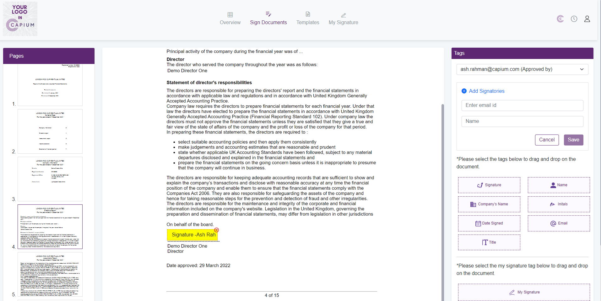
  - 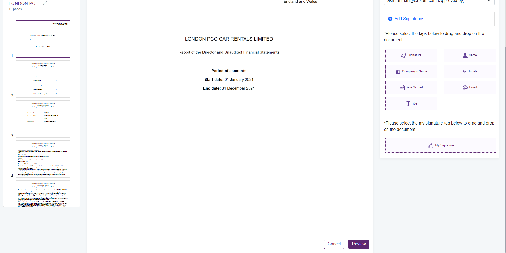
  - 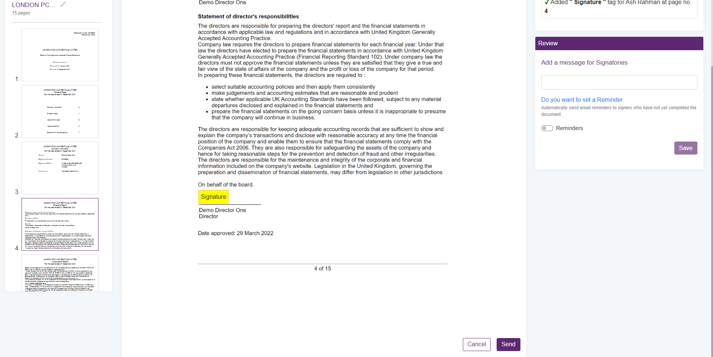

---

### 39. Management Reports
- **Folder:** Accounts Production Help Guide
- **Article ID:** `9000221934` | **Slug:** `management-reports`
- **Markdown File:** [raw_articles/9000221934_management-reports.md](../raw_articles/9000221934_management-reports.md)
- **Images Count:** 7
- **Screenshots:**
  - 
  - 
  - 
  - 
  - 
  - 
  - 

---

### 40. How to Import a Trial Balance from FreeAgent
- **Folder:** Accounts Production Help Guide
- **Article ID:** `9000230408` | **Slug:** `how-to-import-a-trial-balance-from-freeagent`
- **Markdown File:** [raw_articles/9000230408_how-to-import-a-trial-balance-from-freeagent.md](../raw_articles/9000230408_how-to-import-a-trial-balance-from-freeagent.md)
- **Images Count:** 3
- **Screenshots:**
  - 
  - 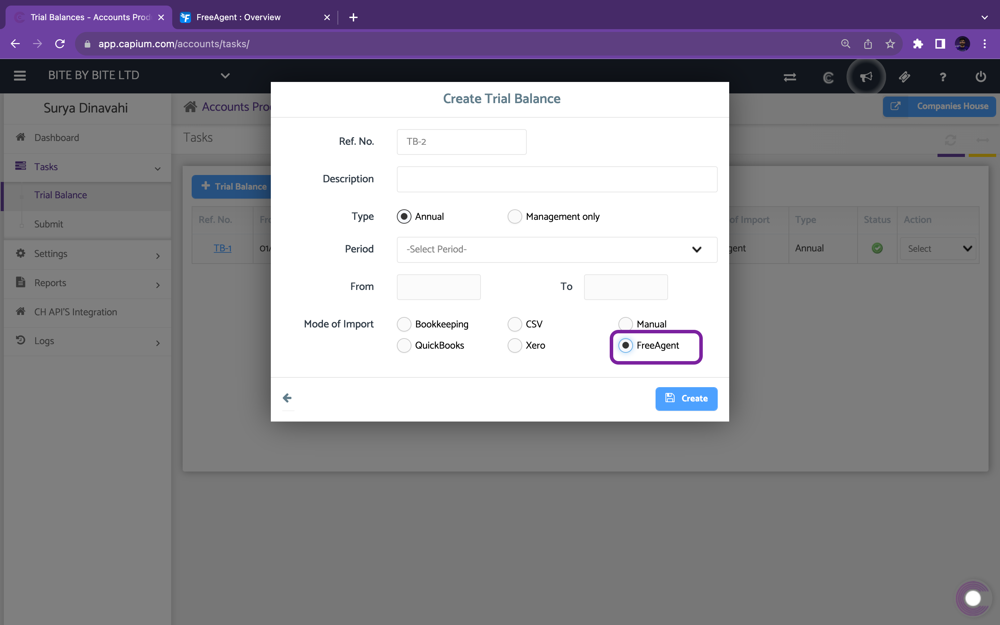
  - 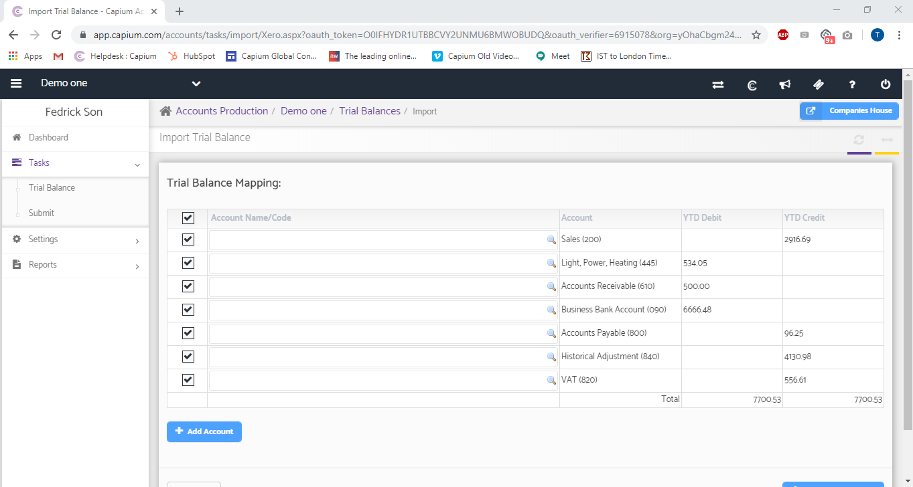

---

### 41. Presenter ID and how to apply for a presenter account - from 03/06/2024
- **Folder:** Accounts Production Help Guide
- **Article ID:** `9000236664` | **Slug:** `presenter-id-and-how-to-apply-for-a-presenter-account-from-03-06-2024`
- **Markdown File:** [raw_articles/9000236664_presenter-id-and-how-to-apply-for-a-presenter-account-from-03-06-2024.md](../raw_articles/9000236664_presenter-id-and-how-to-apply-for-a-presenter-account-from-03-06-2024.md)
- **Images Count:** 0

---

### 42. Submitted Revised Accounts in Capium
- **Folder:** Accounts Production Help Guide
- **Article ID:** `9000268364` | **Slug:** `submitted-revised-accounts-in-capium`
- **Markdown File:** [raw_articles/9000268364_submitted-revised-accounts-in-capium.md](../raw_articles/9000268364_submitted-revised-accounts-in-capium.md)
- **Images Count:** 0

---

### 43. Draft stamp in Accounts Report
- **Folder:** Accounts Production Help Guide
- **Article ID:** `9000271601` | **Slug:** `draft-stamp-in-accounts-report`
- **Markdown File:** [raw_articles/9000271601_draft-stamp-in-accounts-report.md](../raw_articles/9000271601_draft-stamp-in-accounts-report.md)
- **Images Count:** 1
- **Screenshots:**
  - 

---

### 44. Accountants Report In Annual accounts
- **Folder:** Accounts Production Help Guide
- **Article ID:** `9000271603` | **Slug:** `accountants-report-in-annual-accounts`
- **Markdown File:** [raw_articles/9000271603_accountants-report-in-annual-accounts.md](../raw_articles/9000271603_accountants-report-in-annual-accounts.md)
- **Images Count:** 2
- **Screenshots:**
  - 
  - 

---

### 45. Year headings
- **Folder:** Accounts Production Help Guide
- **Article ID:** `9000271606` | **Slug:** `year-headings`
- **Markdown File:** [raw_articles/9000271606_year-headings.md](../raw_articles/9000271606_year-headings.md)
- **Images Count:** 3
- **Screenshots:**
  - 
  - 
  - 

---

### 46. Dormant Company accounts and CT600
- **Folder:** Accounts Production Help Guide
- **Article ID:** `9000271618` | **Slug:** `dormant-company-accounts-and-ct600`
- **Markdown File:** [raw_articles/9000271618_dormant-company-accounts-and-ct600.md](../raw_articles/9000271618_dormant-company-accounts-and-ct600.md)
- **Images Count:** 1
- **Screenshots:**
  - 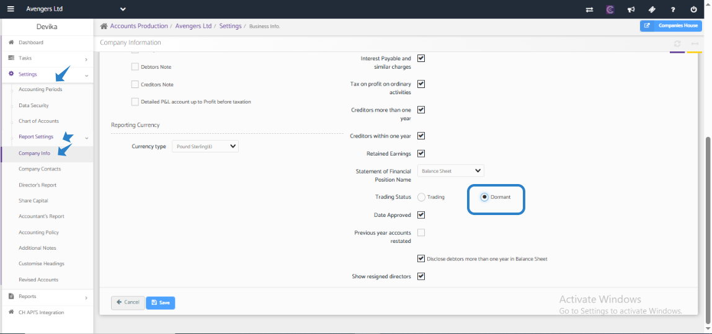

---

### 47. Report formatting in Accounts Production 
- **Folder:** Accounts Production Help Guide
- **Article ID:** `9000271621` | **Slug:** `report-formatting-in-accounts-production-`
- **Markdown File:** [raw_articles/9000271621_report-formatting-in-accounts-production-.md](../raw_articles/9000271621_report-formatting-in-accounts-production-.md)
- **Images Count:** 1
- **Screenshots:**
  - 

---

### 48. Notes Missing from Report
- **Folder:** Accounts Production Help Guide
- **Article ID:** `9000271628` | **Slug:** `notes-missing-from-report`
- **Markdown File:** [raw_articles/9000271628_notes-missing-from-report.md](../raw_articles/9000271628_notes-missing-from-report.md)
- **Images Count:** 2
- **Screenshots:**
  - 
  - 

---

### 49. Date of letter of engagement
- **Folder:** Accounts Production Help Guide
- **Article ID:** `9000271630` | **Slug:** `date-of-letter-of-engagement`
- **Markdown File:** [raw_articles/9000271630_date-of-letter-of-engagement.md](../raw_articles/9000271630_date-of-letter-of-engagement.md)
- **Images Count:** 1
- **Screenshots:**
  - 

---

### 50. How to Include a Detailed Profit and Loss Account for FRS 105
- **Folder:** Accounts Production Help Guide
- **Article ID:** `9000271669` | **Slug:** `how-to-include-a-detailed-profit-and-loss-account-for-frs-105`
- **Markdown File:** [raw_articles/9000271669_how-to-include-a-detailed-profit-and-loss-account-for-frs-105.md](../raw_articles/9000271669_how-to-include-a-detailed-profit-and-loss-account-for-frs-105.md)
- **Images Count:** 0

---

### 51. Filing Error &quot;Correct errors in the steps&quot;
- **Folder:** Accounts Production Help Guide
- **Article ID:** `9000271811` | **Slug:** `filing-error-correct-errors-in-the-steps-`
- **Markdown File:** [raw_articles/9000271811_filing-error-correct-errors-in-the-steps-.md](../raw_articles/9000271811_filing-error-correct-errors-in-the-steps-.md)
- **Images Count:** 0

---

### 52. How to edit the title of Management Accounts Report
- **Folder:** Accounts Production Help Guide
- **Article ID:** `9000271746` | **Slug:** `how-to-edit-the-title-of-management-accounts-report`
- **Markdown File:** [raw_articles/9000271746_how-to-edit-the-title-of-management-accounts-report.md](../raw_articles/9000271746_how-to-edit-the-title-of-management-accounts-report.md)
- **Images Count:** 0

---

### 53. Amend Annual Report Name
- **Folder:** Accounts Production Help Guide
- **Article ID:** `9000272169` | **Slug:** `amend-annual-report-name`
- **Markdown File:** [raw_articles/9000272169_amend-annual-report-name.md](../raw_articles/9000272169_amend-annual-report-name.md)
- **Images Count:** 4
- **Screenshots:**
  - 
  - 
  - 
  - 

---

### 54. Error on revised accounts
- **Folder:** Accounts Production Help Guide
- **Article ID:** `9000271733` | **Slug:** `error-on-revised-accounts`
- **Markdown File:** [raw_articles/9000271733_error-on-revised-accounts.md](../raw_articles/9000271733_error-on-revised-accounts.md)
- **Images Count:** 0

---

### 55. Previous year accounts restated
- **Folder:** Accounts Production Help Guide
- **Article ID:** `9000272901` | **Slug:** `previous-year-accounts-restated`
- **Markdown File:** [raw_articles/9000272901_previous-year-accounts-restated.md](../raw_articles/9000272901_previous-year-accounts-restated.md)
- **Images Count:** 3
- **Screenshots:**
  - 
  - 
  - 

---

### 56. Capium: Default Active COA Codes
- **Folder:** Accounts Production Help Guide
- **Article ID:** `9000276188` | **Slug:** `capium-default-active-coa-codes`
- **Markdown File:** [raw_articles/9000276188_capium-default-active-coa-codes.md](../raw_articles/9000276188_capium-default-active-coa-codes.md)
- **Images Count:** 1
- **Screenshots:**
  - 

---

### 57. How to create prior accounting period
- **Folder:** Accounts Production Help Guide
- **Article ID:** `9000277306` | **Slug:** `how-to-create-prior-accounting-period`
- **Markdown File:** [raw_articles/9000277306_how-to-create-prior-accounting-period.md](../raw_articles/9000277306_how-to-create-prior-accounting-period.md)
- **Images Count:** 1
- **Screenshots:**
  - 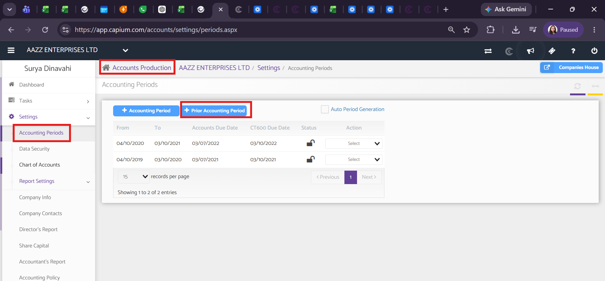

---

### 58. How do I change/remove the sign date of accounts?
- **Folder:** Accounts Production FAQs
- **Article ID:** `9000165535` | **Slug:** `how-do-i-change-remove-the-sign-date-of-accounts-`
- **Markdown File:** [raw_articles/9000165535_how-do-i-change-remove-the-sign-date-of-accounts-.md](../raw_articles/9000165535_how-do-i-change-remove-the-sign-date-of-accounts-.md)
- **Images Count:** 1
- **Screenshots:**
  - 

---

### 59. How to submit a Dormant set of accounts to Companies House
- **Folder:** Accounts Production FAQs
- **Article ID:** `9000165537` | **Slug:** `how-to-submit-a-dormant-set-of-accounts-to-companies-house`
- **Markdown File:** [raw_articles/9000165537_how-to-submit-a-dormant-set-of-accounts-to-companies-house.md](../raw_articles/9000165537_how-to-submit-a-dormant-set-of-accounts-to-companies-house.md)
- **Images Count:** 3
- **Screenshots:**
  - 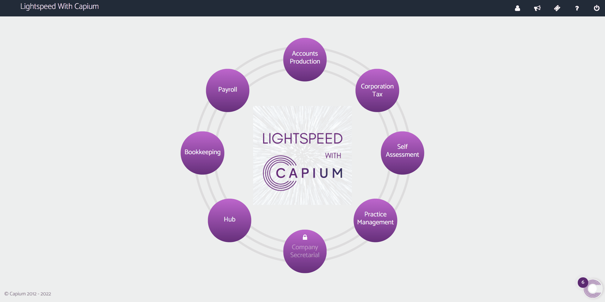
  - 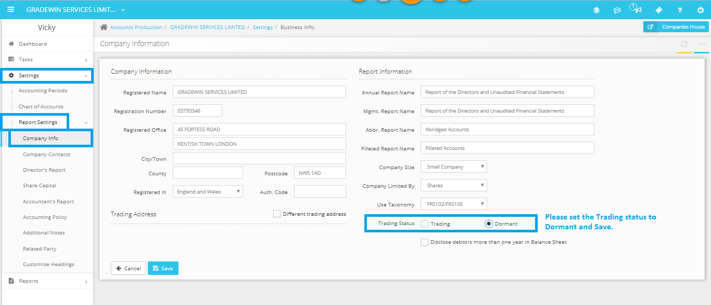
  - 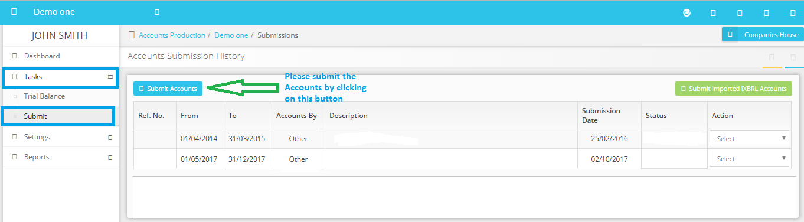

---

### 60. &#39;Accountants or Auditors report&#39; must be attached with selected Accounts Report
- **Folder:** Accounts Production FAQs
- **Article ID:** `9000165539` | **Slug:** `-accountants-or-auditors-report-must-be-attached-with-selected-accounts-report`
- **Markdown File:** [raw_articles/9000165539_-accountants-or-auditors-report-must-be-attached-with-selected-accounts-report.md](../raw_articles/9000165539_-accountants-or-auditors-report-must-be-attached-with-selected-accounts-report.md)
- **Images Count:** 3
- **Screenshots:**
  - 
  - 
  - 

---

### 61. How do I remove the balance sheet for a Sole Trader?
- **Folder:** Accounts Production FAQs
- **Article ID:** `9000165540` | **Slug:** `how-do-i-remove-the-balance-sheet-for-a-sole-trader-`
- **Markdown File:** [raw_articles/9000165540_how-do-i-remove-the-balance-sheet-for-a-sole-trader-.md](../raw_articles/9000165540_how-do-i-remove-the-balance-sheet-for-a-sole-trader-.md)
- **Images Count:** 1
- **Screenshots:**
  - 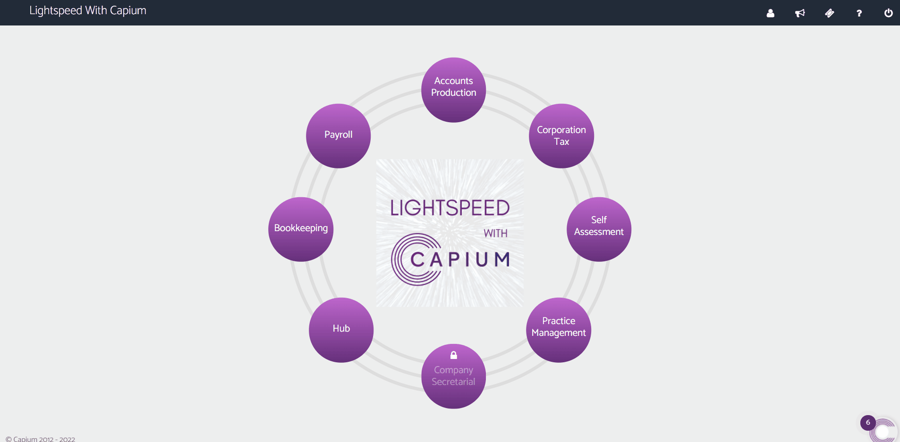

---

### 62. Warning message related to Accounting Policy while generating the reports
- **Folder:** Accounts Production FAQs
- **Article ID:** `9000165541` | **Slug:** `warning-message-related-to-accounting-policy-while-generating-the-reports`
- **Markdown File:** [raw_articles/9000165541_warning-message-related-to-accounting-policy-while-generating-the-reports.md](../raw_articles/9000165541_warning-message-related-to-accounting-policy-while-generating-the-reports.md)
- **Images Count:** 3
- **Screenshots:**
  - 
  - 
  - 

---

### 63. Tangible Fixed Assets - accounting policy has been included but depreciation rate not specified
- **Folder:** Accounts Production FAQs
- **Article ID:** `9000165543` | **Slug:** `tangible-fixed-assets-accounting-policy-has-been-included-but-depreciation-rate-not-specified`
- **Markdown File:** [raw_articles/9000165543_tangible-fixed-assets-accounting-policy-has-been-included-but-depreciation-rate-not-specified.md](../raw_articles/9000165543_tangible-fixed-assets-accounting-policy-has-been-included-but-depreciation-rate-not-specified.md)
- **Images Count:** 1
- **Screenshots:**
  - 

---

### 64. How to amend the rounding difference shown in accounts?
- **Folder:** Accounts Production FAQs
- **Article ID:** `9000165545` | **Slug:** `how-to-amend-the-rounding-difference-shown-in-accounts-`
- **Markdown File:** [raw_articles/9000165545_how-to-amend-the-rounding-difference-shown-in-accounts-.md](../raw_articles/9000165545_how-to-amend-the-rounding-difference-shown-in-accounts-.md)
- **Images Count:** 2
- **Screenshots:**
  - 
  - 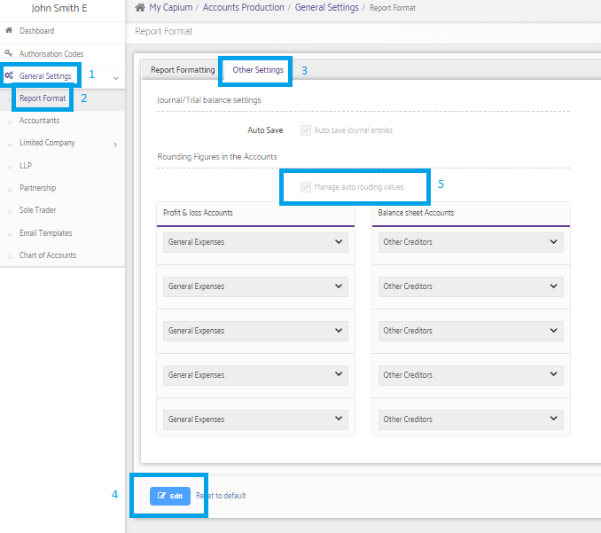

---

### 65. How to display the Director’s joining date and leaving date in the accounts report?
- **Folder:** Accounts Production FAQs
- **Article ID:** `9000165546` | **Slug:** `how-to-display-the-director-s-joining-date-and-leaving-date-in-the-accounts-report-`
- **Markdown File:** [raw_articles/9000165546_how-to-display-the-director-s-joining-date-and-leaving-date-in-the-accounts-report-.md](../raw_articles/9000165546_how-to-display-the-director-s-joining-date-and-leaving-date-in-the-accounts-report-.md)
- **Images Count:** 1
- **Screenshots:**
  - 

---

### 66. I don’t want to show the Accountant’s report in the accounts report.
- **Folder:** Accounts Production FAQs
- **Article ID:** `9000165548` | **Slug:** `i-don-t-want-to-show-the-accountant-s-report-in-the-accounts-report-`
- **Markdown File:** [raw_articles/9000165548_i-don-t-want-to-show-the-accountant-s-report-in-the-accounts-report-.md](../raw_articles/9000165548_i-don-t-want-to-show-the-accountant-s-report-in-the-accounts-report-.md)
- **Images Count:** 1
- **Screenshots:**
  - 

---

### 67. How to import a Trial Balance using a CSV file?
- **Folder:** Accounts Production FAQs
- **Article ID:** `9000165549` | **Slug:** `how-to-import-a-trial-balance-using-a-csv-file-`
- **Markdown File:** [raw_articles/9000165549_how-to-import-a-trial-balance-using-a-csv-file-.md](../raw_articles/9000165549_how-to-import-a-trial-balance-using-a-csv-file-.md)
- **Images Count:** 3
- **Screenshots:**
  - 
  - 
  - 

---

### 68. Nominal Code disappeared while updating the Trial Balance
- **Folder:** Accounts Production FAQs
- **Article ID:** `9000165550` | **Slug:** `nominal-code-disappeared-while-updating-the-trial-balance`
- **Markdown File:** [raw_articles/9000165550_nominal-code-disappeared-while-updating-the-trial-balance.md](../raw_articles/9000165550_nominal-code-disappeared-while-updating-the-trial-balance.md)
- **Images Count:** 1
- **Screenshots:**
  - 

---

### 69. I&#39;ve made a change in the account settings but it is not showing in the accounts? How do I regenerate accounts?
- **Folder:** Accounts Production FAQs
- **Article ID:** `9000165628` | **Slug:** `i-ve-made-a-change-in-the-account-settings-but-it-is-not-showing-in-the-accounts-how-do-i-regenerate`
- **Markdown File:** [raw_articles/9000165628_i-ve-made-a-change-in-the-account-settings-but-it-is-not-showing-in-the-accounts-how-do-i-regenerate.md](../raw_articles/9000165628_i-ve-made-a-change-in-the-account-settings-but-it-is-not-showing-in-the-accounts-how-do-i-regenerate.md)
- **Images Count:** 1
- **Screenshots:**
  - 

---

### 70. Companies House submission is given error &quot;EF has not found&quot;
- **Folder:** Accounts Production FAQs
- **Article ID:** `9000165551` | **Slug:** `companies-house-submission-is-given-error-ef-has-not-found-`
- **Markdown File:** [raw_articles/9000165551_companies-house-submission-is-given-error-ef-has-not-found-.md](../raw_articles/9000165551_companies-house-submission-is-given-error-ef-has-not-found-.md)
- **Images Count:** 0

---

### 71. How to add Journals in Trial Balance?
- **Folder:** Accounts Production FAQs
- **Article ID:** `9000165552` | **Slug:** `how-to-add-journals-in-trial-balance-`
- **Markdown File:** [raw_articles/9000165552_how-to-add-journals-in-trial-balance-.md](../raw_articles/9000165552_how-to-add-journals-in-trial-balance-.md)
- **Images Count:** 3
- **Screenshots:**
  - 
  - 
  - 

---

### 72. How to confirm if the submission is successful or not?
- **Folder:** Accounts Production FAQs
- **Article ID:** `9000165553` | **Slug:** `how-to-confirm-if-the-submission-is-successful-or-not-`
- **Markdown File:** [raw_articles/9000165553_how-to-confirm-if-the-submission-is-successful-or-not-.md](../raw_articles/9000165553_how-to-confirm-if-the-submission-is-successful-or-not-.md)
- **Images Count:** 0

---

### 73. How to set up more than one director&#39;s current/loan account?
- **Folder:** Accounts Production FAQs
- **Article ID:** `9000165554` | **Slug:** `how-to-set-up-more-than-one-director-s-current-loan-account-`
- **Markdown File:** [raw_articles/9000165554_how-to-set-up-more-than-one-director-s-current-loan-account-.md](../raw_articles/9000165554_how-to-set-up-more-than-one-director-s-current-loan-account-.md)
- **Images Count:** 1
- **Screenshots:**
  - 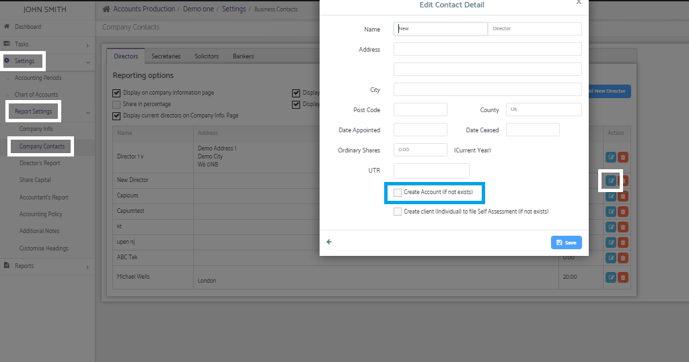

---

### 74. Why am I not able to add the previous accounting period?
- **Folder:** Accounts Production FAQs
- **Article ID:** `9000165555` | **Slug:** `why-am-i-not-able-to-add-the-previous-accounting-period-`
- **Markdown File:** [raw_articles/9000165555_why-am-i-not-able-to-add-the-previous-accounting-period-.md](../raw_articles/9000165555_why-am-i-not-able-to-add-the-previous-accounting-period-.md)
- **Images Count:** 2
- **Screenshots:**
  - 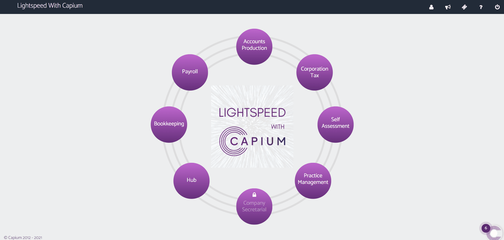
  - 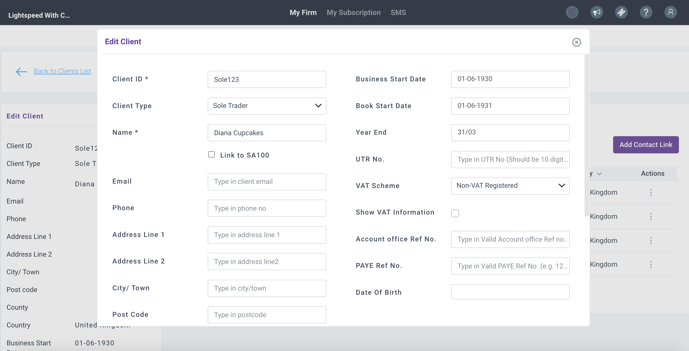

---

### 75. How to add Staff Cost in Accounts Report for FRS 102 Section 1A?
- **Folder:** Accounts Production FAQs
- **Article ID:** `9000165556` | **Slug:** `how-to-add-staff-cost-in-accounts-report-for-frs-102-section-1a-`
- **Markdown File:** [raw_articles/9000165556_how-to-add-staff-cost-in-accounts-report-for-frs-102-section-1a-.md](../raw_articles/9000165556_how-to-add-staff-cost-in-accounts-report-for-frs-102-section-1a-.md)
- **Images Count:** 1
- **Screenshots:**
  - 

---

### 76. How to add Directors&#39; Emoluments in Accounts Report for FRS 102 Section 1A?
- **Folder:** Accounts Production FAQs
- **Article ID:** `9000165557` | **Slug:** `how-to-add-directors-emoluments-in-accounts-report-for-frs-102-section-1a-`
- **Markdown File:** [raw_articles/9000165557_how-to-add-directors-emoluments-in-accounts-report-for-frs-102-section-1a-.md](../raw_articles/9000165557_how-to-add-directors-emoluments-in-accounts-report-for-frs-102-section-1a-.md)
- **Images Count:** 1
- **Screenshots:**
  - 

---

### 77. How to edit chart of accounts code globally?
- **Folder:** Accounts Production FAQs
- **Article ID:** `9000165559` | **Slug:** `how-to-edit-chart-of-accounts-code-globally-`
- **Markdown File:** [raw_articles/9000165559_how-to-edit-chart-of-accounts-code-globally-.md](../raw_articles/9000165559_how-to-edit-chart-of-accounts-code-globally-.md)
- **Images Count:** 3
- **Screenshots:**
  - 
  - 
  - 

---

### 78. Why is there no option to add the new Accounting period?
- **Folder:** Accounts Production FAQs
- **Article ID:** `9000165560` | **Slug:** `why-is-there-no-option-to-add-the-new-accounting-period-`
- **Markdown File:** [raw_articles/9000165560_why-is-there-no-option-to-add-the-new-accounting-period-.md](../raw_articles/9000165560_why-is-there-no-option-to-add-the-new-accounting-period-.md)
- **Images Count:** 1
- **Screenshots:**
  - 

---

### 79. How to edit/delete Accounting Period?
- **Folder:** Accounts Production FAQs
- **Article ID:** `9000165561` | **Slug:** `how-to-edit-delete-accounting-period-`
- **Markdown File:** [raw_articles/9000165561_how-to-edit-delete-accounting-period-.md](../raw_articles/9000165561_how-to-edit-delete-accounting-period-.md)
- **Images Count:** 0

---

### 80. How do I import a trial balance into Accounts Production
- **Folder:** Accounts Production FAQs
- **Article ID:** `9000165631` | **Slug:** `how-do-i-import-a-trial-balance-into-accounts-production`
- **Markdown File:** [raw_articles/9000165631_how-do-i-import-a-trial-balance-into-accounts-production.md](../raw_articles/9000165631_how-do-i-import-a-trial-balance-into-accounts-production.md)
- **Images Count:** 0

---

### 81. How do I include / exclude an accountant&#39;s report?
- **Folder:** Accounts Production FAQs
- **Article ID:** `9000165638` | **Slug:** `how-do-i-include-exclude-an-accountant-s-report-`
- **Markdown File:** [raw_articles/9000165638_how-do-i-include-exclude-an-accountant-s-report-.md](../raw_articles/9000165638_how-do-i-include-exclude-an-accountant-s-report-.md)
- **Images Count:** 3
- **Screenshots:**
  - 
  - 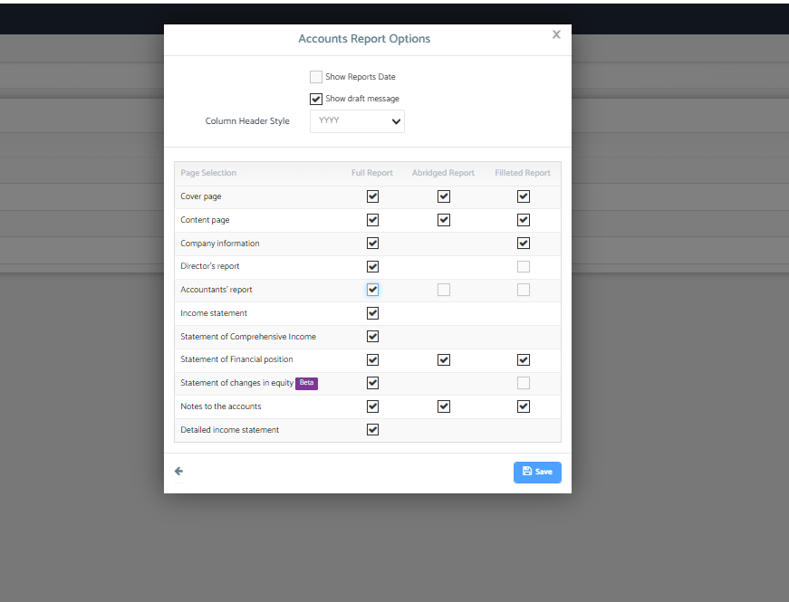
  - 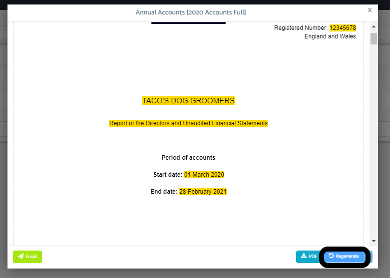

---

### 82. How to add journal entries?
- **Folder:** Accounts Production FAQs
- **Article ID:** `9000165639` | **Slug:** `how-to-add-journal-entries-`
- **Markdown File:** [raw_articles/9000165639_how-to-add-journal-entries-.md](../raw_articles/9000165639_how-to-add-journal-entries-.md)
- **Images Count:** 4
- **Screenshots:**
  - 
  - 
  - 
  - 

---

### 83. How do I create accounts and CT600 corporation tax returns
- **Folder:** Accounts Production FAQs
- **Article ID:** `9000165724` | **Slug:** `how-do-i-create-accounts-and-ct600-corporation-tax-returns`
- **Markdown File:** [raw_articles/9000165724_how-do-i-create-accounts-and-ct600-corporation-tax-returns.md](../raw_articles/9000165724_how-do-i-create-accounts-and-ct600-corporation-tax-returns.md)
- **Images Count:** 0

---

### 84. Is it possible to get the land and buildings policy note split between freehold and leasehold?
- **Folder:** Accounts Production FAQs
- **Article ID:** `9000165797` | **Slug:** `is-it-possible-to-get-the-land-and-buildings-policy-note-split-between-freehold-and-leasehold-`
- **Markdown File:** [raw_articles/9000165797_is-it-possible-to-get-the-land-and-buildings-policy-note-split-between-freehold-and-leasehold-.md](../raw_articles/9000165797_is-it-possible-to-get-the-land-and-buildings-policy-note-split-between-freehold-and-leasehold-.md)
- **Images Count:** 0

---

### 85. There is a date on the accountants report at the bottom. How do we change this?
- **Folder:** Accounts Production FAQs
- **Article ID:** `9000165800` | **Slug:** `there-is-a-date-on-the-accountants-report-at-the-bottom-how-do-we-change-this-`
- **Markdown File:** [raw_articles/9000165800_there-is-a-date-on-the-accountants-report-at-the-bottom-how-do-we-change-this-.md](../raw_articles/9000165800_there-is-a-date-on-the-accountants-report-at-the-bottom-how-do-we-change-this-.md)
- **Images Count:** 2
- **Screenshots:**
  - 
  - 

---

### 86. How to produce FRS 105 micro company accounts?
- **Folder:** Accounts Production FAQs
- **Article ID:** `9000165801` | **Slug:** `how-to-produce-frs-105-micro-company-accounts-`
- **Markdown File:** [raw_articles/9000165801_how-to-produce-frs-105-micro-company-accounts-.md](../raw_articles/9000165801_how-to-produce-frs-105-micro-company-accounts-.md)
- **Images Count:** 2
- **Screenshots:**
  - 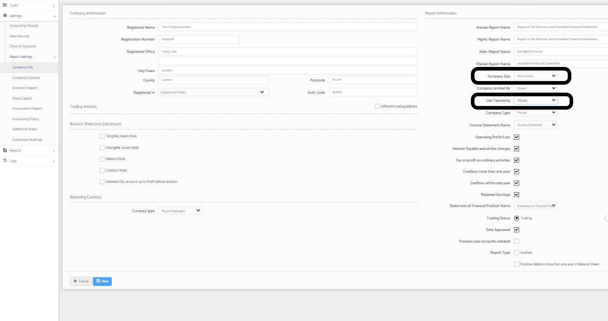
  - 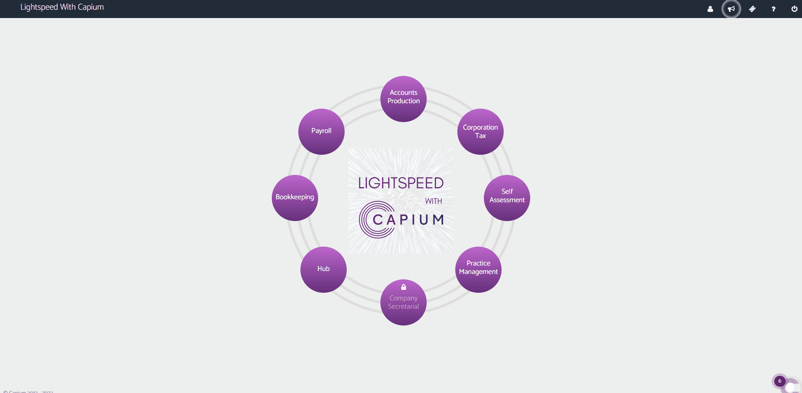

---

### 87. We have been trying to add the share capital notes to the accounts.  Can you please advise why it is not showing in the report?
- **Folder:** Accounts Production FAQs
- **Article ID:** `9000165802` | **Slug:** `we-have-been-trying-to-add-the-share-capital-notes-to-the-accounts-can-you-please-advise-why-it-is-`
- **Markdown File:** [raw_articles/9000165802_we-have-been-trying-to-add-the-share-capital-notes-to-the-accounts-can-you-please-advise-why-it-is-.md](../raw_articles/9000165802_we-have-been-trying-to-add-the-share-capital-notes-to-the-accounts-can-you-please-advise-why-it-is-.md)
- **Images Count:** 0

---

### 88. Directors cessation date is not showing in company information or directors report. How can we correct this?
- **Folder:** Accounts Production FAQs
- **Article ID:** `9000165805` | **Slug:** `directors-cessation-date-is-not-showing-in-company-information-or-directors-report-how-can-we-correc`
- **Markdown File:** [raw_articles/9000165805_directors-cessation-date-is-not-showing-in-company-information-or-directors-report-how-can-we-correc.md](../raw_articles/9000165805_directors-cessation-date-is-not-showing-in-company-information-or-directors-report-how-can-we-correc.md)
- **Images Count:** 4
- **Screenshots:**
  - 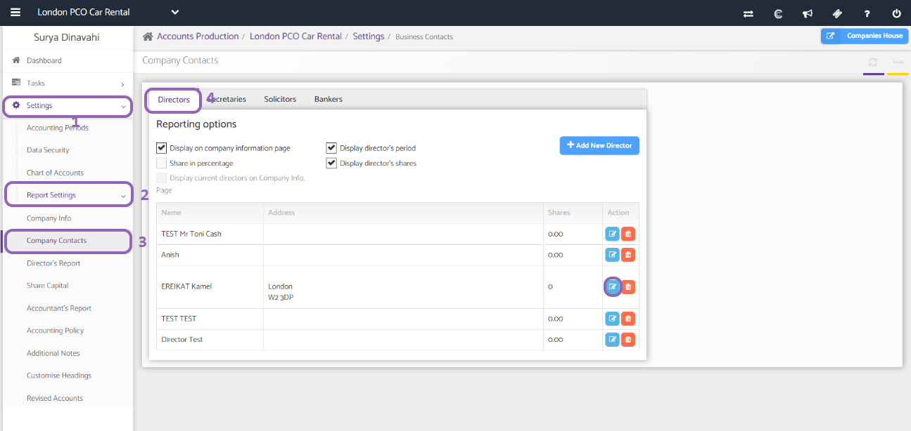
  - 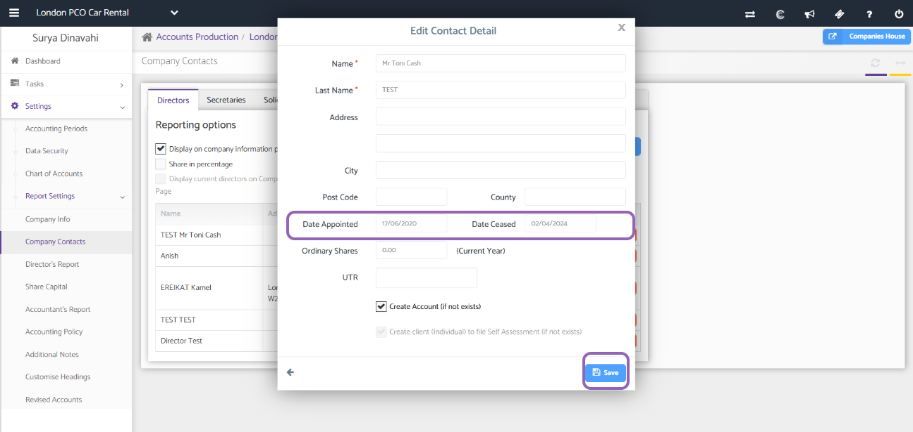
  - 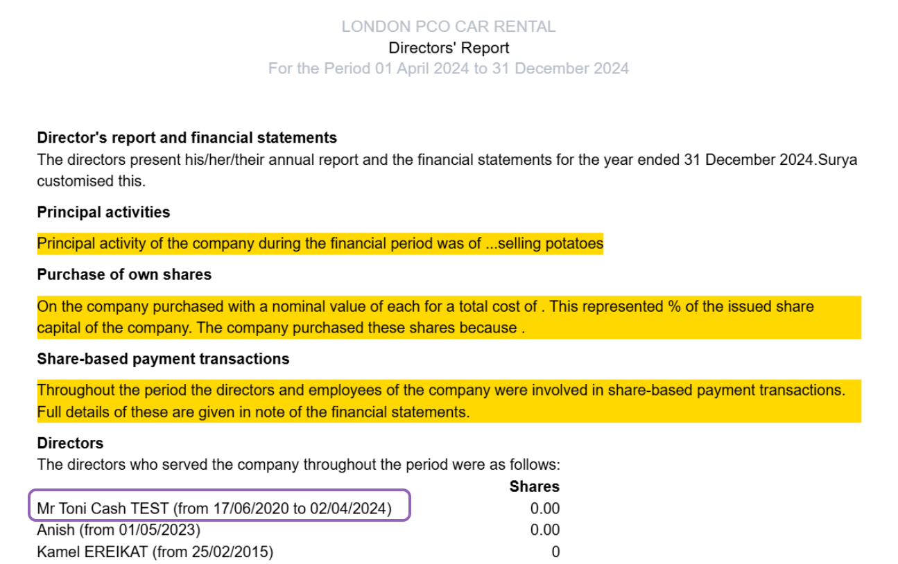
  - 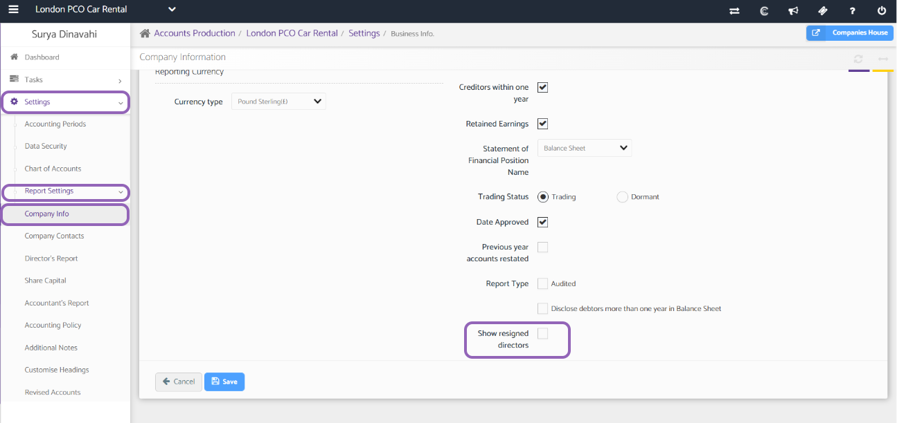

---

### 89. Can you tell me how we can record that a business has ceased to trade. 
- **Folder:** Accounts Production FAQs
- **Article ID:** `9000165807` | **Slug:** `can-you-tell-me-how-we-can-record-that-a-business-has-ceased-to-trade-`
- **Markdown File:** [raw_articles/9000165807_can-you-tell-me-how-we-can-record-that-a-business-has-ceased-to-trade-.md](../raw_articles/9000165807_can-you-tell-me-how-we-can-record-that-a-business-has-ceased-to-trade-.md)
- **Images Count:** 0

---

### 90. How to print your final Accounts
- **Folder:** Accounts Production FAQs
- **Article ID:** `9000166988` | **Slug:** `how-to-print-your-final-accounts`
- **Markdown File:** [raw_articles/9000166988_how-to-print-your-final-accounts.md](../raw_articles/9000166988_how-to-print-your-final-accounts.md)
- **Images Count:** 0

---

### 91. How to add a related party in accounts
- **Folder:** Accounts Production FAQs
- **Article ID:** `9000171486` | **Slug:** `how-to-add-a-related-party-in-accounts`
- **Markdown File:** [raw_articles/9000171486_how-to-add-a-related-party-in-accounts.md](../raw_articles/9000171486_how-to-add-a-related-party-in-accounts.md)
- **Images Count:** 1
- **Screenshots:**
  - 

---

### 92. How to turn on auto rounding values in your annual accounts
- **Folder:** Accounts Production FAQs
- **Article ID:** `9000204342` | **Slug:** `how-to-turn-on-auto-rounding-values-in-your-annual-accounts`
- **Markdown File:** [raw_articles/9000204342_how-to-turn-on-auto-rounding-values-in-your-annual-accounts.md](../raw_articles/9000204342_how-to-turn-on-auto-rounding-values-in-your-annual-accounts.md)
- **Images Count:** 4
- **Screenshots:**
  - 
  - 
  - 
  - 

---

### 93. How do you add a draft watermark to your accounts
- **Folder:** Accounts Production FAQs
- **Article ID:** `9000205109` | **Slug:** `how-do-you-add-a-draft-watermark-to-your-accounts`
- **Markdown File:** [raw_articles/9000205109_how-do-you-add-a-draft-watermark-to-your-accounts.md](../raw_articles/9000205109_how-do-you-add-a-draft-watermark-to-your-accounts.md)
- **Images Count:** 4
- **Screenshots:**
  - 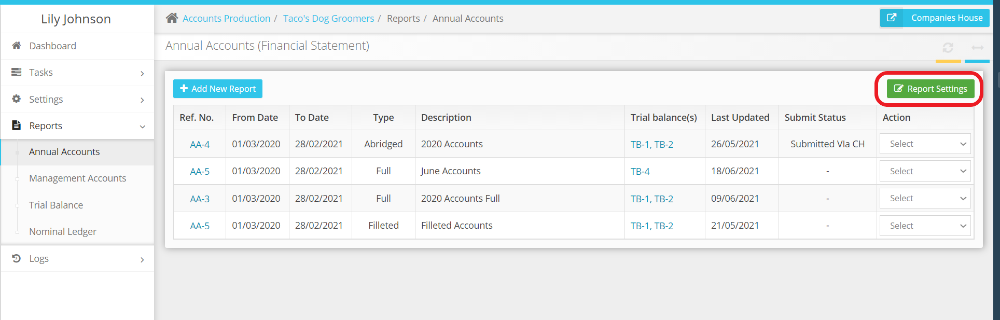
  - 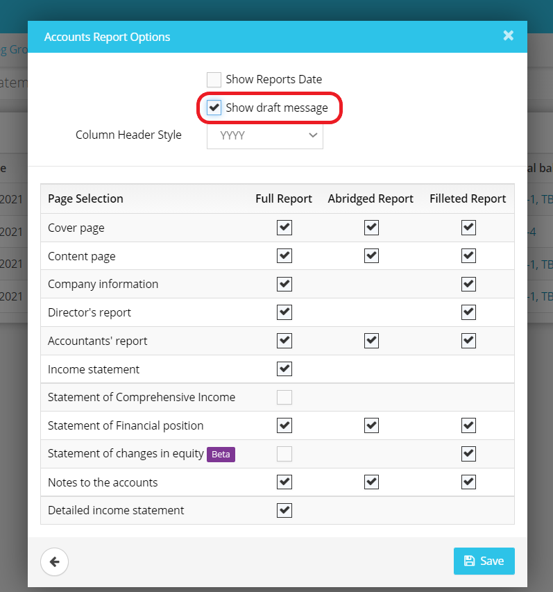
  - 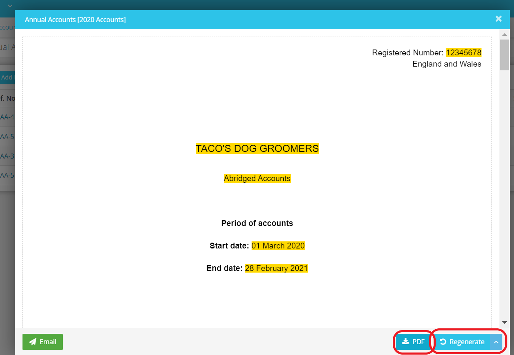
  - 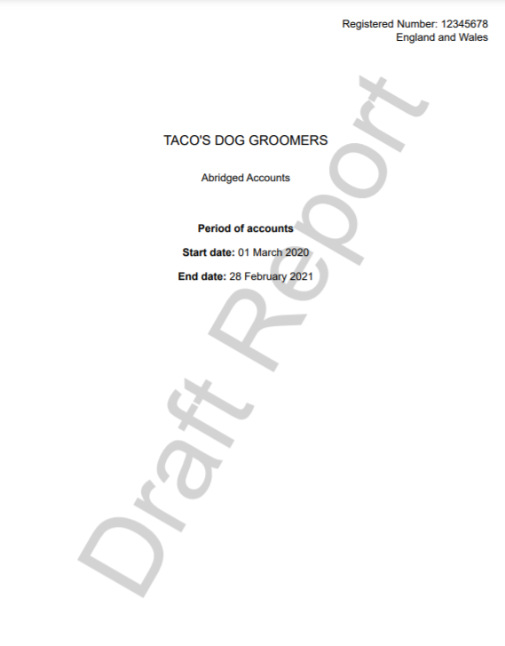

---

### 94. Error Code 9999 when submitting accounts to Companies House
- **Folder:** Accounts Production FAQs
- **Article ID:** `9000225106` | **Slug:** `error-code-9999-when-submitting-accounts-to-companies-house`
- **Markdown File:** [raw_articles/9000225106_error-code-9999-when-submitting-accounts-to-companies-house.md](../raw_articles/9000225106_error-code-9999-when-submitting-accounts-to-companies-house.md)
- **Images Count:** 0

---

### 95. Note: Submitting Accounts/ixbrl Reports that have been generated outside of Capium
- **Folder:** Accounts Production FAQs
- **Article ID:** `9000234281` | **Slug:** `note-submitting-accounts-ixbrl-reports-that-have-been-generated-outside-of-capium`
- **Markdown File:** [raw_articles/9000234281_note-submitting-accounts-ixbrl-reports-that-have-been-generated-outside-of-capium.md](../raw_articles/9000234281_note-submitting-accounts-ixbrl-reports-that-have-been-generated-outside-of-capium.md)
- **Images Count:** 0

---

### 96. How to Add/ Amend Signature Dates
- **Folder:** Accounts Production FAQs
- **Article ID:** `9000236614` | **Slug:** `how-to-add-amend-signature-dates`
- **Markdown File:** [raw_articles/9000236614_how-to-add-amend-signature-dates.md](../raw_articles/9000236614_how-to-add-amend-signature-dates.md)
- **Images Count:** 1
- **Screenshots:**
  - 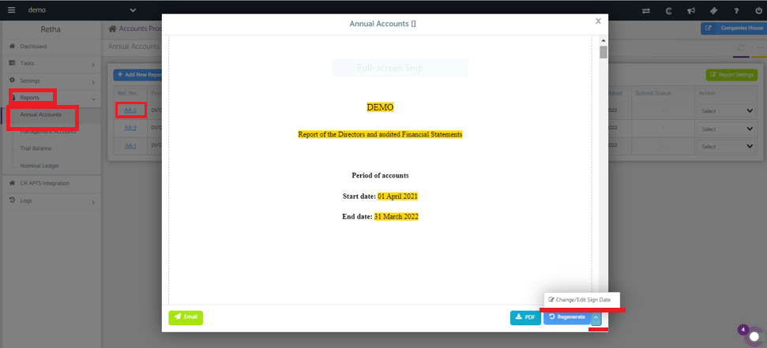

---

### 97. How to select reports for a company limited by guarantee
- **Folder:** Accounts Production FAQs
- **Article ID:** `9000237595` | **Slug:** `how-to-select-reports-for-a-company-limited-by-guarantee`
- **Markdown File:** [raw_articles/9000237595_how-to-select-reports-for-a-company-limited-by-guarantee.md](../raw_articles/9000237595_how-to-select-reports-for-a-company-limited-by-guarantee.md)
- **Images Count:** 2
- **Screenshots:**
  - 
  - 

---

### 98. Does the GOV.UK One Login change affect software filing?
- **Folder:** Accounts Production FAQs
- **Article ID:** `9000271641` | **Slug:** `does-the-gov-uk-one-login-change-affect-software-filing-`
- **Markdown File:** [raw_articles/9000271641_does-the-gov-uk-one-login-change-affect-software-filing-.md](../raw_articles/9000271641_does-the-gov-uk-one-login-change-affect-software-filing-.md)
- **Images Count:** 0

---

### 99. How to Incorporate Approval Dates on Statutory Accounts
- **Folder:** Accounts Production FAQs
- **Article ID:** `9000271670` | **Slug:** `how-to-incorporate-approval-dates-on-statutory-accounts`
- **Markdown File:** [raw_articles/9000271670_how-to-incorporate-approval-dates-on-statutory-accounts.md](../raw_articles/9000271670_how-to-incorporate-approval-dates-on-statutory-accounts.md)
- **Images Count:** 1
- **Screenshots:**
  - 

---

### 100. Principal Activity - Directors Report
- **Folder:** Accounts Production FAQs
- **Article ID:** `9000272252` | **Slug:** `principal-activity-directors-report`
- **Markdown File:** [raw_articles/9000272252_principal-activity-directors-report.md](../raw_articles/9000272252_principal-activity-directors-report.md)
- **Images Count:** 1
- **Screenshots:**
  - 

---

### 101. How to create Dormant Accounts
- **Folder:** Accounts Production FAQs
- **Article ID:** `9000277531` | **Slug:** `how-to-create-dormant-accounts`
- **Markdown File:** [raw_articles/9000277531_how-to-create-dormant-accounts.md](../raw_articles/9000277531_how-to-create-dormant-accounts.md)
- **Images Count:** 0

---

### 102. How To Regenerate Annual Accounts
- **Folder:** Accounts Production FAQs
- **Article ID:** `9000277532` | **Slug:** `how-to-regenerate-annual-accounts`
- **Markdown File:** [raw_articles/9000277532_how-to-regenerate-annual-accounts.md](../raw_articles/9000277532_how-to-regenerate-annual-accounts.md)
- **Images Count:** 0

---

### 103. CIC Accounts Walkthough
- **Folder:** Community Interest Companies (CIC)
- **Article ID:** `9000278289` | **Slug:** `cic-accounts-walkthough`
- **Markdown File:** [raw_articles/9000278289_cic-accounts-walkthough.md](../raw_articles/9000278289_cic-accounts-walkthough.md)
- **Images Count:** 0

---

### 104. Creating or a New CIC client
- **Folder:** Community Interest Companies (CIC)
- **Article ID:** `9000278286` | **Slug:** `creating-or-a-new-cic-client`
- **Markdown File:** [raw_articles/9000278286_creating-or-a-new-cic-client.md](../raw_articles/9000278286_creating-or-a-new-cic-client.md)
- **Images Count:** 1
- **Screenshots:**
  - 

---

### 105. Converting an existing client to a CIC
- **Folder:** Community Interest Companies (CIC)
- **Article ID:** `9000278288` | **Slug:** `converting-an-existing-client-to-a-cic`
- **Markdown File:** [raw_articles/9000278288_converting-an-existing-client-to-a-cic.md](../raw_articles/9000278288_converting-an-existing-client-to-a-cic.md)
- **Images Count:** 2
- **Screenshots:**
  - 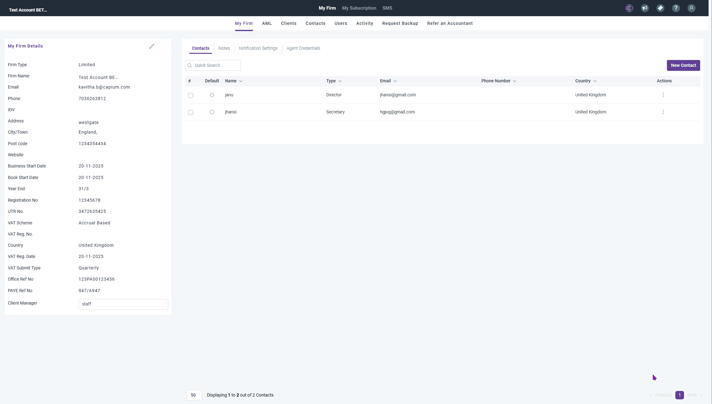
  - 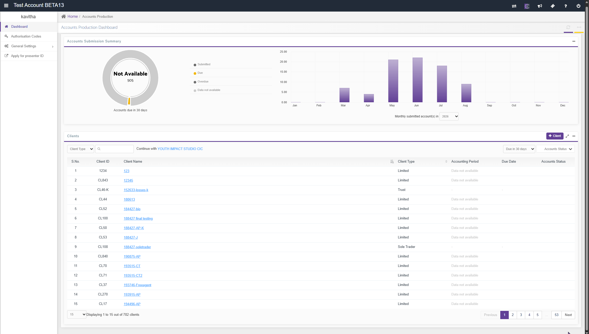

---

### 106. Completing the CIC 34 Notes in Accounts Production
- **Folder:** Community Interest Companies (CIC)
- **Article ID:** `9000278309` | **Slug:** `completing-the-cic-34-notes-in-accounts-production`
- **Markdown File:** [raw_articles/9000278309_completing-the-cic-34-notes-in-accounts-production.md](../raw_articles/9000278309_completing-the-cic-34-notes-in-accounts-production.md)
- **Images Count:** 0

---

### 107. CIC Filings in Accounts Production
- **Folder:** Community Interest Companies (CIC)
- **Article ID:** `9000278308` | **Slug:** `cic-filings-in-accounts-production`
- **Markdown File:** [raw_articles/9000278308_cic-filings-in-accounts-production.md](../raw_articles/9000278308_cic-filings-in-accounts-production.md)
- **Images Count:** 0

---

### 108. Creating a CIC Zip Package
- **Folder:** Community Interest Companies (CIC)
- **Article ID:** `9000278416` | **Slug:** `creating-a-cic-zip-package`
- **Markdown File:** [raw_articles/9000278416_creating-a-cic-zip-package.md](../raw_articles/9000278416_creating-a-cic-zip-package.md)
- **Images Count:** 1
- **Screenshots:**
  - 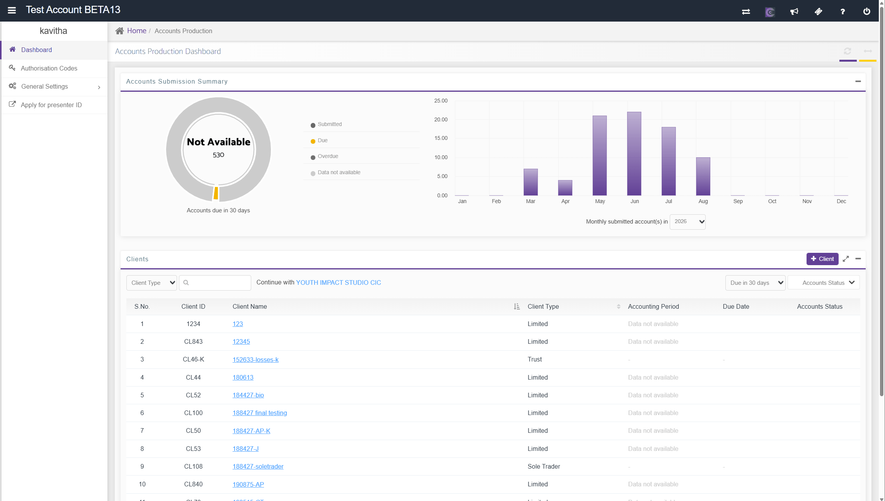

---

