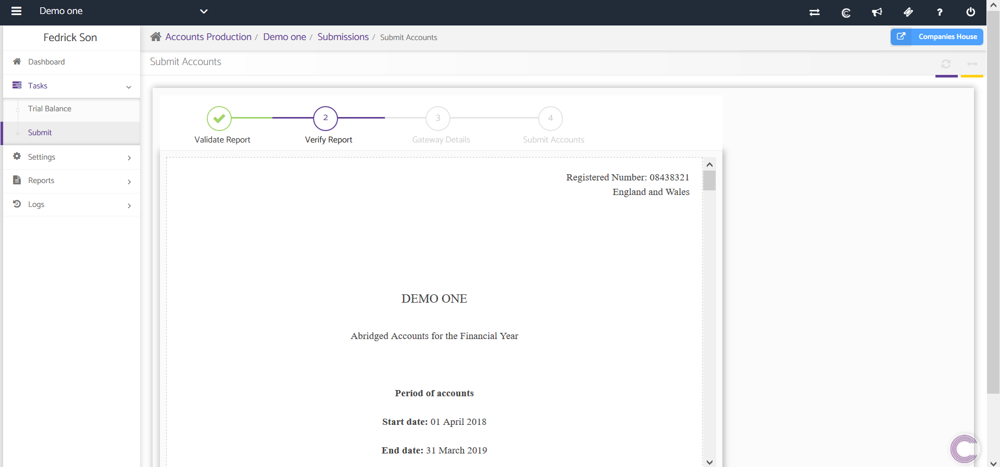
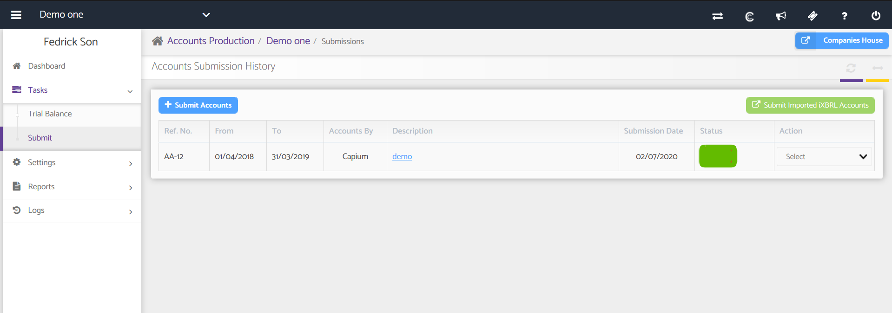

# Submit
	 	
			
			Print

- **Category:** Accounts Production
- **Folder:** Accounts Production Help Guide
- **Source URL:** [https://capium.freshdesk.com/support/solutions/articles/9000165480-submit](https://capium.freshdesk.com/support/solutions/articles/9000165480-submit)
- **Article ID:** 9000165480

## Content

Solution home 
		Accounts Production
		Accounts Production Help Guide

### Submit

			Print

	Modified on: Mon, 24 Aug, 2020 at  5:04 PM

		Location: Accounts Production module > Client Specific > Tasks > Submit

This subsection is covers the process of submitting prepared Annual Reports to Companies House.

Only Abbreviated & Filleted reports can submitted to Companies House from Capium

When you click on Submit you will need to navigate through the 4 step process:

1. Validate Report (Pre-validation stage where you will be prompted if there are any issues)
2. Verify Report - you will be presented with the prepared accounts to review
3. Gateway Details - Enter your gateway details if this is your first submission
4. Submit to Companies House 

It shows the details of Reports submitted to Companies House containing:

Ref. No. of the report so submitted.

From and to date showing the dates for which trial balance was prepared and hence the report.

Type of report abbreviated or full with the name of the report in the description.

Date of submission to Companies House.

Status of submission

 - Pending: If the report has been submitted to Companies House but the response from Companies House is to be received.

 - Submitted: If the report has been submitted with the response received from Companies House.

 - Error: If there is an error after submission of the report then this status is shown.

### Actions that can be taken on the report submitted:

Download Report as PDF: Report so submitted can be downloaded as PDF.

 - Download Response as PDF: Response to be received from Companies House can be downloaded as PDF on receipt.

										Did you find it helpful?
								Yes
								No

Send feedback	Sorry we couldn't be helpful. Help us improve this article with your feedback.

## Screenshots & Diagrams (2)

