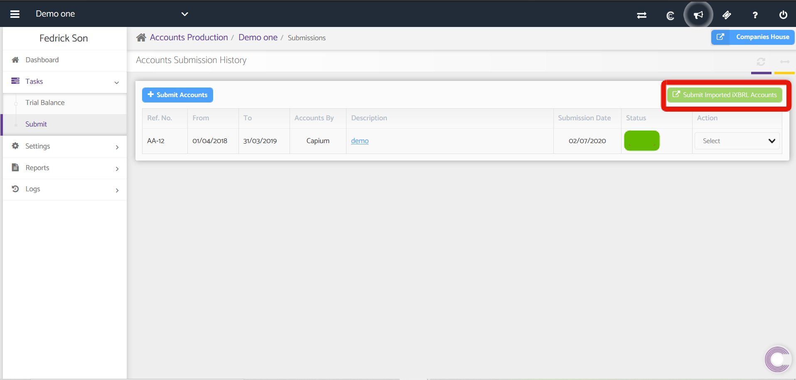
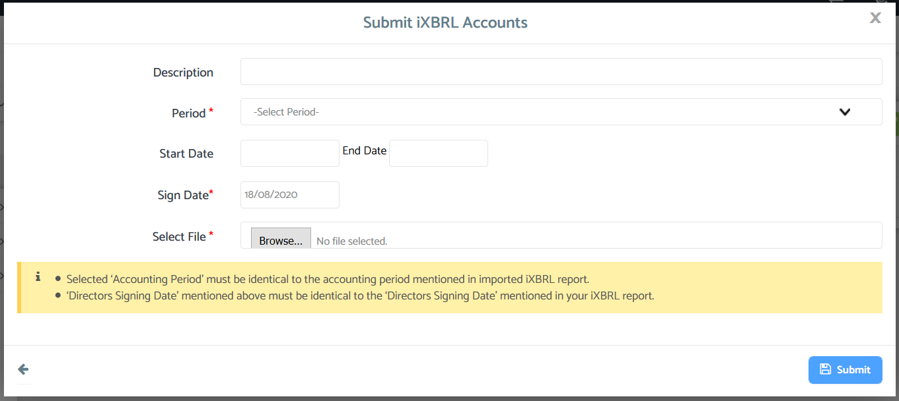

# Submit iXBRL
	 	
			
			Print

- **Category:** Accounts Production
- **Folder:** Accounts Production Help Guide
- **Source URL:** [https://capium.freshdesk.com/support/solutions/articles/9000165481-submit-ixbrl](https://capium.freshdesk.com/support/solutions/articles/9000165481-submit-ixbrl)
- **Article ID:** 9000165481

## Content

Solution home 
		Accounts Production
		Accounts Production Help Guide

### Submit iXBRL

			Print

	Modified on: Mon, 18 Dec, 2023 at  6:34 PM

		Location: Accounts Production module > Client Specific > Tasks > Submit

Quick link

Capium allows you to import an iXBRL report of Abbreviated accounts from other providers and then to submit to Companies House. To do this, head to the Submit page using the navigation above 

You need to fill in the details as per the requirement and upload the iXBRL file of abbreviated accounts from your system. Make sure that the ‘Accounting Period’ is the same as mentioned in the imported iXBRL report. Also, the ‘Directors Signing date in the pop-up and the iXBRL report should be the same.

Note: Capium will not perform any kind of validation check on the iXBRL set of accounts generated using other providers. Capium simply submits such iXBRL set of accounts to Companies House and allows the user to get the response, and will not rectify any generated errors in the submitted accounts. You can contact your iXBRL provider to resolve any errors received as a response by the Companies House.

The four step process for submission are as follows:

Validate Report: Annual report so generated is to be validated here. If there are any errors, then the same will be listed here and you may click on resolve to resolve the errors.

 - After resolving the errors, you will be allowed to proceed to the next step.

Verify Report: Report so generated is displayed. You may preview the Report which is to be submitted to Companies House. Also if you want to navigate to the previous step, you may click on the ‘Previous’ tab.

Gateway Details: Here details of Companies House login are to be filled. 

Submit Accounts: Once you are logged in to Companies House all the accounts and reports to be submitted is to be reviewed and then submitted to Companies House.

Important Note: To submit your accounts through an online accounting software, you must apply to Companies House to register and receive Gateway details.

If you have not yet applied for the online submission details, click on the following link of Companies House: https://www.gov.uk/government/publications/apply-for-a-companies-house-online-filing-presenter-account 

Mandatory information required while accounts submission:

While submitting accounts to Companies House through Capium or any other online accounting software, you need to have following Gateway details (Companies House Login details) handy:

Username/Presenter ID - Presenter ID is basically an 11-digit code which is issued by Companies House.

Password/Authentication Code – Authentication code issued by Companies House for filing company documents online including annual returns and dormant accounts. 

Company Authorisation ID – It specifies the company-specific unique 6 characters’ alphanumeric code issued by the Companies House.

Filing returns to Companies House as an Agent:

There is no provision for acting as an agent while filing returns for your clients to Companies House, it isn’t actually required. Accountants can use their own Presenter ID and Authentication Code while filing returns for their clients. But they should use Company Authentication Code of the specific company they are filing annual returns for. 

Your client or company should provide you with this code to make the submission on their behalf online.

To file accounts on behalf of your clients you will need the following details:

Username/Presenter ID - Accountant’s web filing Username, called Presenter ID.

Password/Authentication Code - Accountant’s web filing Password also called Authentication Code issued by Companies House for filing company returns online.

Company Authorisation ID/Company Authentication Code – It specifies unique 6 characters’ alphanumeric code issued by the Companies House for the company you are filing annual returns for, that is the one being submitted and not yours.

Note: We cannot guarantee that ibrxl accounts generated outside of Capium will be able to submitted with Capium. 

										Did you find it helpful?
								Yes
								No

Send feedback	Sorry we couldn't be helpful. Help us improve this article with your feedback.

## Screenshots & Diagrams (2)

