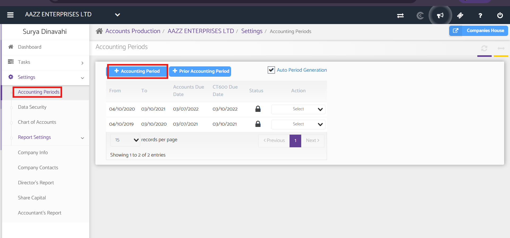
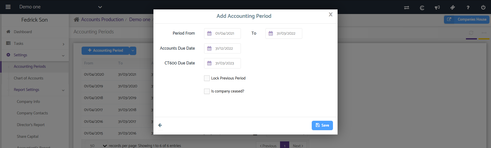

# Add Accounting Periods
	 	
			
			Print

- **Category:** Accounts Production
- **Folder:** Accounts Production Help Guide
- **Source URL:** [https://capium.freshdesk.com/support/solutions/articles/9000165483-add-accounting-periods](https://capium.freshdesk.com/support/solutions/articles/9000165483-add-accounting-periods)
- **Article ID:** 9000165483

## Content

Solution home 
		Accounts Production
		Accounts Production Help Guide

### Add Accounting Periods

			Print

	Modified on: Fri, 26 Jun, 2026 at  3:34 PM

		Navigation: Accounts Production Dashboard > Select Client > Settings > Accounting Periods 

To add a new Accounting Period, click the + Accounting Period button. 

The from and to periods show the starting and ending dates of the accounting period. The status shows whether the accounting periods are locked or unlocked. The Action drop-down allows you to delete an accounting period also you may cease a particular accounting period.

### 

### Add Accounting Period and click save

How to create prior accounting period

How to delete accounting Period

										Did you find it helpful?
								Yes
								No

Send feedback	Sorry we couldn't be helpful. Help us improve this article with your feedback.

## Screenshots & Diagrams (2)

