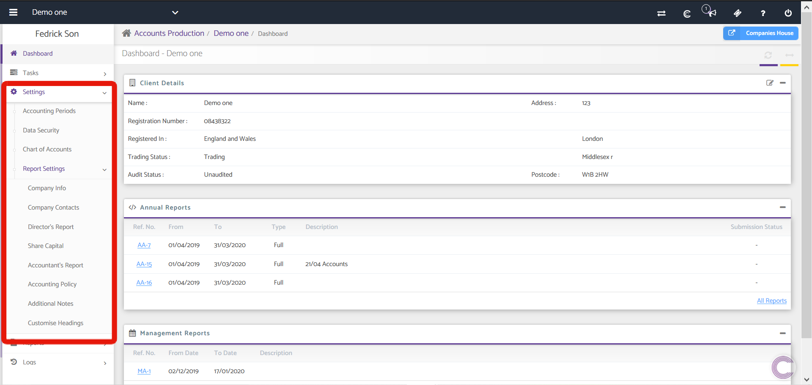

# Report Settings in Accounts
	 	
			
			Print

- **Category:** Accounts Production
- **Folder:** Accounts Production Help Guide
- **Source URL:** [https://capium.freshdesk.com/support/solutions/articles/9000165485-report-settings-in-accounts](https://capium.freshdesk.com/support/solutions/articles/9000165485-report-settings-in-accounts)
- **Article ID:** 9000165485

## Content

Solution home 
		Accounts Production
		Accounts Production Help Guide

### Report Settings in Accounts

			Print

	Modified on: Mon, 12 Oct, 2020 at  5:29 PM

		Location: Accounts Production module > Settings > Report Settings

This section gives the information about the reporting part of the company. It has different subsections which are discussed in detail below. The subsections covered are;

Company Info

Company Contacts

Director’s Report

Share Capital 

Accountant’s Report

Accounting Policy

Additional Notes

Customise Headings

Click here to watch how to hide / remove accountant report

Click here to watch how to use the rounding feature 

										Did you find it helpful?
								Yes
								No

Send feedback	Sorry we couldn't be helpful. Help us improve this article with your feedback.

## Screenshots & Diagrams (1)

