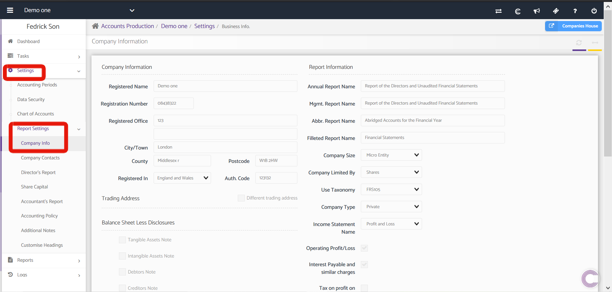

# Company Info - Accounts Production
	 	
			
			Print

- **Category:** Accounts Production
- **Folder:** Accounts Production Help Guide
- **Source URL:** [https://capium.freshdesk.com/support/solutions/articles/9000165486-company-info-accounts-production](https://capium.freshdesk.com/support/solutions/articles/9000165486-company-info-accounts-production)
- **Article ID:** 9000165486

## Content

Solution home 
		Accounts Production
		Accounts Production Help Guide

### Company Info - Accounts Production

			Print

	Modified on: Tue, 30 Jun, 2026 at  4:25 PM

		Location: Accounts Production module > Settings > Report Setting > Company Info 

### 
It is divided into two parts: Company Information and Reports Information.

### 

### Company Information

It shows the basic information of the company. Company name, registered number, registered office, address and the place where the company is registered. These details can be edited and saved.

### 

### Report Information

This shows the information related to the reporting part of the company. The heading name to be given for different categories of the report.

The type of company whether trading or dormant. In trading also whether the audit is applicable or not by selecting the appropriate options.

We have a video on How to Change Company status from Trading to Dormant- Capium, kindly go through it for a better understanding.

Click here to watch how to change wording in the accounts reports

Click here to watch how to prepare dormant accounts 

										Did you find it helpful?
								Yes
								No

Send feedback	Sorry we couldn't be helpful. Help us improve this article with your feedback.

## Screenshots & Diagrams (1)

