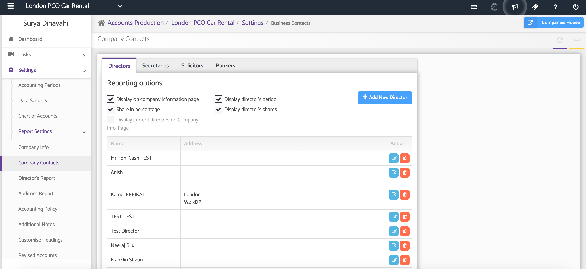
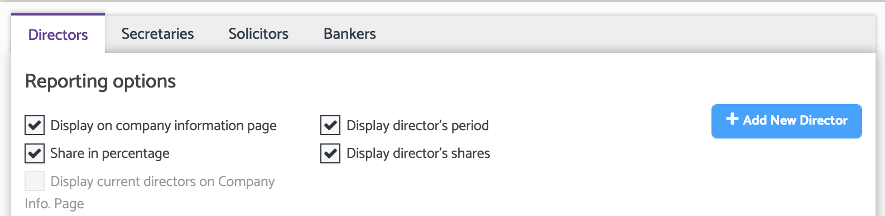

# AP: Adding Company Contacts
	 	
			
			Print

- **Category:** Accounts Production
- **Folder:** Accounts Production Help Guide
- **Source URL:** [https://capium.freshdesk.com/support/solutions/articles/9000165487-ap-adding-company-contacts](https://capium.freshdesk.com/support/solutions/articles/9000165487-ap-adding-company-contacts)
- **Article ID:** 9000165487

## Content

Solution home 
		Accounts Production
		Accounts Production Help Guide

### AP: Adding Company Contacts

			Print

	Modified on: Thu, 25 Jun, 2026 at  2:43 PM

### Overview

The Company Contacts section allows you to maintain details of individuals and organisations associated with the company. This information is used within Accounts Production reports and provides a central location for managing key company contacts.

The following contact types can be maintained within this section:

 - Directors

 - Secretaries

 - Solicitors

 - Bankers

### Navigation:

Accounts Production > Settings > Report Settings > Company Contacts

### Review Existing Contacts

Select the relevant tab to view existing contacts for the company.

Available tabs include:

 - Directors

 - Secretaries

 - Solicitors

 - Bankers

Each tab displays the contacts currently recorded for that contact type.

### Add a New Contact

To add a new contact, select the appropriate tab and click the Add New button.

Complete the required contact details and save your changes.

After entering the contact information, save the record to make it available within the Company Contacts section and related reports.

### Additional Help

### Need Help?

If you need assistance or guidance, please contact your onboarding manager or email Support@capium.com, or call us on 020 3322 5578.

### Related Articles

 - AP: Adding Company Directors

 - AP: Adding Company Secretaries 

 - Accounting Periods

										Did you find it helpful?
								Yes
								No

Send feedback	Sorry we couldn't be helpful. Help us improve this article with your feedback.

## Screenshots & Diagrams (2)

