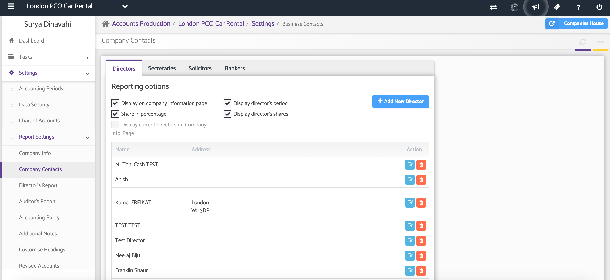
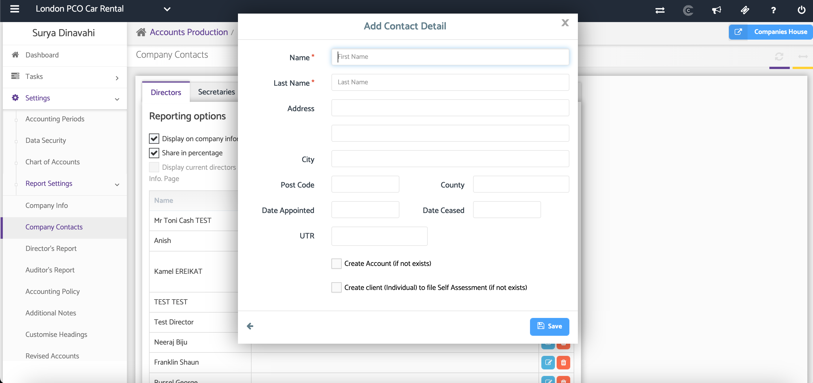
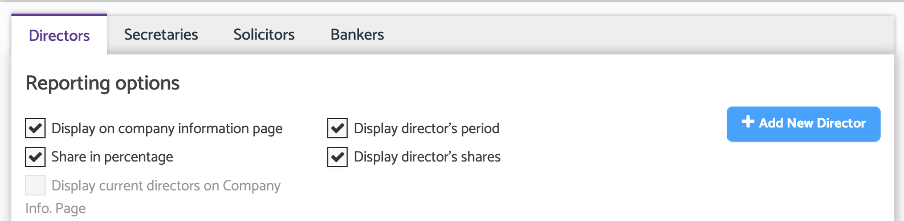

# AP: Adding Company Directors
	 	
			
			Print

- **Category:** Accounts Production
- **Folder:** Accounts Production Help Guide
- **Source URL:** [https://capium.freshdesk.com/support/solutions/articles/9000165488-ap-adding-company-directors](https://capium.freshdesk.com/support/solutions/articles/9000165488-ap-adding-company-directors)
- **Article ID:** 9000165488

## Content

Solution home 
		Accounts Production
		Accounts Production Help Guide

### AP: Adding Company Directors

			Print

	Modified on: Thu, 25 Jun, 2026 at  2:53 PM

### Overview

The Directors section allows you to add and manage company directors within Accounts Production. Director information can be maintained for reporting purposes and are displayed on the Company's Information page within the reports.

### Navigation:

Accounts Production > Settings > Report Settings > Company Contacts > Directors

### Steps and Content

### Step 1: Add a New Director

Click + Add New Director.

A Contact Details page will open where you can enter the director's information.

### Step 2: Enter Director Details

Complete the relevant director information, including the director's name and any additional details required (E.g. Address, Date of Appointment, Cease Date, UTR)

It also allows to create a new account if it does not yet exist as well as create a them as an individual in order to file for Self Assessment.

Once all information has been entered, click Save.

### Step 3: Display the Director on Company Reports and other reporting options

If you would like the director's name to appear on the Company's Information page within generated reports, select the Show on Company Information Page checkbox. See screenshot for more reporting options:

### 

### Step 4: Edit or Delete a Director

You can manage existing director records using the available actions.

 - Edit – Update the director's information.

 - Delete – Remove the director from the company records.

### Additional Help

### Need Help?

If you need assistance or guidance, please contact your onboarding manager or email Support@capium.com, or call us on 020 3322 5578.

### Related Articles

AP: Adding Company Secretaries 

AP: Adding Company Contacts

Accounting Periods

										Did you find it helpful?
								Yes
								No

Send feedback	Sorry we couldn't be helpful. Help us improve this article with your feedback.

## Screenshots & Diagrams (3)

