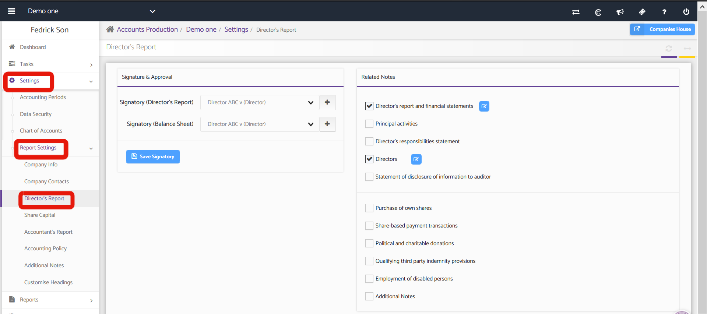

# Directors Report
	 	
			
			Print

- **Category:** Accounts Production
- **Folder:** Accounts Production Help Guide
- **Source URL:** [https://capium.freshdesk.com/support/solutions/articles/9000165493-directors-report](https://capium.freshdesk.com/support/solutions/articles/9000165493-directors-report)
- **Article ID:** 9000165493

## Content

Solution home 
		Accounts Production
		Accounts Production Help Guide

### Directors Report

			Print

	Modified on: Wed, 14 Oct, 2020 at  5:11 PM

		Location: Accounts Production module > Settings > Report Setting > Directors Report

The Directors’ Report is a document produced by the board of directors under the requirements of UK company law, which shows details of the state of the company and its compliance with a set of financial, accounting and corporate social responsibility standards.

You may select a signatory who will sign and approve the report, from the drop-down list for Directors’ Report and for Balance Sheet.

Notes are the contents that form part of the report. You may select the contents to be displayed in the report by putting a tick on the checkbox.

If any content is to be edited, then click on edit and edit the contents.

										Did you find it helpful?
								Yes
								No

Send feedback	Sorry we couldn't be helpful. Help us improve this article with your feedback.

## Screenshots & Diagrams (1)

