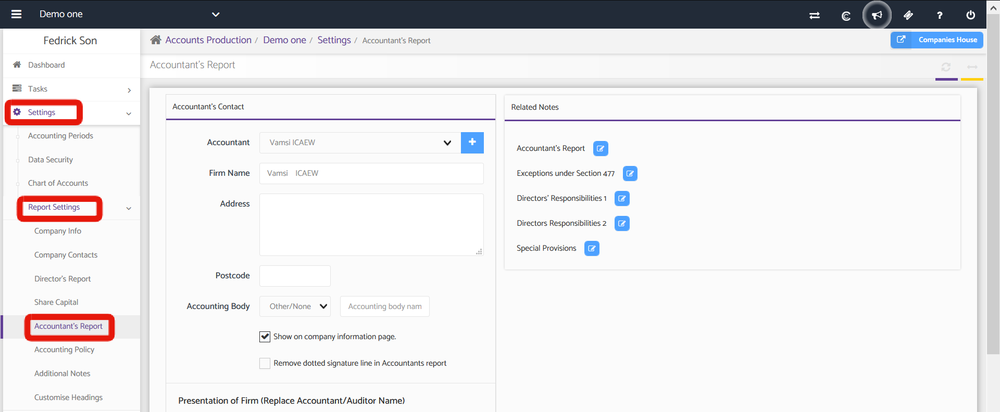

# Auditors Report
	 	
			
			Print

- **Category:** Accounts Production
- **Folder:** Accounts Production Help Guide
- **Source URL:** [https://capium.freshdesk.com/support/solutions/articles/9000165495-auditors-report](https://capium.freshdesk.com/support/solutions/articles/9000165495-auditors-report)
- **Article ID:** 9000165495

## Content

Solution home 
		Accounts Production
		Accounts Production Help Guide

### Auditors Report

			Print

	Modified on: Wed, 14 Oct, 2020 at  5:20 PM

		Location: Accounts Production module > Settings > Report Setting > Auditor’s Report

An accountant is authorised to examine accounts and accounting records, compare the charges with the vouchers, verify balance sheet and income items and state the result. This section is all about the Accountant.

https://gyazo.com/6739e070f1748149f3028ac26f77d5d9 https://gyazo.com/6739e070f1748149f3028ac26f77d5d9

Auditor’s Contact

The firm name of the accountant, address and the accounting body under which it is registered.

Presentation of Firm (Replace Accountant/Auditor Name)

Here the name of the other accountant is mentioned. If the name of the original accountant is to be replaced with other, then the respective checkbox is to be ticked where replacement is to be done.

Related Notes

Here the content of the audit report and the respective headings in reports are specified. These can be edited as required.

Click here to watch how to hide / remove accountant report

Click here to watch how to add director's emoluments in accounts reports 

										Did you find it helpful?
								Yes
								No

Send feedback	Sorry we couldn't be helpful. Help us improve this article with your feedback.

## Screenshots & Diagrams (1)

