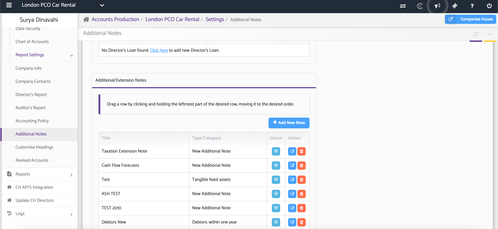
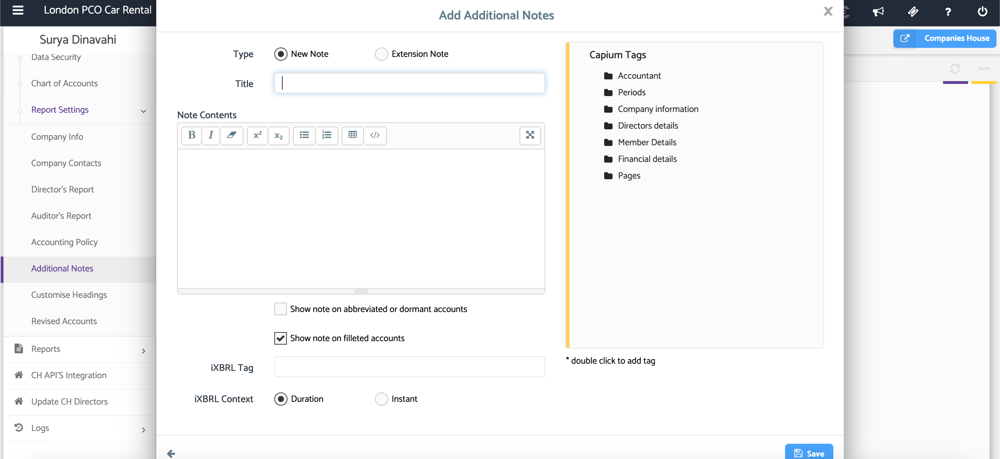

# AP: Formatting Additional Notes
	 	
			
			Print

- **Category:** Accounts Production
- **Folder:** Accounts Production Help Guide
- **Source URL:** [https://capium.freshdesk.com/support/solutions/articles/9000165498-ap-formatting-additional-notes](https://capium.freshdesk.com/support/solutions/articles/9000165498-ap-formatting-additional-notes)
- **Article ID:** 9000165498

## Content

Solution home 
		Accounts Production
		Accounts Production Help Guide

### AP: Formatting Additional Notes

			Print

	Modified on: Thu, 25 Jun, 2026 at  2:26 PM

### Overview

The Additional Notes section in Accounts Production allows you to customise report notes using a range of formatting tools. These options help improve the presentation of report content by enabling text styling, lists, tables, and enhanced editing features.

### Navigation: 

Accounts Production > Client > Settings > Report Settings > Additional Notes > Add New Note

Scroll to the bottom of the Additional Notes page and select Add New Note. This will open the note editor where you can enter and format your report note.

### Step 2: Format Your Text

The editor provides several formatting options to customise your note content:

### 

### -Bold Text:  Use Bold to emphasise important information.

### -Italic Text: Use Italic to highlight specific text.

### -Remove Formatting: Remove all applied formatting from selected text.

### -Superscript: Display characters.

### 

### Step 3: Create Lists

Use lists to organise information clearly within your notes.

### -Bulleted Lists: Create unordered lists using bullet points.

### - Numbered Lists: Create ordered lists using numbering.

### Step 4: Insert Tabular Data

Select the Insert Table option to add structured data to your note.

You can:

 - Choose the number of columns required

 - Add a totals row

 - Create custom column headings

 - Add as many rows as needed

### Step 5: Reset Default Text

Select Reset Default Text to restore the original note content.

This action removes any manual changes and returns the note to its default wording.

### Step 6: Use Full Screen Mode

Select Full Screen to expand the editor and provide a larger workspace when creating or editing notes.

Screenshot below shows the editor tool:

### Additional Help

### Need Help?

If you need assistance or guidance, please contact your onboarding manager or email Support@capium.com, or call us on 020 3322 5578.

### Related Articles

 - Onboarding Guide: Getting Started with Accounts Production

 - Charts of Accounts

 - How to prepare a set of Accounts

										Did you find it helpful?
								Yes
								No

Send feedback	Sorry we couldn't be helpful. Help us improve this article with your feedback.

## Screenshots & Diagrams (2)

