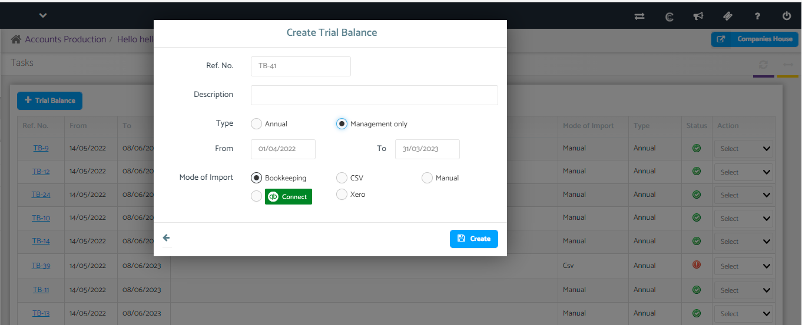
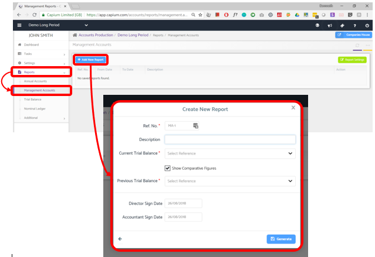
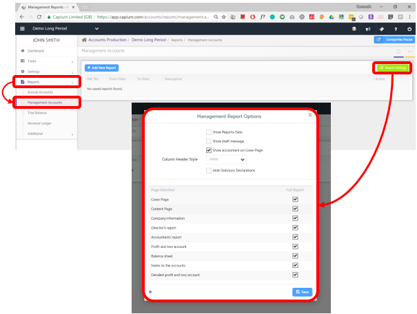

# Management Reports
	 	
			
			Print

- **Category:** Accounts Production
- **Folder:** Accounts Production Help Guide
- **Source URL:** [https://capium.freshdesk.com/support/solutions/articles/9000165500-management-reports](https://capium.freshdesk.com/support/solutions/articles/9000165500-management-reports)
- **Article ID:** 9000165500

## Content

Solution home 
		Accounts Production
		Accounts Production Help Guide

### Management Reports

			Print

	Modified on: Tue, 12 Mar, 2024 at 11:17 AM

		Location: Accounts Production module > Reports > Management Reports

 Management Report is for Management purposes only and is submitted to shareholders. It contains the report of directors, auditors, financial statements, and relevant Notes to Accounts. 

The contents to be included in the report are to be generated from the ‘Settings’ section.

To create a report first of all `Trial Balance` is to be imported or created which acts as the base for generating Financial Statements which is an important part of the report.

Trial Balance is imported from the ‘Tasks’ section and while adding the same you may select the `Type` as management only to enable the `from and to` dates as desired.

Then click on ‘+ Add New Report’ a new box appears for filling in the basic details to create a report.

Ref. No. is generated by default and can be changed as per the requirement. By default, Prefix is ‘MA’ and numbered in sequence automatically.

Name to be given to reporting (if any) can be given in the description, which will be displayed on the top of the report.

Trial Balance imported will have to be selected. If the previous year’s figures or different accounting periods are to be shown, then put a tick on the checkbox of ‘Show Comparative Figures’ and select the Trial Balance whose figures are to be compared with the current Trial balance.

Enter the Director and Accountant sign date for the report which will be shown in the report that will be generated.

Click on generate after mentioning all the fields. This will generate the report and a preview of the report will appear on the screen.

After generating the preview report is to be saved by clicking on the ‘Save Report’ tab. The report saved will be added to the list of reports on the main page of this section.

You may change the options related to reports by clicking on the Report settings button located in the upper right corner of the page. By clicking on it the following box appears:

            You may tick or untick the options, as per the requirement in the report and save it.

If any formatting part related to the report is changed or any content of the report is changed and you want to make changes in reports already generated, then you have to refresh and regenerate the trial balance and the reports respectively.

To regenerate the report, you will have to click on the Ref. Number. of the report which will generate the report preview, click on the ‘regenerate’ tab.

After regenerating, all the changes will be incorporated in the report and launches the preview again, then save the report. This will replace the old report in the list.

If the trail balance is imported from Bookkeeping you will refresh the trial balance by editing the same and regenerate the reports to see the impact in the reports

For other imports you need to create a or edit the trial balance and input the details. 

Brief descriptions about the various reports so prepared are listed. 

Ref. number of the reports clicking on which Report Preview will be generated and if any changes were made to the report the report will have to be regenerated by clicking on the ’Regenerate’ tab and `save` the report.

From and to date will be the dates which were specified and not the date of the trial balance.

Description of the report i.e. name of the report to be given.

Actions that can be taken related to reports:

Delete: This will delete the report permanently.

Download as PDF: Report will be downloaded in PDF form.

										Did you find it helpful?
								Yes
								No

Send feedback	Sorry we couldn't be helpful. Help us improve this article with your feedback.

## Screenshots & Diagrams (3)

