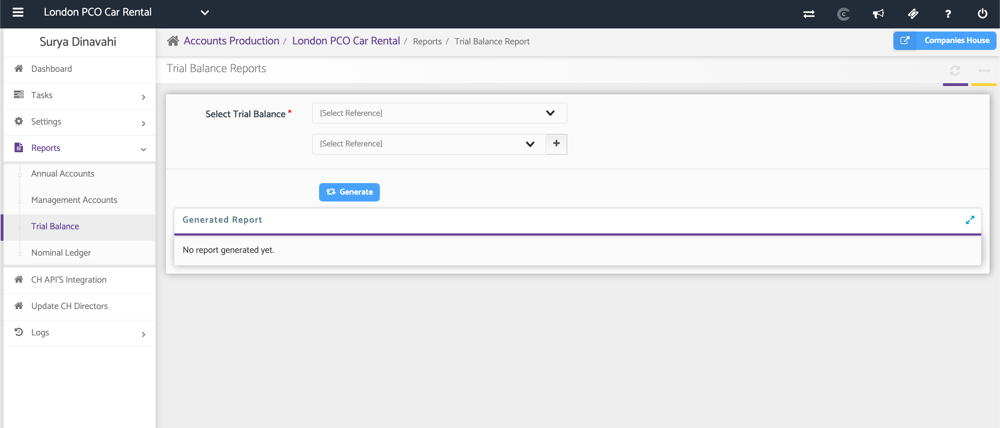
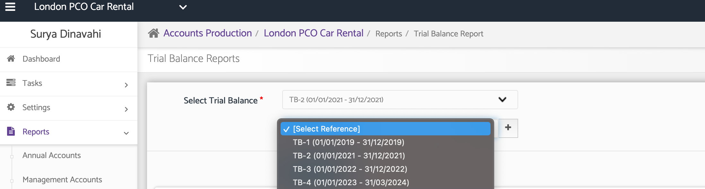
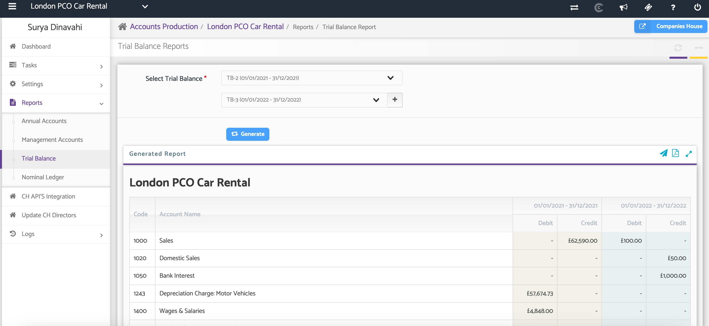
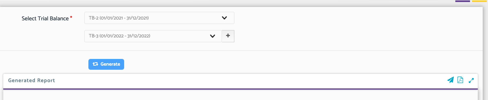

# AP: Comparative Trial Balance
	 	
			
			Print

- **Category:** Accounts Production
- **Folder:** Accounts Production Help Guide
- **Source URL:** [https://capium.freshdesk.com/support/solutions/articles/9000165501-ap-comparative-trial-balance](https://capium.freshdesk.com/support/solutions/articles/9000165501-ap-comparative-trial-balance)
- **Article ID:** 9000165501

## Content

Solution home 
		Accounts Production
		Accounts Production Help Guide

### AP: Comparative Trial Balance

			Print

	Modified on: Thu, 25 Jun, 2026 at  4:10 PM

### Overview

The Comparative Trial Balance report allows you to compare Trial Balances across different accounting periods. This helps you analyse changes in account balances over time and identify variances between reporting periods.

The report uses Trial Balances that have been previously imported into the Accounts Production module.

### Navigation: 

Accounts Production > Reports > Trial Balance

### Step 1: Select the Trial Balances to Compare

Use the drop-down lists to select the required the periods for both Trial balances:

Note: The list will include the Trial Balances that have been already been imported/added under Tasks.

### 

Once all required Trial Balances have been selected, click Generate.

The system will generate the Comparative Trial Balance report, allowing you to review and compare balances across the selected periods.

### Downloading and Sharing the Report

After the report has been generated, you can download it as a PDF for review, sharing, or record-keeping purposes. You can also share the report via email using the email Icon. Please note that you can create email templates for your reports as well as password protect the documents. 

### Additional Help

### Need Help?

If you need assistance or guidance, please contact your onboarding manager or email Support@capium.com, or call us on 020 3322 5578.

### Related Articles

 - How to add Trial Balance

 - Trial Balance Automated Mapping from Xero and QuickBooks

 - How to add journal entries?

										Did you find it helpful?
								Yes
								No

Send feedback	Sorry we couldn't be helpful. Help us improve this article with your feedback.

## Screenshots & Diagrams (4)

