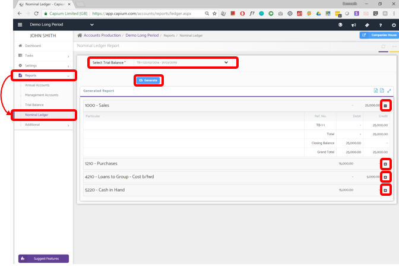

# Nominal Ledger
	 	
			
			Print

- **Category:** Accounts Production
- **Folder:** Accounts Production Help Guide
- **Source URL:** [https://capium.freshdesk.com/support/solutions/articles/9000165502-nominal-ledger](https://capium.freshdesk.com/support/solutions/articles/9000165502-nominal-ledger)
- **Article ID:** 9000165502

## Content

Solution home 
		Accounts Production
		Accounts Production Help Guide

### Nominal Ledger

			Print

	Modified on: Mon, 25 Mar, 2019 at  5:02 PM

		Location: Accounts Production module > Reports > Nominal Ledger

Nominal Ledger is a book or file that contains all of the transactions related to the company’s accounts. It is also referred to as the main area where all the accounting transactions are held. 

The nominal ledger contains the complete set of accounting records which makes sure that for every debit entry there is a credit entry which leads to the balancing of books. 

To see a Nominal Ledger Report you need to select the Trial Balance from the dropdown and click on ‘Generate’ button a Nominal Ledger Report will be generated.

Click here to watch how to make nominal codes active / inactive

										Did you find it helpful?
								Yes
								No

Send feedback	Sorry we couldn't be helpful. Help us improve this article with your feedback.

## Screenshots & Diagrams (1)

