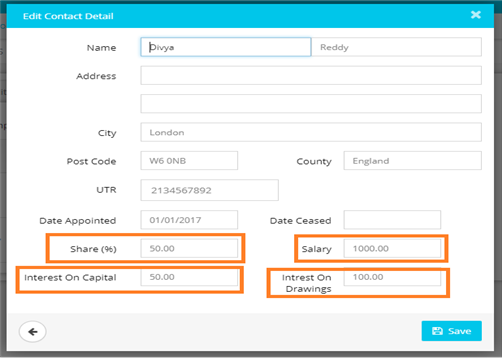
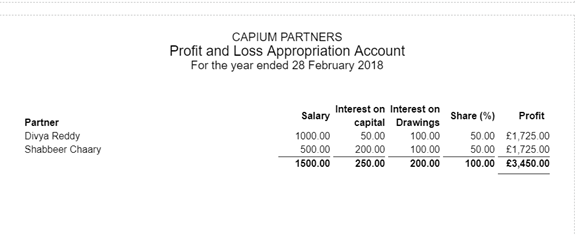

# Profit and Loss Appropriation Account
	 	
			
			Print

- **Category:** Accounts Production
- **Folder:** Accounts Production Help Guide
- **Source URL:** [https://capium.freshdesk.com/support/solutions/articles/9000165503-profit-and-loss-appropriation-account](https://capium.freshdesk.com/support/solutions/articles/9000165503-profit-and-loss-appropriation-account)
- **Article ID:** 9000165503

## Content

Solution home 
		Accounts Production
		Accounts Production Help Guide

### Profit and Loss Appropriation Account

			Print

	Modified on: Mon, 25 Mar, 2019 at 10:24 AM

		Location : Accounts Production >> Partnership Accounts >> Settings>>Business Contacts

Refer to the Link

While adding the Partner(s) information under business contacts, you can also update the details on areas such as - Share %, Salary, Interest On Capital and Interest On Drawings.

Once you update the relevant details, you will see them under the Profit and Loss Appropriation account in the accounts report as below.

Please refer below video for more information.

Click here to watch a video on the Profit and Loss Appropriation Account

										Did you find it helpful?
								Yes
								No

Send feedback	Sorry we couldn't be helpful. Help us improve this article with your feedback.

## Screenshots & Diagrams (2)

