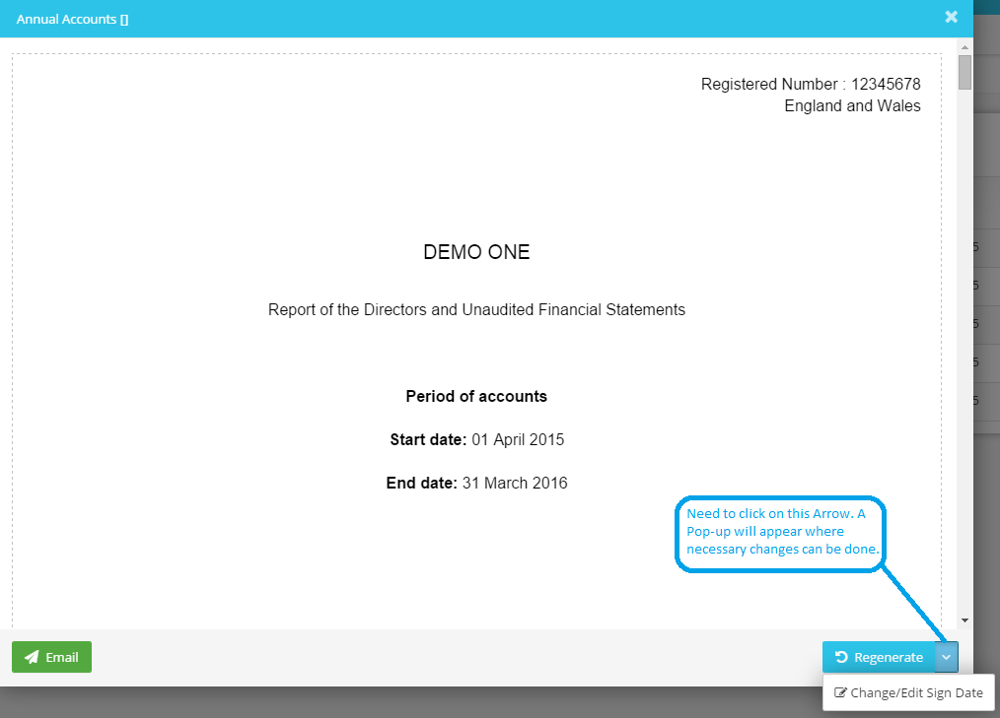

# How do I change/remove the sign date of accounts?
	 	
			
			Print

- **Category:** Accounts Production
- **Folder:** Accounts Production FAQs
- **Source URL:** [https://capium.freshdesk.com/support/solutions/articles/9000165535-how-do-i-change-remove-the-sign-date-of-accounts-](https://capium.freshdesk.com/support/solutions/articles/9000165535-how-do-i-change-remove-the-sign-date-of-accounts-)
- **Article ID:** 9000165535

## Content

Solution home 
		Accounts Production
		Accounts Production FAQs

### How do I change/remove the sign date of accounts?

			Print

	Modified on: Thu, 12 Aug, 2021 at 11:58 AM

		To change the approval date of accounts you need to navigate to Accounts Production >> Reports >> Annual Accounts >> Click on the Reference no of the particular report and a Pop-Up will appear. 

You need to click on the down arrow button near Regenerate and a New Pop-Up will appear where the desired changes can be made.

Please refer below screenshot for more help.

Please click here to find out how to regenerate the accounts

										Did you find it helpful?
								Yes
								No

Send feedback	Sorry we couldn't be helpful. Help us improve this article with your feedback.

## Screenshots & Diagrams (1)

