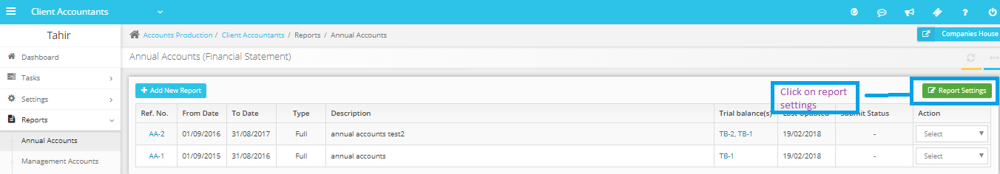
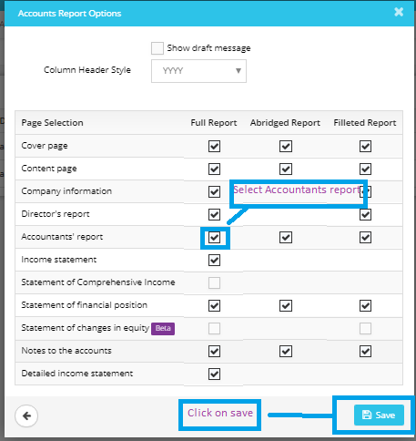

# &#39;Accountants or Auditors report&#39; must be attached with selected Accounts Report
	 	
			
			Print

- **Category:** Accounts Production
- **Folder:** Accounts Production FAQs
- **Source URL:** [https://capium.freshdesk.com/support/solutions/articles/9000165539--accountants-or-auditors-report-must-be-attached-with-selected-accounts-report](https://capium.freshdesk.com/support/solutions/articles/9000165539--accountants-or-auditors-report-must-be-attached-with-selected-accounts-report)
- **Article ID:** 9000165539

## Content

Solution home 
		Accounts Production
		Accounts Production FAQs

### &#39;Accountants or Auditors report&#39; must be attached with selected Accounts Report

			Print

	Modified on: Mon, 25 Mar, 2019 at  5:50 PM

		 - Please navigate to Accounts production>>Reports>>Annual Accounts>>Report Settings, select Accountant’s report and save.

Refer to the link

Once done, please regenerate the Accounts Report to see the impact.

Please refer below screenshot for more help.

 - 

 - 

 - 

Click here to watch how to hide / remove accountant report

Click here to watch how to add director's emoluments in accounts reports 

Click here to watch how to regenerate accounts

										Did you find it helpful?
								Yes
								No

Send feedback	Sorry we couldn't be helpful. Help us improve this article with your feedback.

## Screenshots & Diagrams (3)

