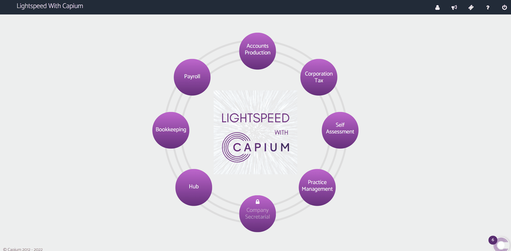
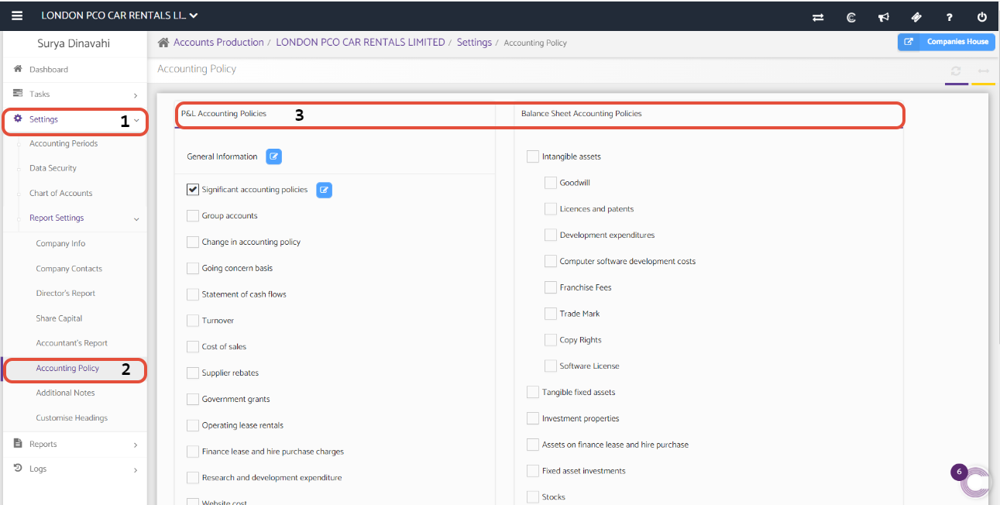
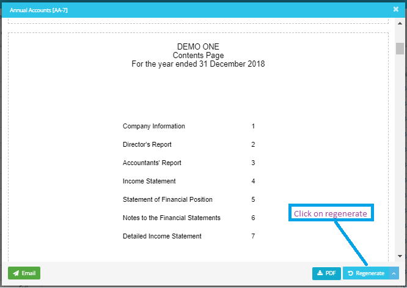

# Warning message related to Accounting Policy while generating the reports
	 	
			
			Print

- **Category:** Accounts Production
- **Folder:** Accounts Production FAQs
- **Source URL:** [https://capium.freshdesk.com/support/solutions/articles/9000165541-warning-message-related-to-accounting-policy-while-generating-the-reports](https://capium.freshdesk.com/support/solutions/articles/9000165541-warning-message-related-to-accounting-policy-while-generating-the-reports)
- **Article ID:** 9000165541

## Content

Solution home 
		Accounts Production
		Accounts Production FAQs

### Warning message related to Accounting Policy while generating the reports

			Print

	Modified on: Tue, 4 Jan, 2022 at  4:19 PM

		The message relating to accounting policies is a warning message (which can be skipped). The message is to inform you that some of the accounting policies have not been selected. Some nominal codes might be flagged in conjunction to this warning. 

In case if you want to disclose these details, you may select the and add relevant accounting policies. You can follow this link to the page. Or follow the below navigation to make the changes. 

Navigation: Accounts Production >> Select Client >> Settings >> Report Settings >> Accounting Policy 

This can be seen in the video and the screenshots below. 

Once you follow that navigation, please select the policies as per the requirements. Follow the clicks 1 & 2 and you can select policies from box 3.

Please note that you will need to regenerate the accounts report to see the impact, as illustrated below. 

										Did you find it helpful?
								Yes
								No

Send feedback	Sorry we couldn't be helpful. Help us improve this article with your feedback.

## Screenshots & Diagrams (3)

