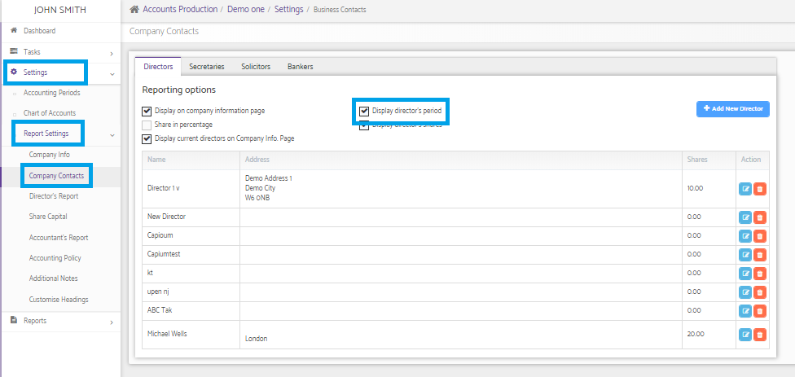

# How to display the Director’s joining date and leaving date in the accounts report?
	 	
			
			Print

- **Category:** Accounts Production
- **Folder:** Accounts Production FAQs
- **Source URL:** [https://capium.freshdesk.com/support/solutions/articles/9000165546-how-to-display-the-director-s-joining-date-and-leaving-date-in-the-accounts-report-](https://capium.freshdesk.com/support/solutions/articles/9000165546-how-to-display-the-director-s-joining-date-and-leaving-date-in-the-accounts-report-)
- **Article ID:** 9000165546

## Content

Solution home 
		Accounts Production
		Accounts Production FAQs

### How to display the Director’s joining date and leaving date in the accounts report?

			Print

	Modified on: Mon, 25 Mar, 2019 at  5:53 PM

		Please follow the below link and select the “Display director's period” and regenerate the accounts to see the impact.

Please refer below screenshot for more help.

Click here to watch how to regenerate accounts

Click here to watch how to display a director's joining / leaving date

										Did you find it helpful?
								Yes
								No

Send feedback	Sorry we couldn't be helpful. Help us improve this article with your feedback.

## Screenshots & Diagrams (1)

