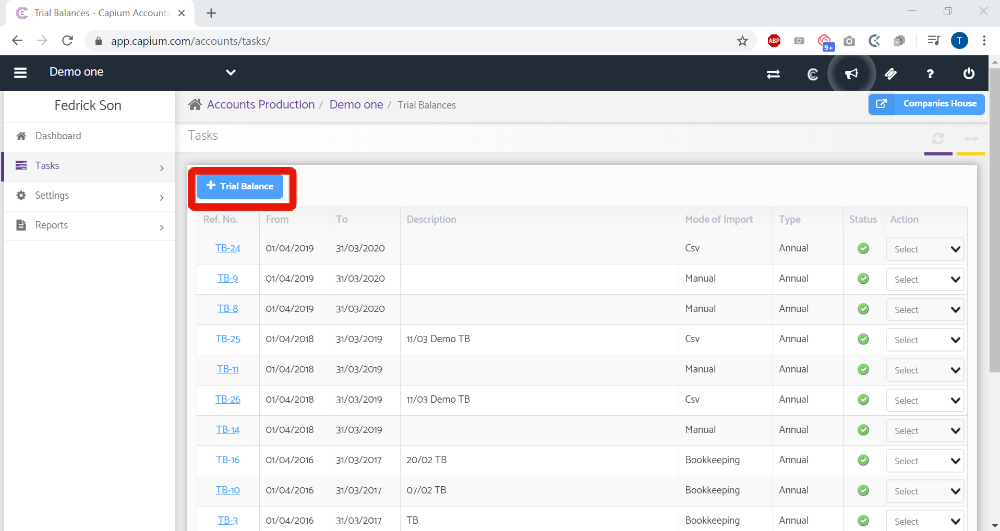
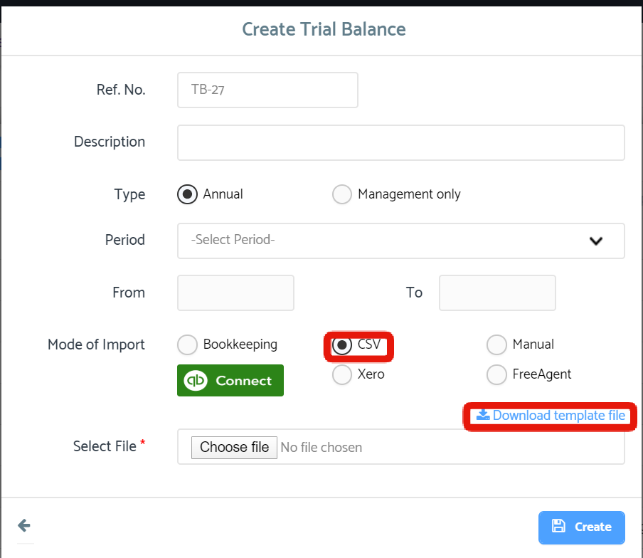
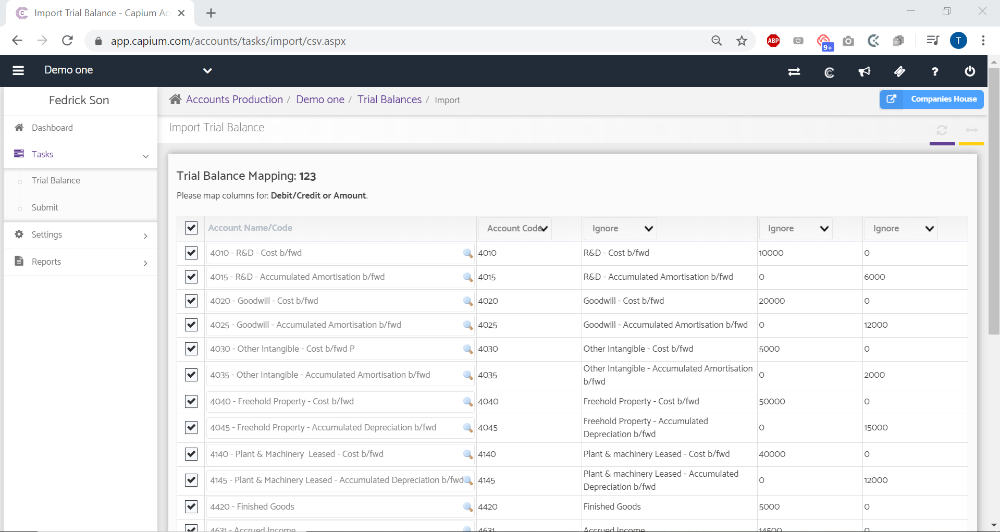

# How to import a Trial Balance using a CSV file?
	 	
			
			Print

- **Category:** Accounts Production
- **Folder:** Accounts Production FAQs
- **Source URL:** [https://capium.freshdesk.com/support/solutions/articles/9000165549-how-to-import-a-trial-balance-using-a-csv-file-](https://capium.freshdesk.com/support/solutions/articles/9000165549-how-to-import-a-trial-balance-using-a-csv-file-)
- **Article ID:** 9000165549

## Content

Solution home 
		Accounts Production
		Accounts Production FAQs

### How to import a Trial Balance using a CSV file?

			Print

	Modified on: Thu, 12 Aug, 2021 at 12:02 PM

		The Trial Balance can be imported in CSV format into Capium Accounts Production by following the below navigation.

Refer to the link

Accounts Production>>Select the Client >>Tasks>>Trial Balance>> +Trial Balance (Blue Button) and then choose the Mode of Import as CSV.

Upon choosing CSV as your mode of Import, you will be prompted to Download the Template file which you can use to populate with your transactions.

Before downloading the template, we recommend exporting the Capium default Chart of Accounts (COA) to use as reference when populating the template file. You can access the COA here.

After importing the Trial Balance using the 'Create' button, you will need finalise the mapping in the below screen, then click confirm to complete the Import.

										Did you find it helpful?
								Yes
								No

Send feedback	Sorry we couldn't be helpful. Help us improve this article with your feedback.

## Screenshots & Diagrams (3)

