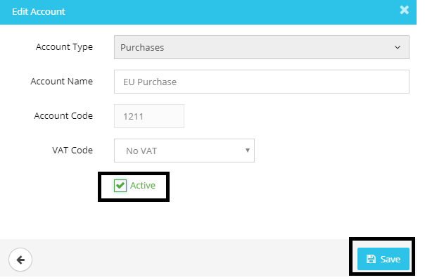

# Nominal Code disappeared while updating the Trial Balance
	 	
			
			Print

- **Category:** Accounts Production
- **Folder:** Accounts Production FAQs
- **Source URL:** [https://capium.freshdesk.com/support/solutions/articles/9000165550-nominal-code-disappeared-while-updating-the-trial-balance](https://capium.freshdesk.com/support/solutions/articles/9000165550-nominal-code-disappeared-while-updating-the-trial-balance)
- **Article ID:** 9000165550

## Content

Solution home 
		Accounts Production
		Accounts Production FAQs

### Nominal Code disappeared while updating the Trial Balance

			Print

	Modified on: Mon, 25 Mar, 2019 at  5:01 PM

		This generally happens when the account code is deactivated. You may activate the accounting code under Settings>>Chart of Accounts, filter the status with Archived, select Edit under the Action drop-down related to the account and activate the account.

Please refer below screenshot for more help.

Click here to watch how to make nominal codes active / inactive

										Did you find it helpful?
								Yes
								No

Send feedback	Sorry we couldn't be helpful. Help us improve this article with your feedback.

## Screenshots & Diagrams (1)

