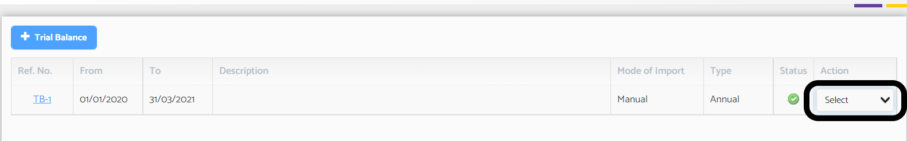
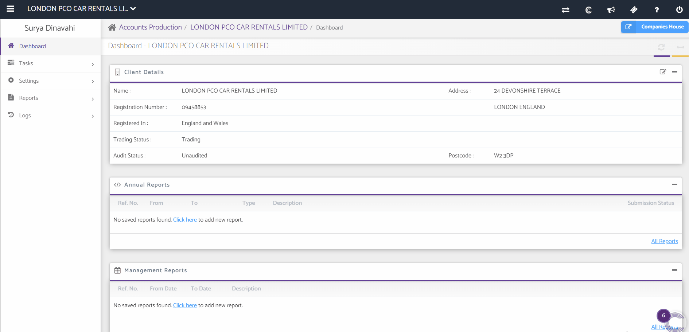

# How to add Journals in Trial Balance?
	 	
			
			Print

- **Category:** Accounts Production
- **Folder:** Accounts Production FAQs
- **Source URL:** [https://capium.freshdesk.com/support/solutions/articles/9000165552-how-to-add-journals-in-trial-balance-](https://capium.freshdesk.com/support/solutions/articles/9000165552-how-to-add-journals-in-trial-balance-)
- **Article ID:** 9000165552

## Content

Solution home 
		Accounts Production
		Accounts Production FAQs

### How to add Journals in Trial Balance?

			Print

	Modified on: Tue, 28 Jun, 2022 at  5:24 PM

		Navigation : Accounts Production >>Client>> Tasks >> Trial Balance >> Action >> Edit >> Add New Journal

Alternatively please refer to this link. which will redirect you to the page 

To add a journal entry please follow the above navigation:

You may simply edit the Trial balance which you created manually or uploaded through QuickBooks, Xero and a CSV file by click on edit from the action dropdown on the right.

On the next page click on the "+Add New Journal" button.

Please refer below video for more help.

If you are importing the data from Capium’s Bookkeeping module directly, then you will have to make the journal entries in the bookkeeping module. 

After preforming the edits in bookkeeping head back to Accounts Production and your Trial Balance. Click edit from action dropdown on the right. Then click refresh at the bottom of the page.

After this your changes will reflect.

										Did you find it helpful?
								Yes
								No

Send feedback	Sorry we couldn't be helpful. Help us improve this article with your feedback.

## Screenshots & Diagrams (3)

