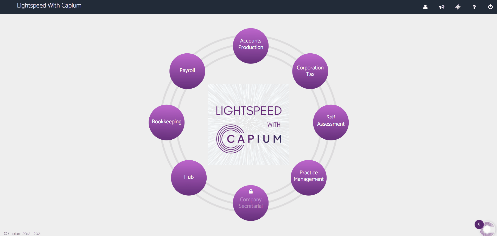
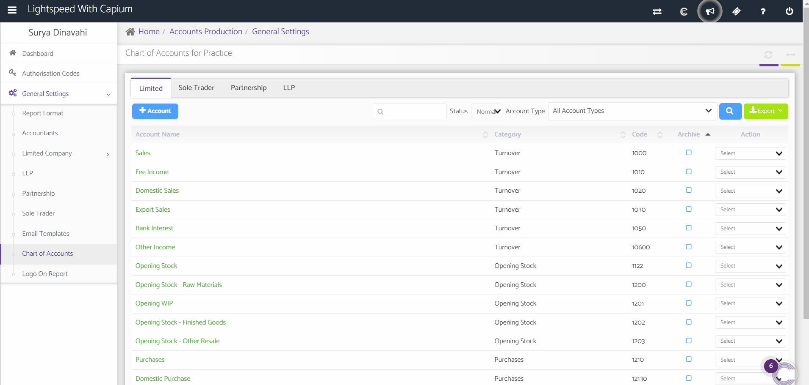
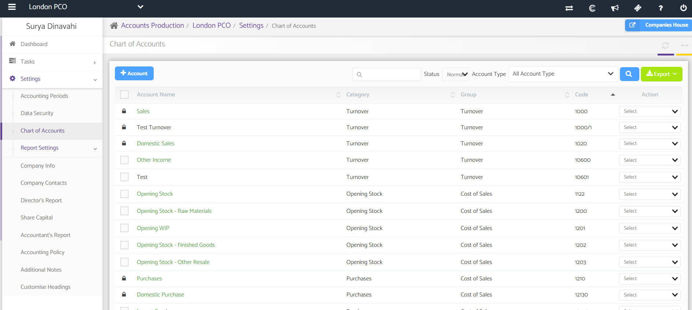

# How to edit chart of accounts code globally?
	 	
			
			Print

- **Category:** Accounts Production
- **Folder:** Accounts Production FAQs
- **Source URL:** [https://capium.freshdesk.com/support/solutions/articles/9000165559-how-to-edit-chart-of-accounts-code-globally-](https://capium.freshdesk.com/support/solutions/articles/9000165559-how-to-edit-chart-of-accounts-code-globally-)
- **Article ID:** 9000165559

## Content

Solution home 
		Accounts Production
		Accounts Production FAQs

### How to edit chart of accounts code globally?

			Print

	Modified on: Tue, 25 Jun, 2024 at  3:41 PM

		This article explains how to edit your Chart of Accounts globally (for all companies) in Accounts Production. 

Please note that you can have different charts of accounts for Limited Companies, Sole Traders, Partnerships, and LLPs.

Navigation: Accounts Production >> General Settings >> Chart of Accounts

Once you navigate to General Setting and then Chart of Accounts. You will see the chart of accounts per each category. 

You can add new accounts to each category as shown below. You can also edit the pre-existing accounts using the action drop down menu as illustrated below. 

Alternatively you can also follow the below link where you can add the desired account for all the clients in one go at a global level.

Refer to the link

Note: The bulk upload here works for P&L and for Balance Sheet it needs to be done individually for each company.

To do this:

Accounts Production > Select specific client > Settings > COA > +Add Account

										Did you find it helpful?
								Yes
								No

Send feedback	Sorry we couldn't be helpful. Help us improve this article with your feedback.

## Screenshots & Diagrams (3)

