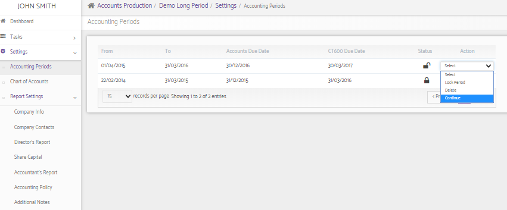

# Why is there no option to add the new Accounting period?
	 	
			
			Print

- **Category:** Accounts Production
- **Folder:** Accounts Production FAQs
- **Source URL:** [https://capium.freshdesk.com/support/solutions/articles/9000165560-why-is-there-no-option-to-add-the-new-accounting-period-](https://capium.freshdesk.com/support/solutions/articles/9000165560-why-is-there-no-option-to-add-the-new-accounting-period-)
- **Article ID:** 9000165560

## Content

Solution home 
		Accounts Production
		Accounts Production FAQs

### Why is there no option to add the new Accounting period?

			Print

	Modified on: Mon, 25 Mar, 2019 at  4:17 PM

		This happens when the option "Is company ceased?" is selected while generating a new accounting period. 

You may click on the "Continue" option from the action drop-down to add a new accounting period as desired.

Please refer below screenshot for more help.

Click here to watch how to add a prior accounting period

										Did you find it helpful?
								Yes
								No

Send feedback	Sorry we couldn't be helpful. Help us improve this article with your feedback.

## Screenshots & Diagrams (1)

