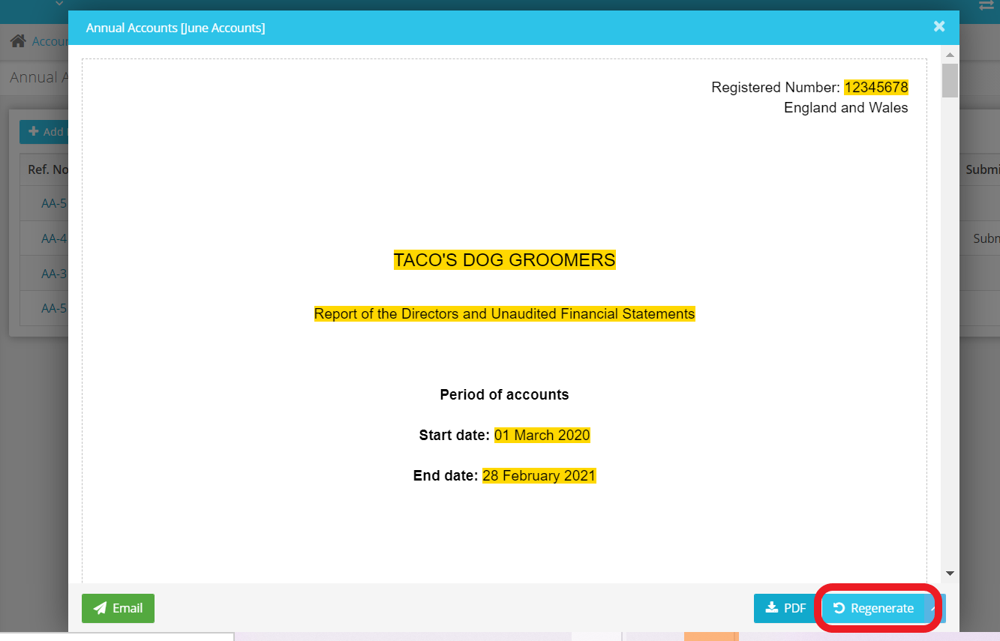

# I&#39;ve made a change in the account settings but it is not showing in the accounts? How do I regenerate accounts?
	 	
			
			Print

- **Category:** Accounts Production
- **Folder:** Accounts Production FAQs
- **Source URL:** [https://capium.freshdesk.com/support/solutions/articles/9000165628-i-ve-made-a-change-in-the-account-settings-but-it-is-not-showing-in-the-accounts-how-do-i-regenerate](https://capium.freshdesk.com/support/solutions/articles/9000165628-i-ve-made-a-change-in-the-account-settings-but-it-is-not-showing-in-the-accounts-how-do-i-regenerate)
- **Article ID:** 9000165628

## Content

Solution home 
		Accounts Production
		Accounts Production FAQs

### I&#39;ve made a change in the account settings but it is not showing in the accounts? How do I regenerate accounts?

			Print

	Modified on: Thu, 12 Aug, 2021 at 11:56 AM

		Navigation: Accounts Production > Select Client > Reports > Annual Accounts > Select accounts

Click here to watch how to regenerate accounts

Help/Guide: 

If you have created your accounts, then you realised you want to change a figure in the TB or add more information in the notes, this will not auto change your accounts

Please make the edit in the Tasks/Settings area

The go to your annual accounts screen click to bring up the accounts, then click regenerate at the bottom of the page

No edits will show until this button is clicked

After you have submitted your accounts to Companies House you will no longer be able to regenerate the accounts

Click to find out how to change the signing date of the accounts

										Did you find it helpful?
								Yes
								No

Send feedback	Sorry we couldn't be helpful. Help us improve this article with your feedback.

## Screenshots & Diagrams (1)

