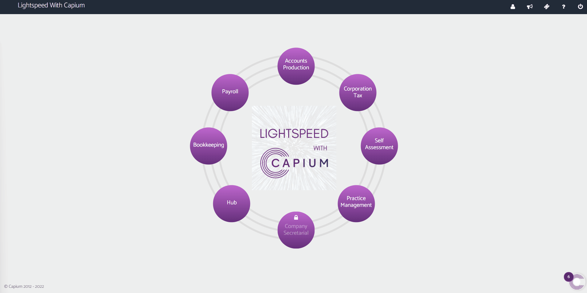
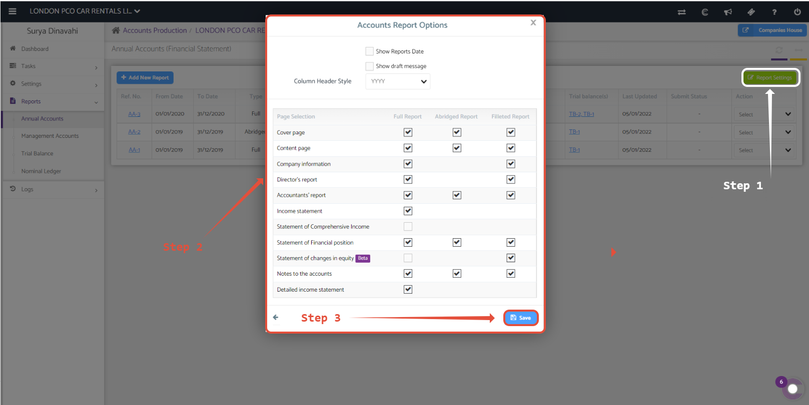

# How to remove a section from annual accounts reports
	 	
			
			Print

- **Category:** Accounts Production
- **Folder:** Accounts Production Help Guide
- **Source URL:** [https://capium.freshdesk.com/support/solutions/articles/9000165636-how-to-remove-a-section-from-annual-accounts-reports](https://capium.freshdesk.com/support/solutions/articles/9000165636-how-to-remove-a-section-from-annual-accounts-reports)
- **Article ID:** 9000165636

## Content

Solution home 
		Accounts Production
		Accounts Production Help Guide

### How to remove a section from annual accounts reports

			Print

	Modified on: Wed, 5 Jan, 2022 at  5:05 PM

		You can add/remove sections in the annual accounts reports by selecting it from accounts report settings. Click this link or follow the navigation as shown below. 
Navigation: Accounts Production >> Reports >> Annual Accounts >> Report Settings >> Accounts Report Options >> Select/Deselect >> Save

Once you click on report settings a pop up will appear prompting you to select/deselect areas as per your requirements. 

Once completed save the changes as illustrated below. 

Please note that you need to regenerate your accounts for the changes to reflect. 

Click here to watch how to add / remove a component from annual reports 

										Did you find it helpful?
								Yes
								No

Send feedback	Sorry we couldn't be helpful. Help us improve this article with your feedback.

## Screenshots & Diagrams (2)

