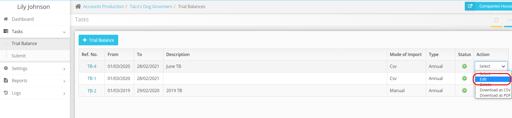
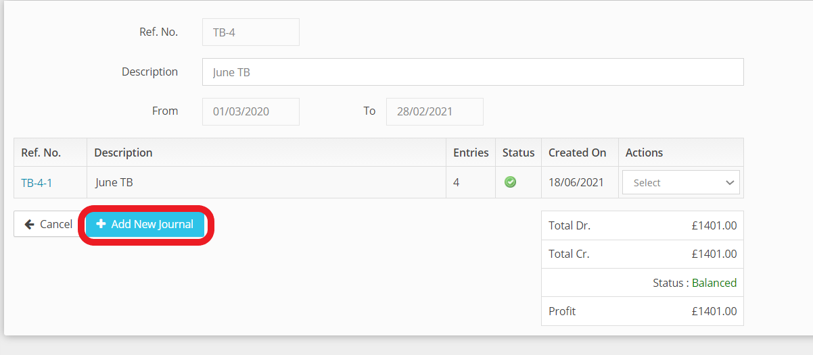
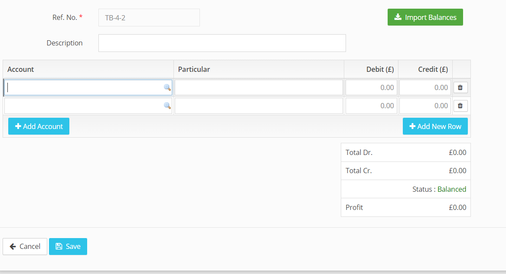
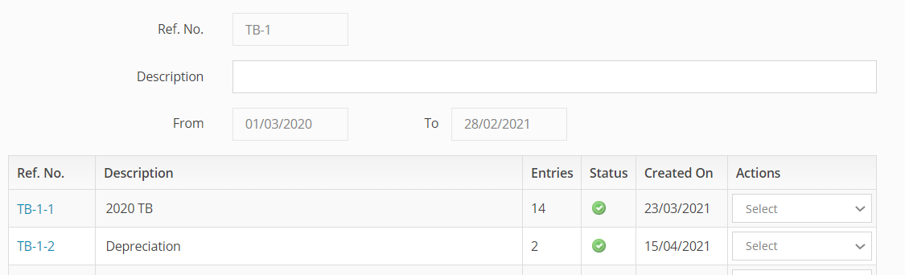

# How to add journal entries?
	 	
			
			Print

- **Category:** Accounts Production
- **Folder:** Accounts Production FAQs
- **Source URL:** [https://capium.freshdesk.com/support/solutions/articles/9000165639-how-to-add-journal-entries-](https://capium.freshdesk.com/support/solutions/articles/9000165639-how-to-add-journal-entries-)
- **Article ID:** 9000165639

## Content

Solution home 
		Accounts Production
		Accounts Production FAQs

### How to add journal entries?

			Print

	Modified on: Tue, 28 Jun, 2022 at  5:25 PM

		Navigation: Accounts Production > Select Client > Tasks > Trial Balance 

Help/Guide: 

Please click here to find out how to create a Trial Balance

Please click edit under action dropdown and a TB created from CSV, Xero, QuickBooks or Manually

If you have imported from Bookkeeping please add the journal into bookkeeping then regenerate the TB

It will then take you to this screen

Please click + Add New Journal

It will take you to this screen to add a manual journal

Once you click Save 

the TB homepage will look like this

										Did you find it helpful?
								Yes
								No

Send feedback	Sorry we couldn't be helpful. Help us improve this article with your feedback.

## Screenshots & Diagrams (4)

