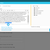
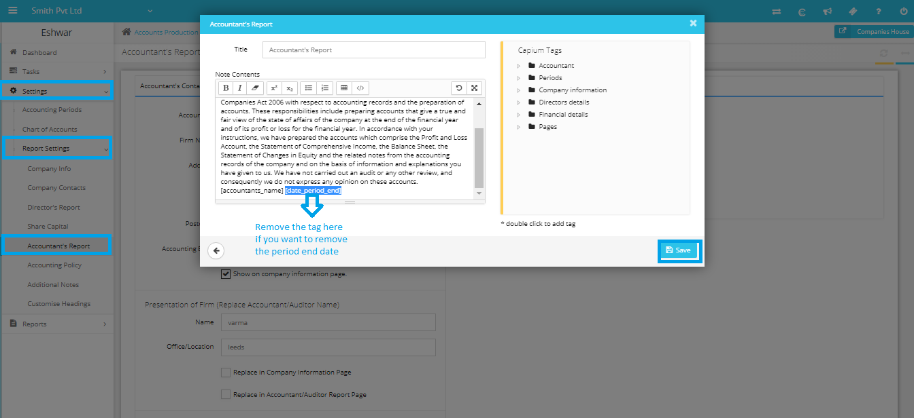

# There is a date on the accountants report at the bottom. How do we change this?
	 	
			
			Print

- **Category:** Accounts Production
- **Folder:** Accounts Production FAQs
- **Source URL:** [https://capium.freshdesk.com/support/solutions/articles/9000165800-there-is-a-date-on-the-accountants-report-at-the-bottom-how-do-we-change-this-](https://capium.freshdesk.com/support/solutions/articles/9000165800-there-is-a-date-on-the-accountants-report-at-the-bottom-how-do-we-change-this-)
- **Article ID:** 9000165800

## Content

Solution home 
		Accounts Production
		Accounts Production FAQs

### There is a date on the accountants report at the bottom. How do we change this?

			Print

	Modified on: Wed, 27 Mar, 2019 at  1:50 PM

		To remove the year end date tag in the Accountant's report, you may please navigate to Accounts Production >> Settings >> General Settings >> Accountant's Report >> Related Notes >> Click on Edit option for Accountant's Report >> Remove the period tag at the bottom of the note content (refer attached) >> Click on save >> Regenerate the accounts reports. 

		Accountant's... (61.8 KB) 

										Did you find it helpful?
								Yes
								No

Send feedback	Sorry we couldn't be helpful. Help us improve this article with your feedback.

## Screenshots & Diagrams (2)

