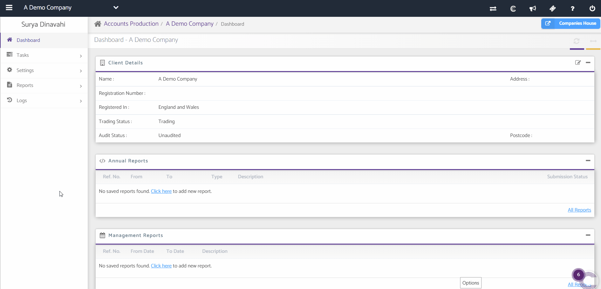

# How to add a related party in accounts
	 	
			
			Print

- **Category:** Accounts Production
- **Folder:** Accounts Production FAQs
- **Source URL:** [https://capium.freshdesk.com/support/solutions/articles/9000171486-how-to-add-a-related-party-in-accounts](https://capium.freshdesk.com/support/solutions/articles/9000171486-how-to-add-a-related-party-in-accounts)
- **Article ID:** 9000171486

## Content

Solution home 
		Accounts Production
		Accounts Production FAQs

### How to add a related party in accounts

			Print

	Modified on: Thu, 23 Dec, 2021 at  2:46 PM

		Navigation : Accounts Production >>Settings >> Report Settings >> Additional Notes

Refer to link

Scroll down through the page, click on 'Add New Party' a Pop-Up will appear. 

Refer to the video below.

Once added you can edit or remove the related parties from the action menu on the right hand side of each party. 

										Did you find it helpful?
								Yes
								No

Send feedback	Sorry we couldn't be helpful. Help us improve this article with your feedback.

## Screenshots & Diagrams (1)

