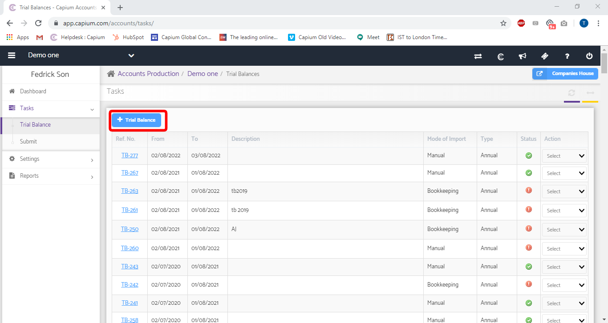
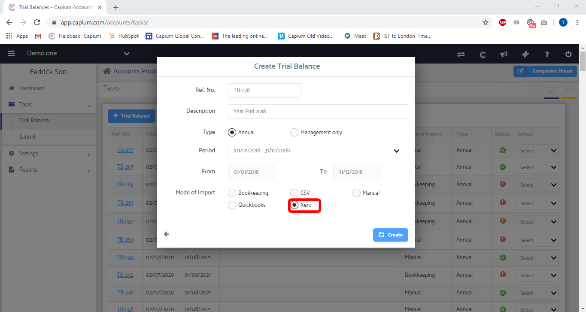

# How to Import a Trial Balance from Xero 
	 	
			
			Print

- **Category:** Accounts Production
- **Folder:** Accounts Production Help Guide
- **Source URL:** [https://capium.freshdesk.com/support/solutions/articles/9000174314-how-to-import-a-trial-balance-from-xero-](https://capium.freshdesk.com/support/solutions/articles/9000174314-how-to-import-a-trial-balance-from-xero-)
- **Article ID:** 9000174314

## Content

Solution home 
		Accounts Production
		Accounts Production Help Guide

### How to Import a Trial Balance from Xero 

			Print

	Modified on: Fri, 16 Jul, 2021 at  3:34 PM

		Location: Accounts Production > Tasks > Trial Balance > Mode of Import: Xero 

Refer to the link

Please click here to find out about Xero automapping

Help/Guide:

Once in Accounts production, navigate to a client workspace. Once there, head to Tasks > Trial Balance and click the + icon to create a new Trial Balance.

Next, enter a description, choose between Annual/Management, choose the Accounting Period and tick Xero for the mode of import. Once you click 'create' you will be redirected to Xero, where you will need to enter your credentials and select a company to import from. 

The final step is to map the entries to Capium's Chart of Accounts. If a particular code isn't available in Capium, use the '+Add Account' option to create a new account.

Click here to watch how to Import a Trial Balance from Xero

										Did you find it helpful?
								Yes
								No

Send feedback	Sorry we couldn't be helpful. Help us improve this article with your feedback.

## Screenshots & Diagrams (3)

