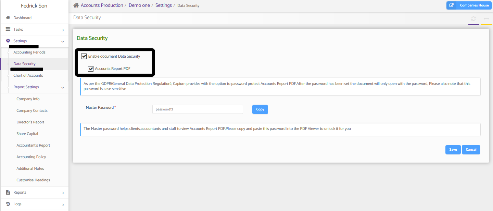

# Document Password Protection - Accounts Production
	 	
			
			Print

- **Category:** Accounts Production
- **Folder:** Accounts Production Help Guide
- **Source URL:** [https://capium.freshdesk.com/support/solutions/articles/9000191275-document-password-protection-accounts-production](https://capium.freshdesk.com/support/solutions/articles/9000191275-document-password-protection-accounts-production)
- **Article ID:** 9000191275

## Content

Solution home 
		Accounts Production
		Accounts Production Help Guide

### Document Password Protection - Accounts Production

			Print

	Modified on: Tue, 4 Aug, 2020 at  5:26 PM

		Accounts Production > Select Client > Settings > Data Security 

Quick Navigation 

Help Guide

Password Protection has been added to Documents within the Accounts Production module and can be enabled by heading to the Navigation above

Once there click the edit button which will allow you to Enable the document protection for the first time. Once enabled, you can then enable password protection for the following report; Accounts Report PDF

Once enabled, use the Master Password section to setup the password which is unique for each client.

										Did you find it helpful?
								Yes
								No

Send feedback	Sorry we couldn't be helpful. Help us improve this article with your feedback.

## Screenshots & Diagrams (1)

