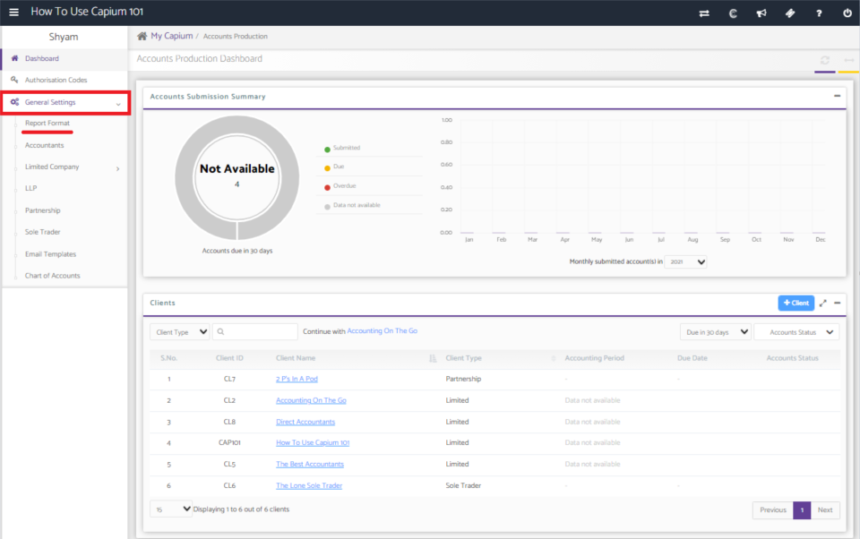
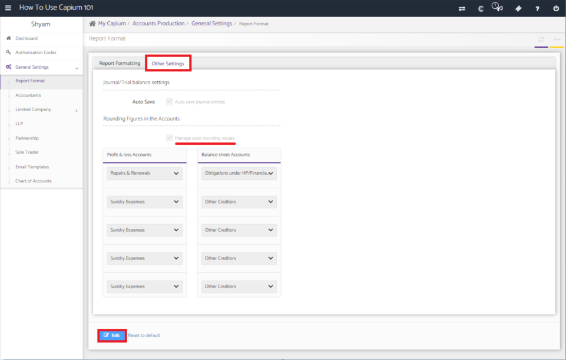
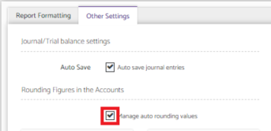
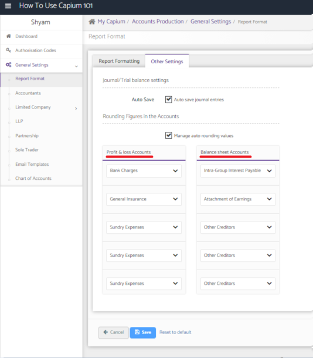

# How to turn on auto rounding values in your annual accounts
	 	
			
			Print

- **Category:** Accounts Production
- **Folder:** Accounts Production FAQs
- **Source URL:** [https://capium.freshdesk.com/support/solutions/articles/9000204342-how-to-turn-on-auto-rounding-values-in-your-annual-accounts](https://capium.freshdesk.com/support/solutions/articles/9000204342-how-to-turn-on-auto-rounding-values-in-your-annual-accounts)
- **Article ID:** 9000204342

## Content

Solution home 
		Accounts Production
		Accounts Production FAQs

### How to turn on auto rounding values in your annual accounts

			Print

	Modified on: Tue, 13 Jul, 2021 at  9:52 AM

		Location:

Accounts production dashboard >>  General settings >> Report format >> Other settings >> Edit >> Click on the tick box 

Video Tutorial:

Click here to watch how to turn on auto rounding values

Help Guide:

Navigating to the report format

To turn on auto round values, go into the 'General Settings' from the accounts production dashboard, and then into 'Report Format'

Turning on auto rounding values

Going into 'Other Settings', there will be a option to turn on 'Manage auto rounding values'.

To turn this on, click on the blue 'edit' button and turn on auto rounding values.

You can then choose which account you want to balance the rounded figures against both in the profit and loss statement, as well as the balance sheet.

										Did you find it helpful?
								Yes
								No

Send feedback	Sorry we couldn't be helpful. Help us improve this article with your feedback.

## Screenshots & Diagrams (4)

