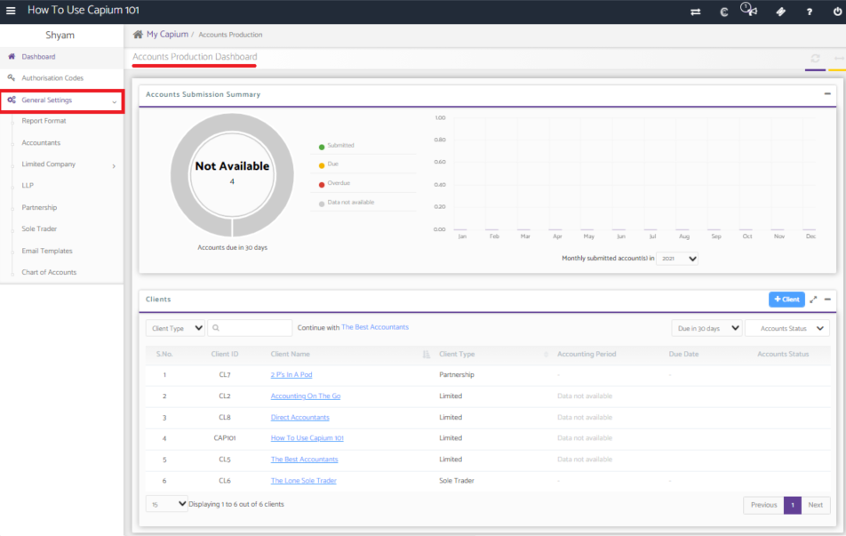
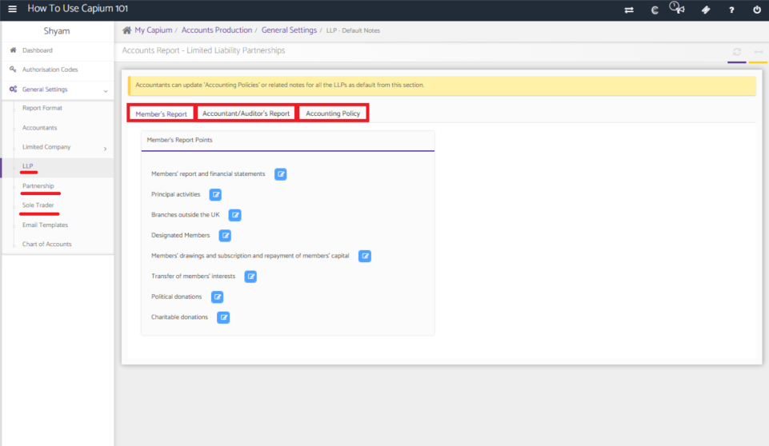
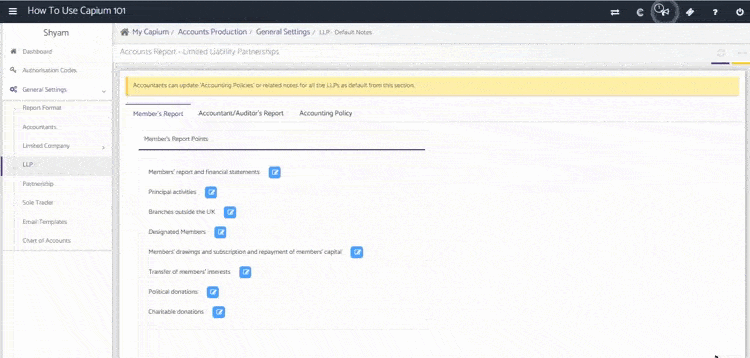
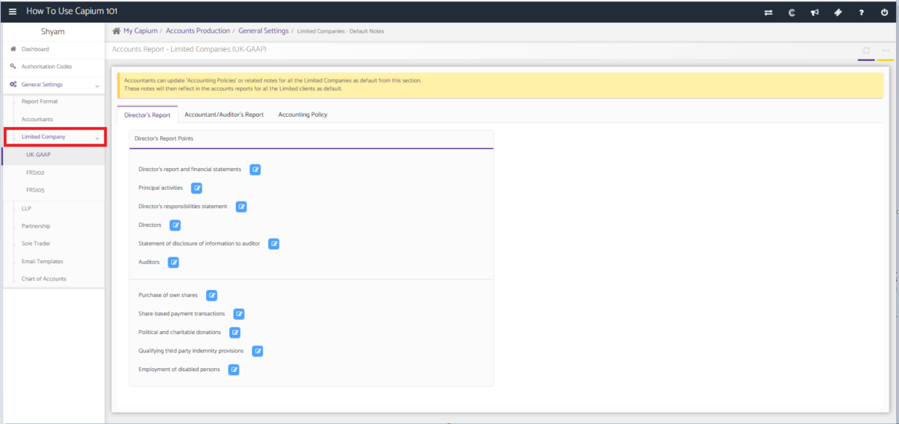
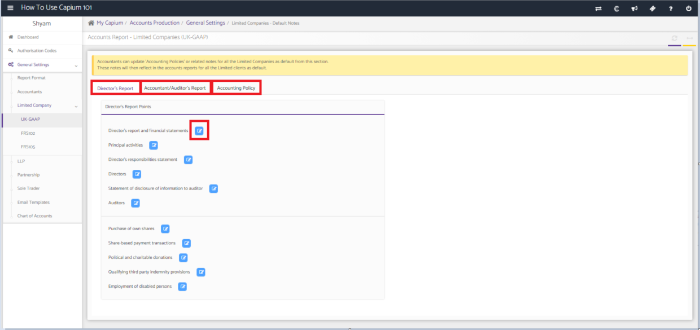
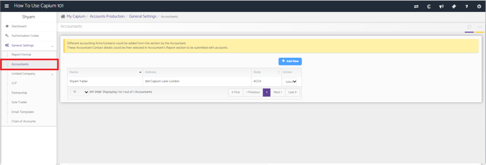
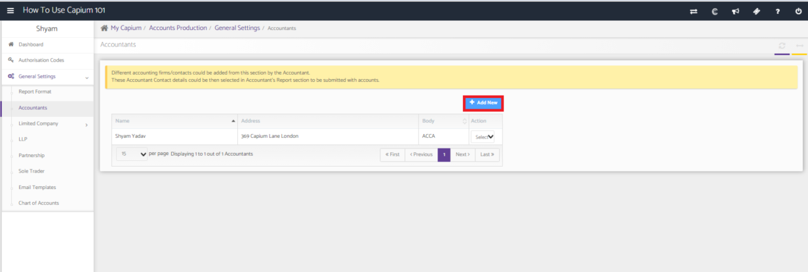
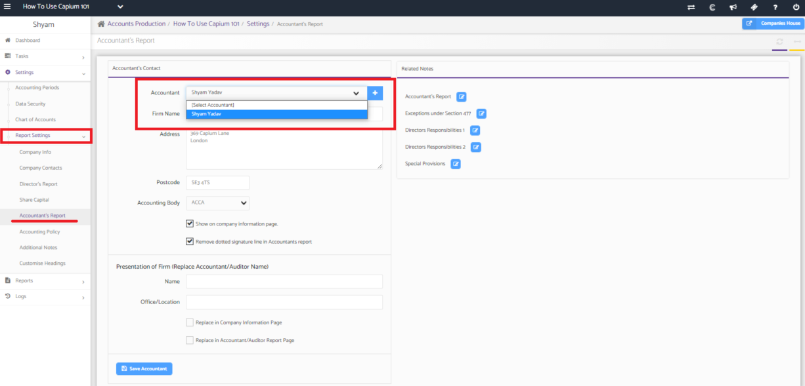

# General Settings in Accounts Production
	 	
			
			Print

- **Category:** Accounts Production
- **Folder:** Accounts Production Help Guide
- **Source URL:** [https://capium.freshdesk.com/support/solutions/articles/9000204344-general-settings-in-accounts-production](https://capium.freshdesk.com/support/solutions/articles/9000204344-general-settings-in-accounts-production)
- **Article ID:** 9000204344

## Content

Solution home 
		Accounts Production
		Accounts Production Help Guide

### General Settings in Accounts Production

			Print

	Modified on: Tue, 3 Aug, 2021 at 12:28 PM

		Video Tutorial

Click here to watch a walkthrough of the general settings in Accounts Production

Click here to watch how to turn on auto rounding values 

Help Guide

The general settings is where you have the ability to change the format of your reports on a global level. This means that any changes that are done here will be reflected in all annual accounts created for your clients.

Editing the account reports for LLPs / Partnerships / Sole Traders

Select the type of company you would like to edit the annual accounts from the navigation panel. 

To edit the information, click on the blue button next to the section that needs to be changed.

You can edit the notes content by dragging and dropping the tags that need to be included and then save.

Editing the account reports for Limited Companies

Click on the 'Limited Company' drop down box in the navigation panel to select the accounts report need to be edited. 

Similar to editing the notes for LLPs, Partnerships and Sole Traders, click on the report that needs to be edited and then use the blue button to select the specific section. 

Adding accountants to your annual report

You can add accountants in the global settings which can then be selected in the accountants report when creating a set of annual accounts. 

To add an accountants, go into the accountants section in the navigation panel. 

Click on 'Add New' and fill in the details accordingly. 

When in the accountants report settings within a client specific account, you will be able to select the accountant that has just been created.

										Did you find it helpful?
								Yes
								No

Send feedback	Sorry we couldn't be helpful. Help us improve this article with your feedback.

## Screenshots & Diagrams (8)

