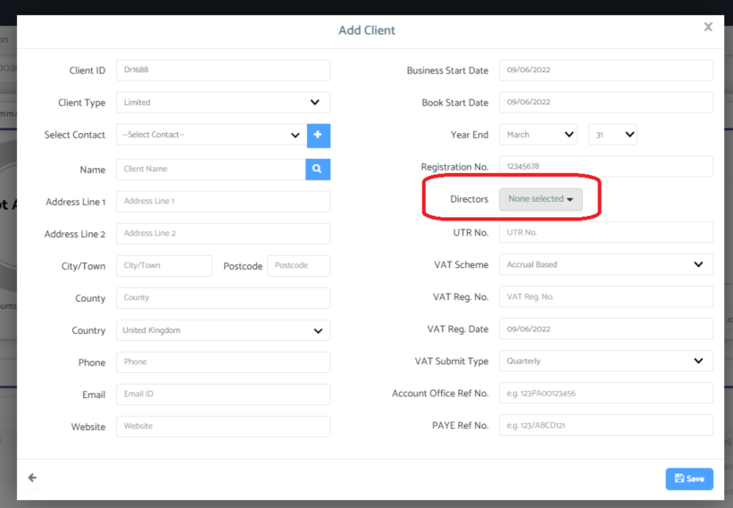
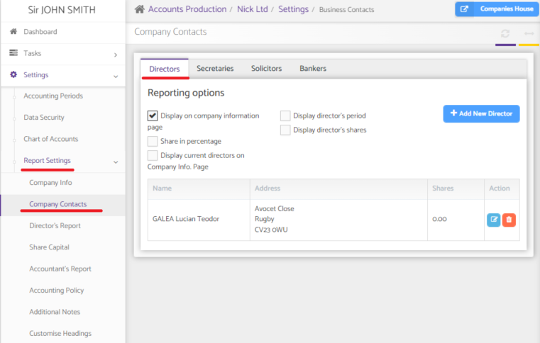
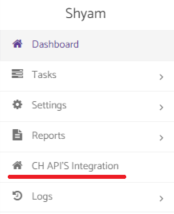
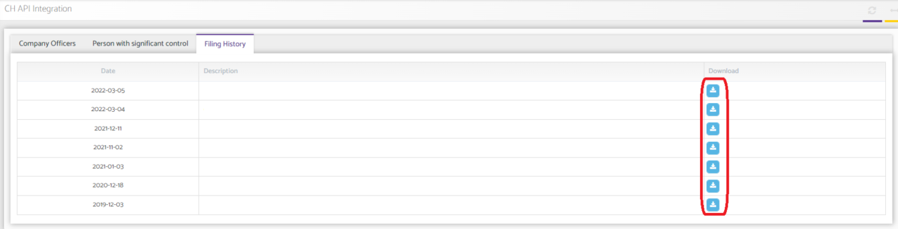

# Accounts Production Companies House integration
	 	
			
			Print

- **Category:** Accounts Production
- **Folder:** Accounts Production Help Guide
- **Source URL:** [https://capium.freshdesk.com/support/solutions/articles/9000216147-accounts-production-companies-house-integration](https://capium.freshdesk.com/support/solutions/articles/9000216147-accounts-production-companies-house-integration)
- **Article ID:** 9000216147

## Content

Solution home 
		Accounts Production
		Accounts Production Help Guide

### Accounts Production Companies House integration

			Print

	Modified on: Thu, 23 Jun, 2022 at  3:42 PM

		Location: 

Accounts Production Dashboard > + Client > Search for registration number > select directors 

Video Tutorial: 

Help Guide: 

Pulling director information

When creating a new client in accounts production, you can now search the registration number and pick up all director information. 

Note: Clients that have already been created will automatically be connected. 

Once directors have been selected their details will be updated in the Company Contacts.

Companies House integration

When navigating into the client account, there is a new 'CH API'S Integration' portal. This will show all information relating to 'Company Officers', ' Person with significant control' and 'Filing History'.

To Download the information previously submitted, click on the download button next to the submission. 

										Did you find it helpful?
								Yes
								No

Send feedback	Sorry we couldn't be helpful. Help us improve this article with your feedback.

## Screenshots & Diagrams (4)

