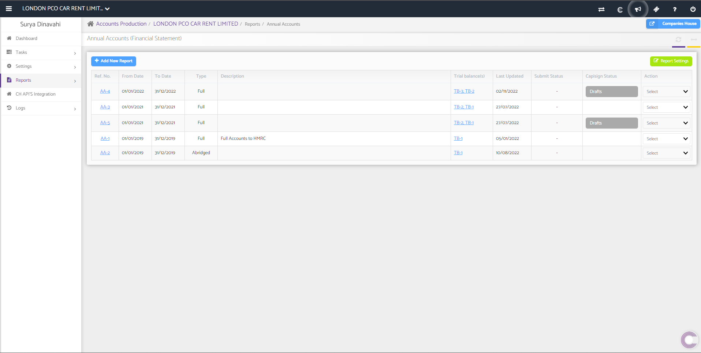
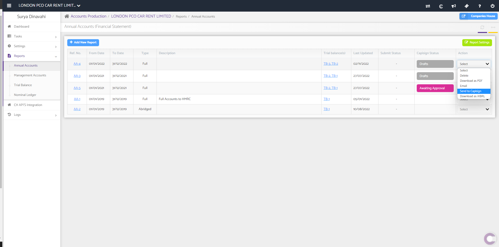

# How to send Annual Accounts from Accounts Production to Capisign
	 	
			
			Print

- **Category:** Accounts Production
- **Folder:** Accounts Production Help Guide
- **Source URL:** [https://capium.freshdesk.com/support/solutions/articles/9000221316-how-to-send-annual-accounts-from-accounts-production-to-capisign](https://capium.freshdesk.com/support/solutions/articles/9000221316-how-to-send-annual-accounts-from-accounts-production-to-capisign)
- **Article ID:** 9000221316

## Content

Solution home 
		Accounts Production
		Accounts Production Help Guide

### How to send Annual Accounts from Accounts Production to Capisign

			Print

	Modified on: Thu, 6 Apr, 2023 at  8:15 AM

		To send Annual Accounts from Accounts Production to Capisign you can click this link. Alternatively you can also follow the navigation as shown below.

Navigation: Accounts Production >> Client Specific >> Annual Accounts > Action >> Send to Capisign 

After you have navigated your way to the client specific Annual Accounts, select 'Edit' from 'Action' drop down. 

Select 'Send to Capisign'. 

										Did you find it helpful?
								Yes
								No

Send feedback	Sorry we couldn't be helpful. Help us improve this article with your feedback.

## Screenshots & Diagrams (2)

