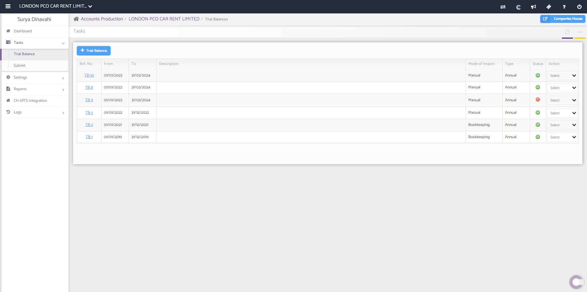
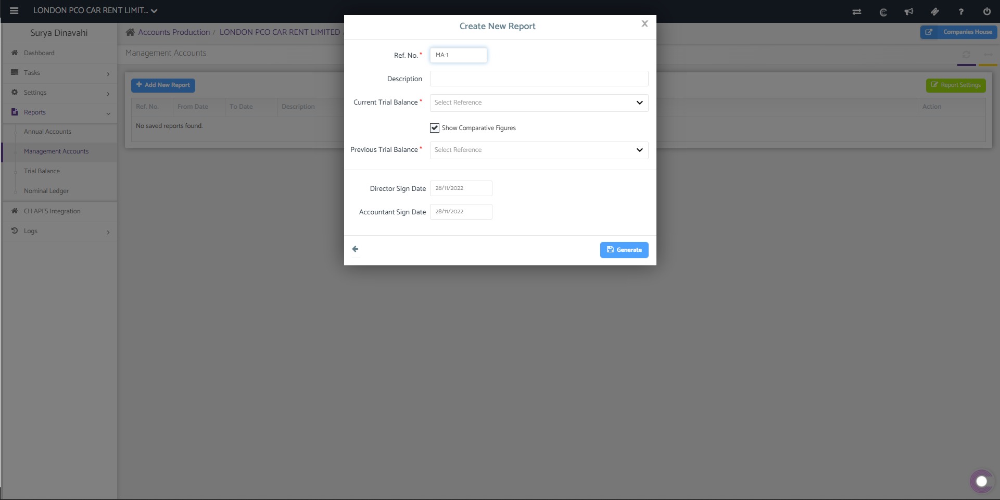
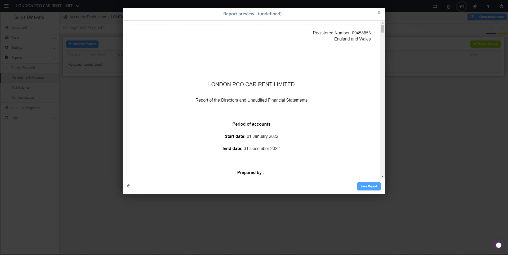
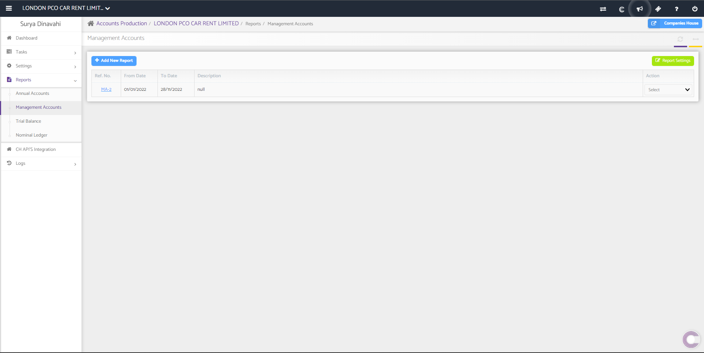
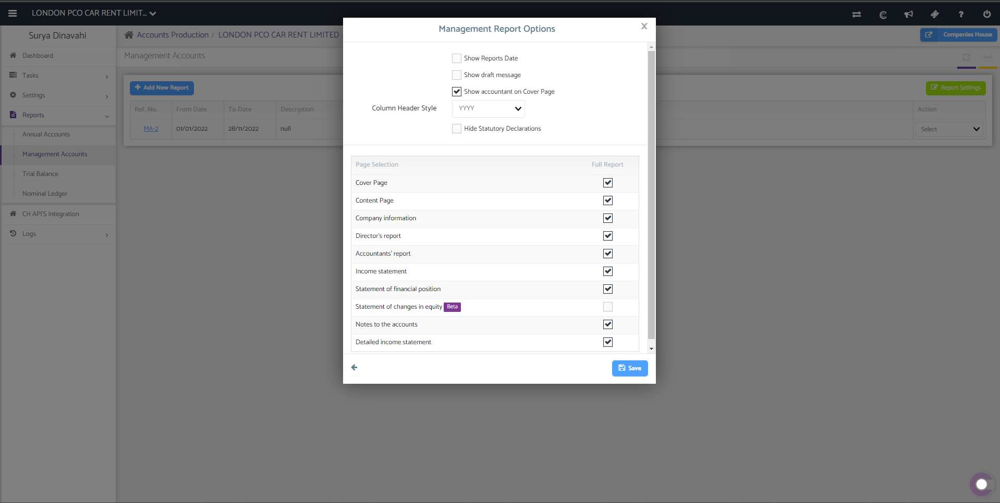
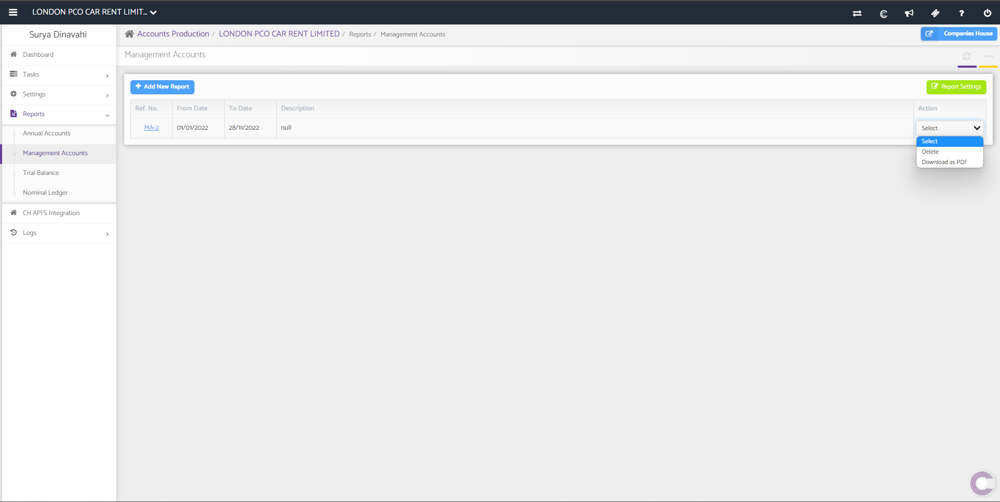

# Management Reports
	 	
			
			Print

- **Category:** Accounts Production
- **Folder:** Accounts Production Help Guide
- **Source URL:** [https://capium.freshdesk.com/support/solutions/articles/9000221934-management-reports](https://capium.freshdesk.com/support/solutions/articles/9000221934-management-reports)
- **Article ID:** 9000221934

## Content

Solution home 
		Accounts Production
		Accounts Production Help Guide

### Management Reports

			Print

	Modified on: Thu, 6 Apr, 2023 at  8:15 AM

		To create a Management Report you can click on this link. Alternatively you can also follow the navigation as shown below.

Navigation: Accounts Production > Client Specific > Reports > Management Accounts

A trial balance must be imported or created from the 'Tasks' section to act as the base for generating financial statements.

Once you have a trial balance set up, select '+Add New Report' and the following prompt will appear. 

Fill in the the basic credentials and select 'Generate' and preview of the report will appear. 

Once you are happy with the preview of the report, select 'Save Report' and it will be added to the list of reports.

If you select 'Report Settings', the following prompt will appear and you will be able to edit the options related to the Management Reports. 

You are able to delete or download the report by selecting the 'Action' drop down. 

										Did you find it helpful?
								Yes
								No

Send feedback	Sorry we couldn't be helpful. Help us improve this article with your feedback.

## Screenshots & Diagrams (7)

