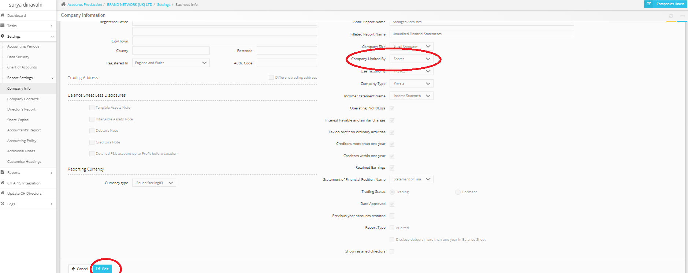
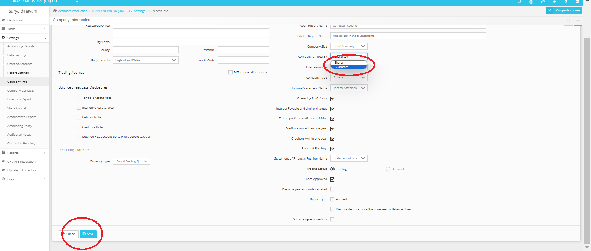

# How to select reports for a company limited by guarantee
	 	
			
			Print

- **Category:** Accounts Production
- **Folder:** Accounts Production FAQs
- **Source URL:** [https://capium.freshdesk.com/support/solutions/articles/9000237595-how-to-select-reports-for-a-company-limited-by-guarantee](https://capium.freshdesk.com/support/solutions/articles/9000237595-how-to-select-reports-for-a-company-limited-by-guarantee)
- **Article ID:** 9000237595

## Content

Solution home 
		Accounts Production
		Accounts Production FAQs

### How to select reports for a company limited by guarantee

			Print

	Modified on: Mon, 22 Apr, 2024 at  5:05 PM

		How to select reports for a company limited by guarantee:
Please go to Accounts Production > Select the client > Settings > Company Information > Edit >

Then select by guarantee, then click save:

This will update the report formatting.

										Did you find it helpful?
								Yes
								No

Send feedback	Sorry we couldn't be helpful. Help us improve this article with your feedback.

## Screenshots & Diagrams (2)

