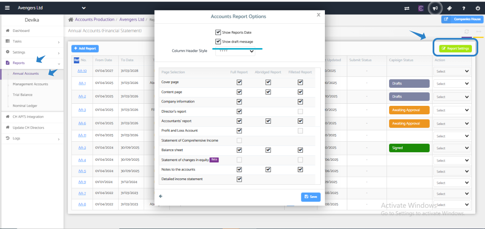

# Draft stamp in Accounts Report
	 	
			
			Print

- **Category:** Accounts Production
- **Folder:** Accounts Production Help Guide
- **Source URL:** [https://capium.freshdesk.com/support/solutions/articles/9000271601-draft-stamp-in-accounts-report](https://capium.freshdesk.com/support/solutions/articles/9000271601-draft-stamp-in-accounts-report)
- **Article ID:** 9000271601

## Content

Solution home 
		Accounts Production
		Accounts Production Help Guide

### Draft stamp in Accounts Report

			Print

	Modified on: Thu, 13 Nov, 2025 at 12:53 PM

		How to Show Draft Stamp in Accounts Report?

If you need to display a Draft stamp in your Accounts report, follow these simple steps:

1. Go to Accounts Production >> Client specific >> Reports >> Annual Accounts.

2. Navigate to Report Settings: Go to the Report Settings section in your account.

3. Select 'Show Draft Message': Once in the Report Settings, look for the option to 'Show Draft Message' and make sure the checkbox is selected.

3. Regenerate the Annual Report: After enabling the 'Show Draft Message' option, you will need to regenerate the annual report. To do this, go to Account Productions >> Reports >> Annual Accounts.

4. Check the Updated Report: Once the report has been regenerated, you can download the PDF to review the changes and ensure that the Draft stamp is now displayed.

By following these steps, you can easily show a Draft stamp in your Accounts report. If you have any further questions or encounter any issues, please don't hesitate to reach out to our customer support team for assistance. We are here to help and ensure that you have a seamless experience with our platform.

										Did you find it helpful?
								Yes
								No

Send feedback	Sorry we couldn't be helpful. Help us improve this article with your feedback.

## Screenshots & Diagrams (1)

