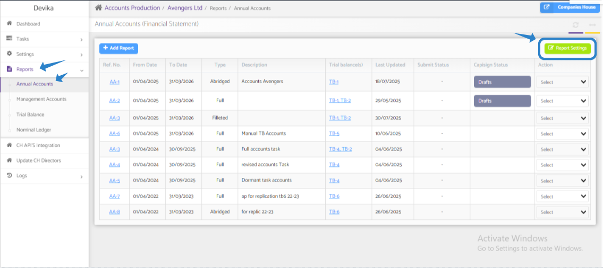
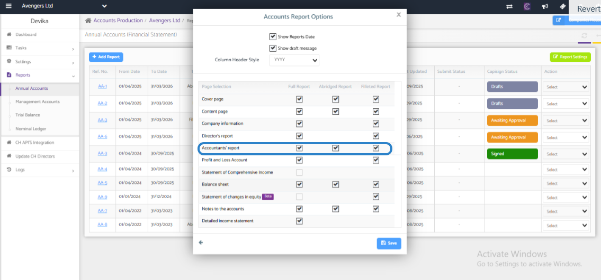

# Accountants Report In Annual accounts
	 	
			
			Print

- **Category:** Accounts Production
- **Folder:** Accounts Production Help Guide
- **Source URL:** [https://capium.freshdesk.com/support/solutions/articles/9000271603-accountants-report-in-annual-accounts](https://capium.freshdesk.com/support/solutions/articles/9000271603-accountants-report-in-annual-accounts)
- **Article ID:** 9000271603

## Content

Solution home 
		Accounts Production
		Accounts Production Help Guide

### Accountants Report In Annual accounts

			Print

	Modified on: Wed, 22 Oct, 2025 at  7:08 AM

		Title: Accountant Report

To include the 'Accountant's Report' in the Annual Accounts, please follow the steps below:

1. Navigate to Accounts Production: Go to the Accounts Production section in your Chaucer software.

2. Client Specific: Select the specific client for whom you want to include the Accountant's Report.

3. Reports: Click on the Reports tab to access the different report options available.

4. Annual Accounts: Choose the Annual Accounts option from the list of reports.

5. Report Settings: Once you have selected the Annual Accounts report, refer to the attached document for further instructions on accessing the Report Settings.

6. Select the "Accountant's Report" checkbox: In the Report Settings, make sure to check the box for "Accountant's Report" to include it in the Annual Accounts.

7. Regenerate the accounts report: After making the necessary changes in the Report Settings, regenerate the accounts report to ensure that the Accountant's Report is included.

If you encounter any issues or have further questions about including the Accountant's Report in the Annual Accounts, please don't hesitate to reach out to our customer support team for assistance. We are here to help and ensure that you can effectively utilize the features of the Chaucer software for your accounting needs.

										Did you find it helpful?
								Yes
								No

Send feedback	Sorry we couldn't be helpful. Help us improve this article with your feedback.

## Screenshots & Diagrams (2)

