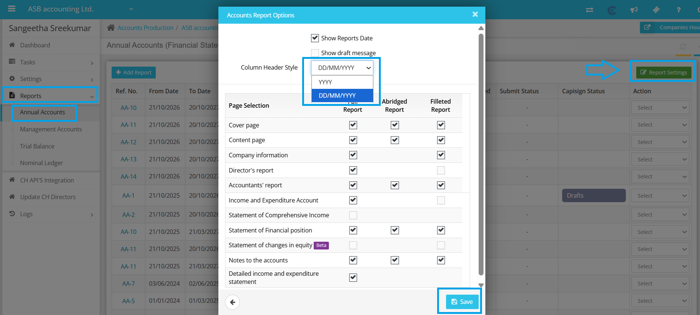
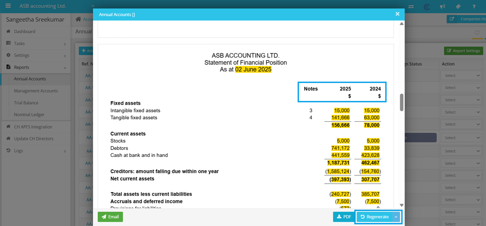
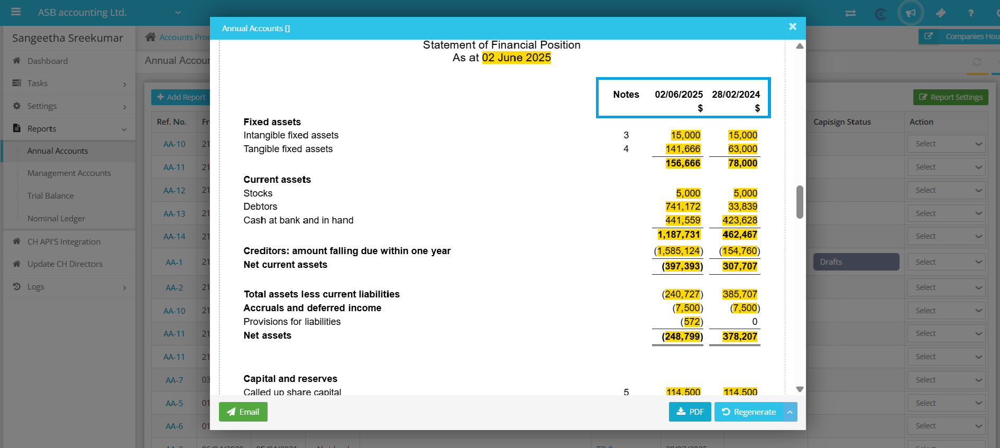

# Year headings
	 	
			
			Print

- **Category:** Accounts Production
- **Folder:** Accounts Production Help Guide
- **Source URL:** [https://capium.freshdesk.com/support/solutions/articles/9000271606-year-headings](https://capium.freshdesk.com/support/solutions/articles/9000271606-year-headings)
- **Article ID:** 9000271606

## Content

Solution home 
		Accounts Production
		Accounts Production Help Guide

### Year headings

			Print

	Modified on: Sat, 18 Oct, 2025 at  1:41 PM

		How to Update Column Header Style in Annual Reports

At times, you may need to update the column header style in your annual reports to meet specific requirements or preferences. Here's a step-by-step guide on how to do it:

1. Navigate to Accounts Production: Start by logging into your account and accessing the Accounts Production section.

2. Client Specific: Select the specific client for whom you want to update the column header style.

3. Reports: Once you have selected the client, go to the Reports tab to access the list of available reports.

4. Annual Report: From the list of reports, choose the Annual Report option to access the settings for this specific report.

5. Report Settings: Within the Annual Report section, look for the Report Settings option and click on it to access the settings for the column header style.

6. Column Header Style: Under the Report Settings, you will find the option to update the Column Header Style. Click on this option to make the necessary changes.

7. Choose the desired date format for the column headers. You can select from various options, such as DD/MM/YYYY and YYYY.

Once you have updated the column header style, don't forget to regenerate the annual report to ensure that the changes have been applied successfully. If you encounter any difficulties or have any questions, please don't hesitate to reach out to our customer support team for assistance.

										Did you find it helpful?
								Yes
								No

Send feedback	Sorry we couldn't be helpful. Help us improve this article with your feedback.

## Screenshots & Diagrams (3)

