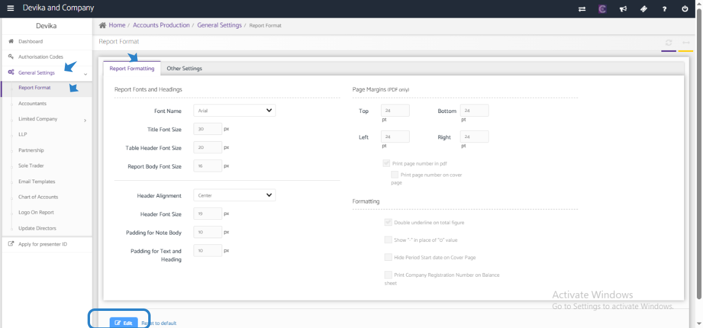

# Report formatting in Accounts Production 
	 	
			
			Print

- **Category:** Accounts Production
- **Folder:** Accounts Production Help Guide
- **Source URL:** [https://capium.freshdesk.com/support/solutions/articles/9000271621-report-formatting-in-accounts-production-](https://capium.freshdesk.com/support/solutions/articles/9000271621-report-formatting-in-accounts-production-)
- **Article ID:** 9000271621

## Content

Solution home 
		Accounts Production
		Accounts Production Help Guide

### Report formatting in Accounts Production 

			Print

	Modified on: Mon, 10 Nov, 2025 at  7:04 PM

		To change the account production report format, please follow these steps:

1. Access the Accounts Production section: Log in to your account and navigate to the Accounts Production tab.

2. Go to General Settings: Once in the Accounts Production section, click on General Settings.

3. Select Report Format: Under General Settings, you will find the option for Report Format. Click on this to proceed.

4. Edit and Update Details: You will now have the option to edit and update the details of the report format according to your preferences.

5. Save Changes: After making the necessary adjustments, be sure to save the changes to ensure they are applied.

It is important to note that any changes made to the report format will be reflected in all client accounts. Additionally, after modifying the report format, it is crucial to regenerate any accounts reports that have already been prepared. This will ensure that the updates are incorporated into the reports.

If you encounter any difficulties or have further questions about changing the account production report format, please feel free to reach out to our customer support team for assistance. We are here to help and ensure that you have a seamless experience with our platform.

										Did you find it helpful?
								Yes
								No

Send feedback	Sorry we couldn't be helpful. Help us improve this article with your feedback.

## Screenshots & Diagrams (1)

