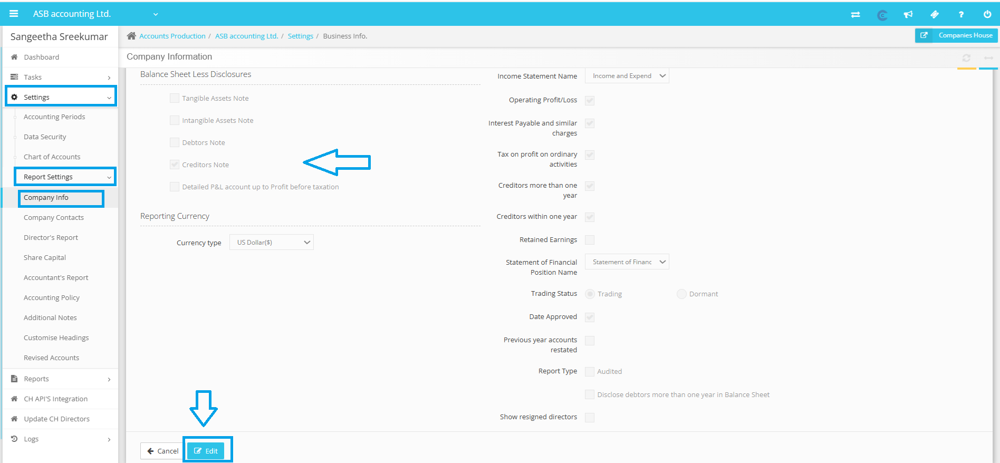
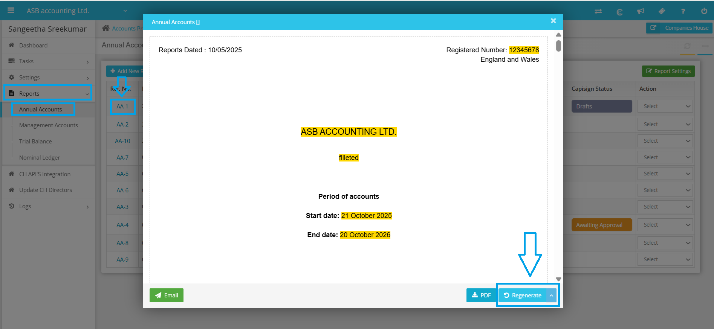

# Notes Missing from Report
	 	
			
			Print

- **Category:** Accounts Production
- **Folder:** Accounts Production Help Guide
- **Source URL:** [https://capium.freshdesk.com/support/solutions/articles/9000271628-notes-missing-from-report](https://capium.freshdesk.com/support/solutions/articles/9000271628-notes-missing-from-report)
- **Article ID:** 9000271628

## Content

Solution home 
		Accounts Production
		Accounts Production Help Guide

### Notes Missing from Report

			Print

	Modified on: Sat, 18 Oct, 2025 at  1:50 PM

		If notes are not visible in the report, there are several steps you can take to address the issue. Here’s how you can approach this problem:

1. Navigate to Settings: Start by going to Settings in your account.

2. Access Report Settings: Once in the Settings section, click on Report settings.

3. Edit Company Info: Under Report settings, select Company info and then click on Edit.

4. Deselect Balance Sheet Less Disclosures: Under Company info, you will see the option for Balance Sheet Less Disclosures. Deselect the boxes under this section.

5. Save Changes: Once you have deselected the boxes, please remember to click on Save to confirm that your modifications are implemented.

6. Regenerate the Report: Once you have saved the changes, regenerate the report to reflect the updates.

Note: If you need to remove the note, you can simply tick the boxes again, save your changes, and regenerate the reports to reflect the updates.

After following these steps, please verify from your end to ensure that the issue has been resolved. If you continue to encounter any problems, please do not hesitate to reach out to our customer support team for further assistance.

										Did you find it helpful?
								Yes
								No

Send feedback	Sorry we couldn't be helpful. Help us improve this article with your feedback.

## Screenshots & Diagrams (2)

