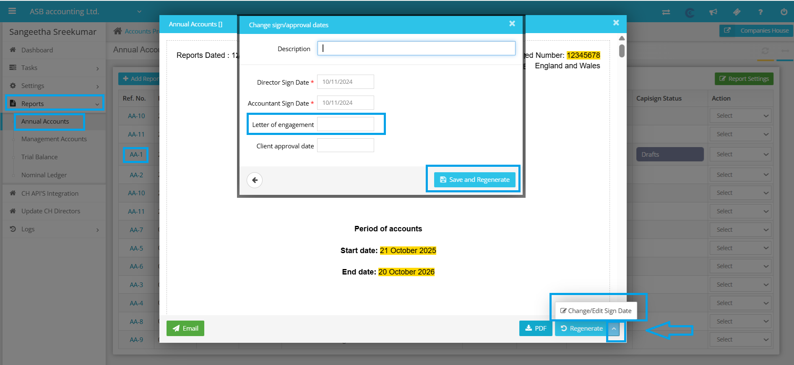

# Date of letter of engagement
	 	
			
			Print

- **Category:** Accounts Production
- **Folder:** Accounts Production Help Guide
- **Source URL:** [https://capium.freshdesk.com/support/solutions/articles/9000271630-date-of-letter-of-engagement](https://capium.freshdesk.com/support/solutions/articles/9000271630-date-of-letter-of-engagement)
- **Article ID:** 9000271630

## Content

Solution home 
		Accounts Production
		Accounts Production Help Guide

### Date of letter of engagement

			Print

	Modified on: Thu, 16 Oct, 2025 at  5:37 PM

		To change the date of the letter of engagement, please follow these steps:

1. Navigate to Accounts Production.

2. Click on Client and then select Reports.

3. Choose Annual Accounts and click on the reference number for the report you need to update.

4. Locate the option to modify the sign/approval date (Change/Edit sign Date) and select it (as shown below).

5. Update the correct details with the new date of the letter of engagement.

6. Save your changes and regenerate the report.

We have also attached a file to this message for your reference.

We hope that these instructions are clear and easy to follow. If you encounter any difficulties or need further assistance, please do not hesitate to reach out to our customer support team. 

										Did you find it helpful?
								Yes
								No

Send feedback	Sorry we couldn't be helpful. Help us improve this article with your feedback.

## Screenshots & Diagrams (1)

