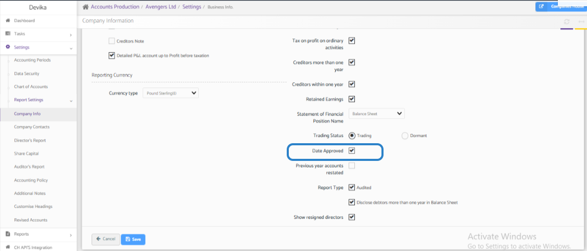

# How to Incorporate Approval Dates on Statutory Accounts
	 	
			
			Print

- **Category:** Accounts Production
- **Folder:** Accounts Production FAQs
- **Source URL:** [https://capium.freshdesk.com/support/solutions/articles/9000271670-how-to-incorporate-approval-dates-on-statutory-accounts](https://capium.freshdesk.com/support/solutions/articles/9000271670-how-to-incorporate-approval-dates-on-statutory-accounts)
- **Article ID:** 9000271670

## Content

Solution home 
		Accounts Production
		Accounts Production FAQs

### How to Incorporate Approval Dates on Statutory Accounts

			Print

	Modified on: Wed, 22 Oct, 2025 at  6:54 AM

		Approval Dates on Statutory Accounts

In order to incorporate the approval date into the accounts report, follow these steps:

1. Navigate to Accounts Production

2. Go to Client Specific

3. Select Settings

4. Go to Report Settings

5. Click on Company Info

6. Select Edit

7. Check the box labelled "Date Approved"

8. Click Save

After completing these steps, kindly regenerate the accounts report to observe the updated changes.

If you encounter any difficulties or have any questions regarding this process, please do not hesitate to reach out to our customer support team. We are here to assist you and ensure that you are able to successfully include the approval date on your statutory accounts.

We hope this information has been helpful to you. If you require further assistance or have any other inquiries, feel free to contact us. Thank you for choosing our services and we look forward to helping you with any of your accounting needs.

										Did you find it helpful?
								Yes
								No

Send feedback	Sorry we couldn't be helpful. Help us improve this article with your feedback.

## Screenshots & Diagrams (1)

