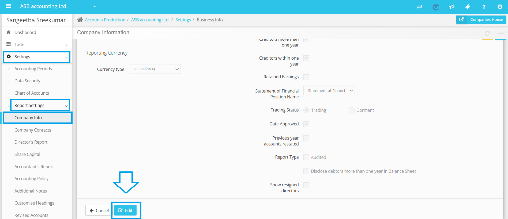
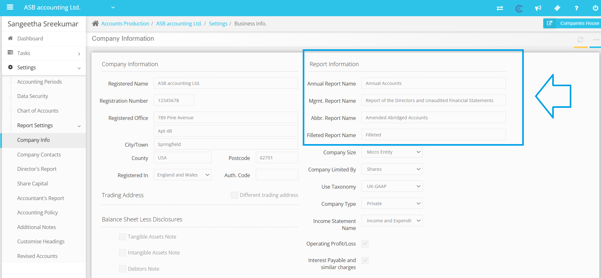
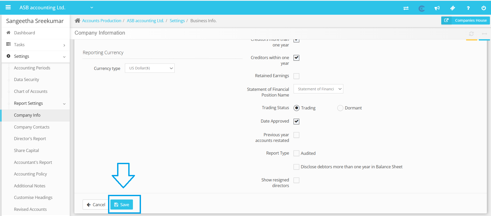

# Amend Annual Report Name
	 	
			
			Print

- **Category:** Accounts Production
- **Folder:** Accounts Production Help Guide
- **Source URL:** [https://capium.freshdesk.com/support/solutions/articles/9000272169-amend-annual-report-name](https://capium.freshdesk.com/support/solutions/articles/9000272169-amend-annual-report-name)
- **Article ID:** 9000272169

## Content

Solution home 
		Accounts Production
		Accounts Production Help Guide

### Amend Annual Report Name

			Print

	Modified on: Thu, 13 Nov, 2025 at  7:13 PM

		Update the Annual Report Name

Updating the cover page of your accounts is a straightforward process that allows you to ensure your reports reflect the most current information about your company. Follow the steps below to easily amend the name on your annual report cover page:

1. Navigate to Settings: Begin by logging into your account and selecting the Settings tab located under the client account. 

2. Access Report Settings: Once you are in the Settings section, look for the Report Settings option. Clicking on this will take you to a dedicated area where you can customize your reports, including the cover page details.

3. Update Company Info: Within the Report Settings, you will find a section labeled Company Info. Click on this option to proceed to the area where you can update essential details about your company.

4. Edit Report Information: Under the Company Info section, you will see an option to edit your Report Information. Click on this to access the fields that can be modified, including the report name.

5. Update Report Name: After accessing the editable fields, simply enter the new report name and any other necessary information. Once you have made your changes, be sure to save your updates to ensure they take effect.

After completing these steps, the system will automatically incorporate the new information into your accounts report when it is regenerated. 

We hope this information helps you successfully update the cover page of your accounts. If you encounter any difficulties or have any questions about this process, please don't hesitate to reach out to our customer support team for assistance.

										Did you find it helpful?
								Yes
								No

Send feedback	Sorry we couldn't be helpful. Help us improve this article with your feedback.

## Screenshots & Diagrams (4)

