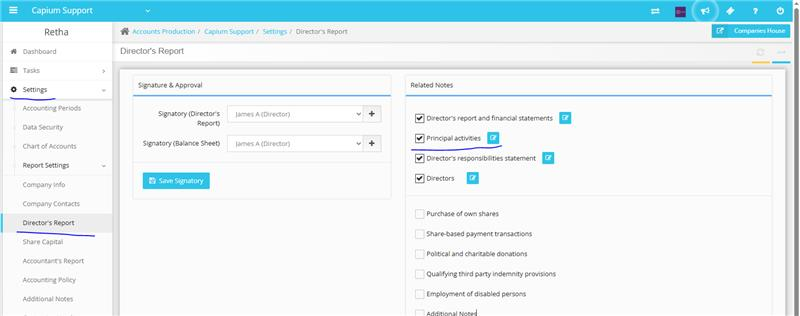

# Principal Activity - Directors Report
	 	
			
			Print

- **Category:** Accounts Production
- **Folder:** Accounts Production FAQs
- **Source URL:** [https://capium.freshdesk.com/support/solutions/articles/9000272252-principal-activity-directors-report](https://capium.freshdesk.com/support/solutions/articles/9000272252-principal-activity-directors-report)
- **Article ID:** 9000272252

## Content

Solution home 
		Accounts Production
		Accounts Production FAQs

### Principal Activity - Directors Report

			Print

	Modified on: Thu, 6 Nov, 2025 at  9:30 AM

1. To access the director's report section, you will need to log in Accounts Production module > Select the client

2. Navigate to the Setting tab, then click on Directors Report

3. Then in Related Notes you can update Principal Activity

										Did you find it helpful?
								Yes
								No

Send feedback	Sorry we couldn't be helpful. Help us improve this article with your feedback.

## Screenshots & Diagrams (1)

