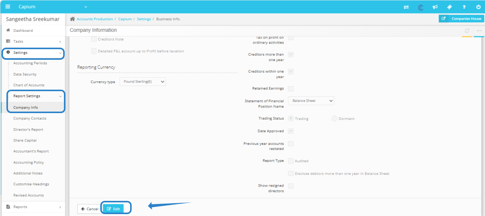
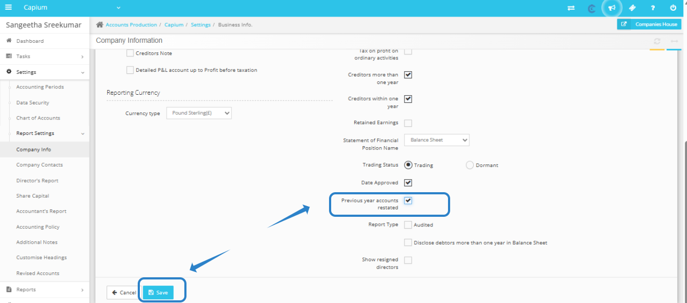
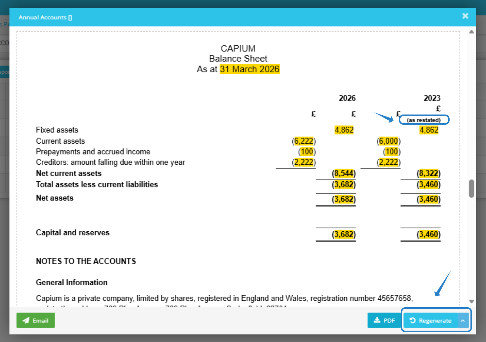

# Previous year accounts restated
	 	
			
			Print

- **Category:** Accounts Production
- **Folder:** Accounts Production Help Guide
- **Source URL:** [https://capium.freshdesk.com/support/solutions/articles/9000272901-previous-year-accounts-restated](https://capium.freshdesk.com/support/solutions/articles/9000272901-previous-year-accounts-restated)
- **Article ID:** 9000272901

## Content

Solution home 
		Accounts Production
		Accounts Production Help Guide

### Previous year accounts restated

			Print

	Modified on: Tue, 16 Dec, 2025 at  5:38 PM

		Prior Year Adjustment

This article will guide you through the process of adjusting prior-year accounts in our system. To initiate a prior year adjustment, please follow these steps:

1. Navigate to Accounts Production: Start by logging into your account and heading to the Accounts Production section. 

2. Client Specific Settings: Once in Accounts Production, select the client.

3. Report Settings: Within the Client settings, locate the 'Report Settings' option.

4. Company Info: Click on 'Company Info' to access the details related to your business.

5. Edit Company Info: After accessing Company Info, click on the 'Edit' button. This will allow you to make necessary changes to your company settings.

6. Select the Checkbox for 'Previous Year Accounts Restated': Look for the checkbox labeled 'Previous year accounts restated.' By selecting this option, you indicate that the accounts from the previous year have been adjusted and should be reflected in your current reports.

7. Save Changes: Don’t forget to click 'Save' after making your adjustments. This step is vital to ensure that your changes are recorded in the system.

8. Regenerate Accounts: If you have already generated a set of accounts before making these adjustments, it is important to regenerate them. This will ensure that the new settings are applied and your reports are accurate.

If you encounter any difficulties during this process or have questions about the adjustments, please do not hesitate to reach out to our customer support team. We are here to help you navigate through these changes smoothly. Thank you for your attention to this important matter!

										Did you find it helpful?
								Yes
								No

Send feedback	Sorry we couldn't be helpful. Help us improve this article with your feedback.

## Screenshots & Diagrams (3)

