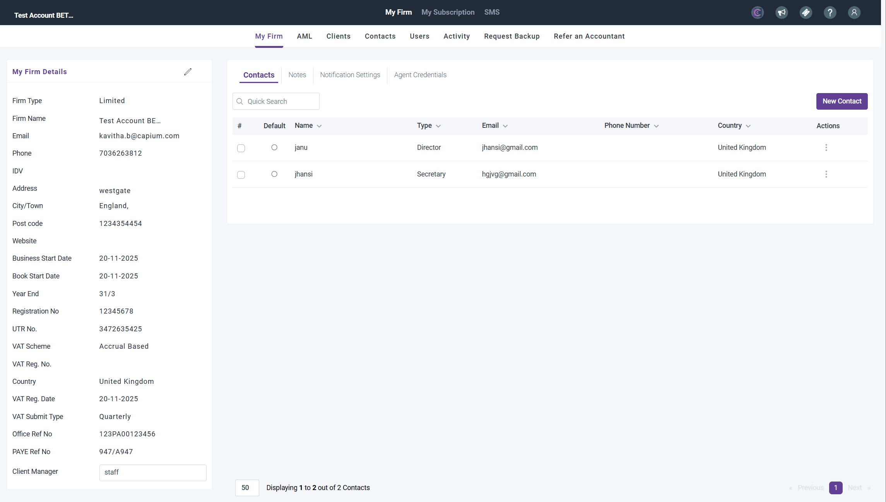

# Creating or a New CIC client
	 	
			
			Print

- **Category:** Accounts Production
- **Folder:** Community Interest Companies (CIC)
- **Source URL:** [https://capium.freshdesk.com/support/solutions/articles/9000278286-creating-or-a-new-cic-client](https://capium.freshdesk.com/support/solutions/articles/9000278286-creating-or-a-new-cic-client)
- **Article ID:** 9000278286

## Content

Solution home 
		Accounts Production
		Community Interest Companies (CIC)

### Creating or a New CIC client

			Print

	Modified on: Thu, 20 Aug, 2026 at 12:43 PM

		This article explains how to set a client up as a Community Interest Company (CIC) in Capium, by creating a new client directly as a CIC client. 

Note: This article covers client setup only. For existing clients, who are already set up on the system please refer to this article. 
### Before you start

The client must already exist in Capium as a Limited company type, or be created as one. A CIC cannot be set up as any other client type.
Have the client's company details to hand, including registration number, UTR and year-end date, so you can complete the record in full at this stage.

### 
Creating a new client as a CIC

Navigate to the client section. Navigation > My Admin > Clients > Add Client. 
Set the client type to Limited company. 
Select the option to designate the client as a CIC. 
Enter the client's details. Please make sure you fill all the relevant areas in the client setup page.  
Save the client record.

Add to Related Articles:

Converting an existing client to a CIC (already present)
CIC Accounts Walkthrough
CIC Filings in Accounts Production
Completing the CIC 34 Notes in Accounts Production
How to generate and file the CIC accounts and CIC 34 report
How to add Trial Balance (covers the "trial balance import" the note box mentions)
Report Settings in Accounts (covers "report settings")

										Did you find it helpful?
								Yes
								No

Send feedback	Sorry we couldn't be helpful. Help us improve this article with your feedback.

## Screenshots & Diagrams (1)

