# Anti-Money Laundering Module - Knowledge Base & Feature Index

> Total Articles: **13** | Module Directory: `d:/sansuite/Anti-Money Laundering`

## Articles List & Local Assets

### 1. AML - How to guide
- **Folder:** Capium AML
- **Article ID:** `9000191661` | **Slug:** `aml-how-to-guide`
- **Markdown File:** [raw_articles/9000191661_aml-how-to-guide.md](../raw_articles/9000191661_aml-how-to-guide.md)
- **Images Count:** 12
- **Screenshots:**
  - 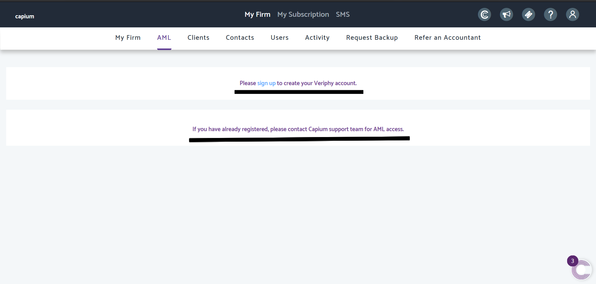
  - 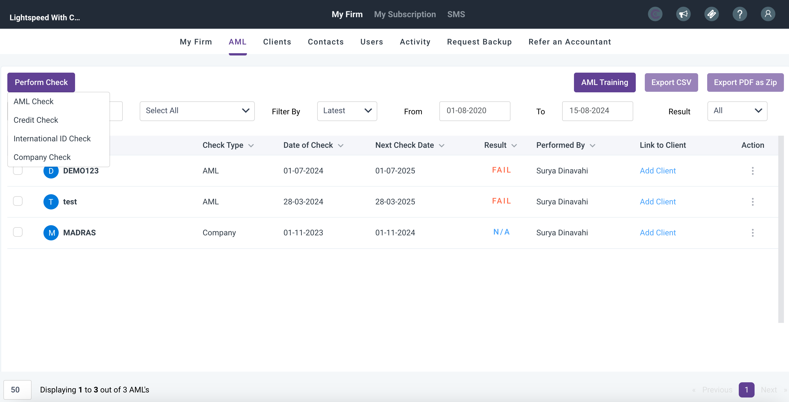
  - 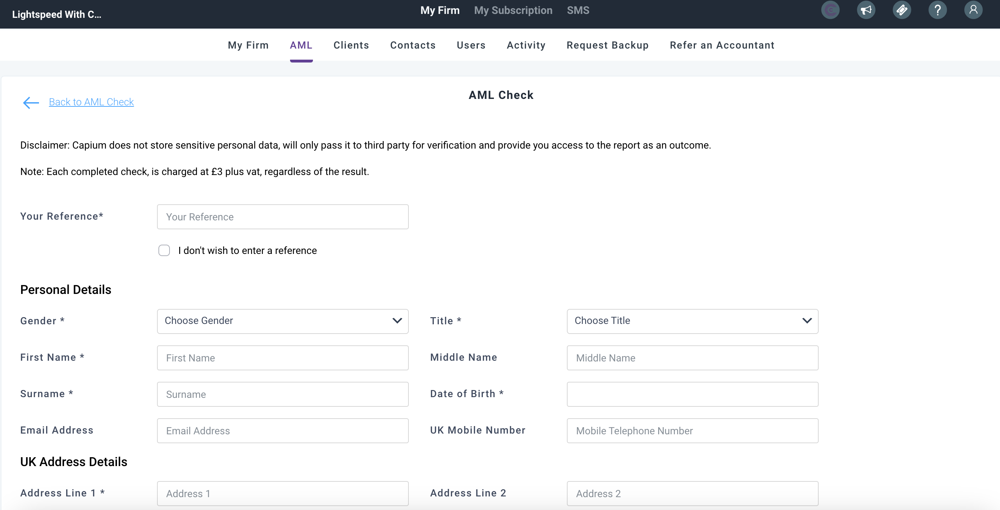
  - 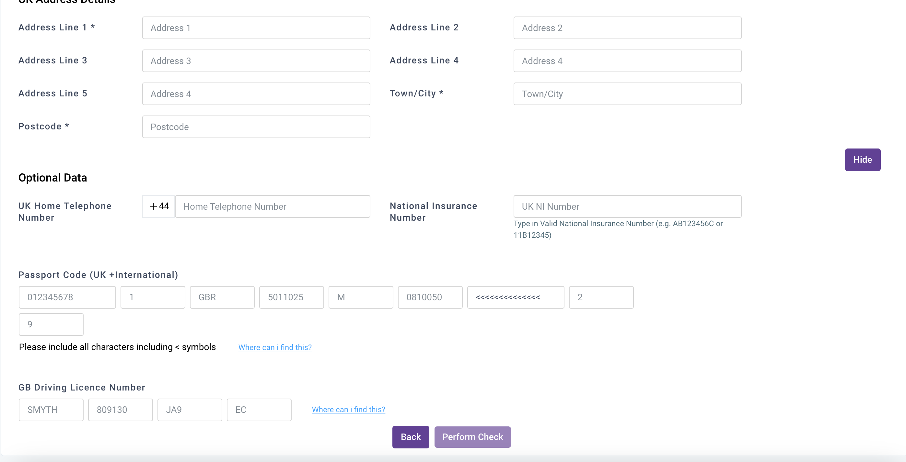
  - 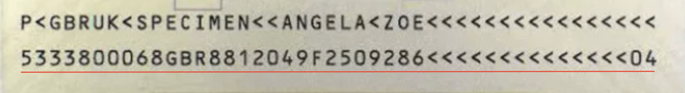
  - 
  - 
  - 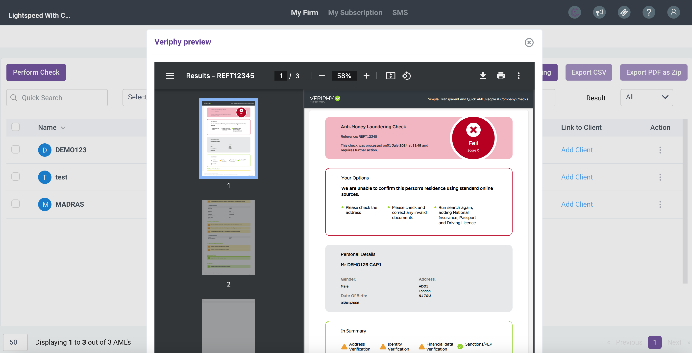
  - 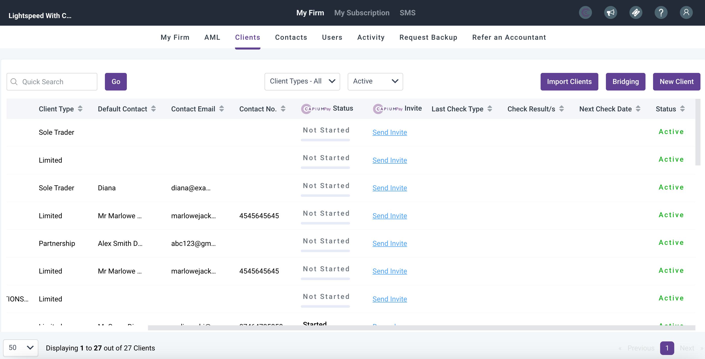
  - 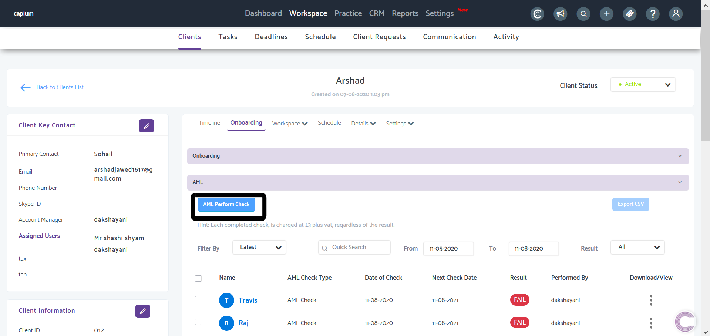
  - 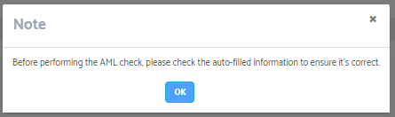
  - 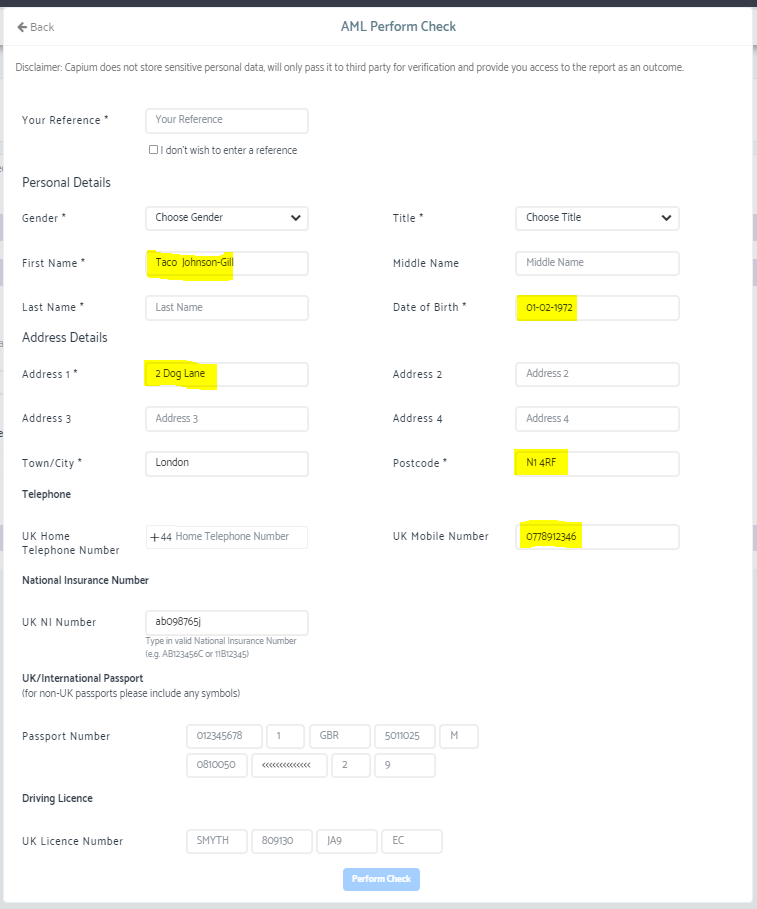

---

### 2. AML - Important and Useful Links
- **Folder:** Capium AML
- **Article ID:** `9000191662` | **Slug:** `aml-important-and-useful-links`
- **Markdown File:** [raw_articles/9000191662_aml-important-and-useful-links.md](../raw_articles/9000191662_aml-important-and-useful-links.md)
- **Images Count:** 0

---

### 3. AML Check:- International ID Check
- **Folder:** Capium AML
- **Article ID:** `9000232091` | **Slug:** `aml-check-international-id-check`
- **Markdown File:** [raw_articles/9000232091_aml-check-international-id-check.md](../raw_articles/9000232091_aml-check-international-id-check.md)
- **Images Count:** 1
- **Screenshots:**
  - 

---

### 4. AML Check:- UK Company Check
- **Folder:** Capium AML
- **Article ID:** `9000232092` | **Slug:** `aml-check-uk-company-check`
- **Markdown File:** [raw_articles/9000232092_aml-check-uk-company-check.md](../raw_articles/9000232092_aml-check-uk-company-check.md)
- **Images Count:** 1
- **Screenshots:**
  - 

---

### 5. AML Check:- Individual Credit Screens
- **Folder:** Capium AML
- **Article ID:** `9000232093` | **Slug:** `aml-check-individual-credit-screens`
- **Markdown File:** [raw_articles/9000232093_aml-check-individual-credit-screens.md](../raw_articles/9000232093_aml-check-individual-credit-screens.md)
- **Images Count:** 1
- **Screenshots:**
  - 

---

### 6. AML Check:- UK AMLC with PEPs &amp; Sanctions
- **Folder:** Capium AML
- **Article ID:** `9000232094` | **Slug:** `aml-check-uk-amlc-with-peps-sanctions`
- **Markdown File:** [raw_articles/9000232094_aml-check-uk-amlc-with-peps-sanctions.md](../raw_articles/9000232094_aml-check-uk-amlc-with-peps-sanctions.md)
- **Images Count:** 0

---

### 7. Money laundering supervision for accountancy service providers
- **Folder:** Capium AML
- **Article ID:** `9000240720` | **Slug:** `money-laundering-supervision-for-accountancy-service-providers`
- **Markdown File:** [raw_articles/9000240720_money-laundering-supervision-for-accountancy-service-providers.md](../raw_articles/9000240720_money-laundering-supervision-for-accountancy-service-providers.md)
- **Images Count:** 0

---

### 8. AML Training
- **Folder:** Capium AML
- **Article ID:** `9000246949` | **Slug:** `aml-training`
- **Markdown File:** [raw_articles/9000246949_aml-training.md](../raw_articles/9000246949_aml-training.md)
- **Images Count:** 0

---

### 9. Upcoming changes to Companies House Identity verification and ACSP&#39;s. What you need to know:
- **Folder:** Capium AML
- **Article ID:** `9000267335` | **Slug:** `upcoming-changes-to-companies-house-identity-verification-and-acsp-s-what-you-need-to-know-`
- **Markdown File:** [raw_articles/9000267335_upcoming-changes-to-companies-house-identity-verification-and-acsp-s-what-you-need-to-know-.md](../raw_articles/9000267335_upcoming-changes-to-companies-house-identity-verification-and-acsp-s-what-you-need-to-know-.md)
- **Images Count:** 0

---

### 10. Biometric Check
- **Folder:** Capium AML
- **Article ID:** `9000268913` | **Slug:** `biometric-check`
- **Markdown File:** [raw_articles/9000268913_biometric-check.md](../raw_articles/9000268913_biometric-check.md)
- **Images Count:** 5
- **Screenshots:**
  - 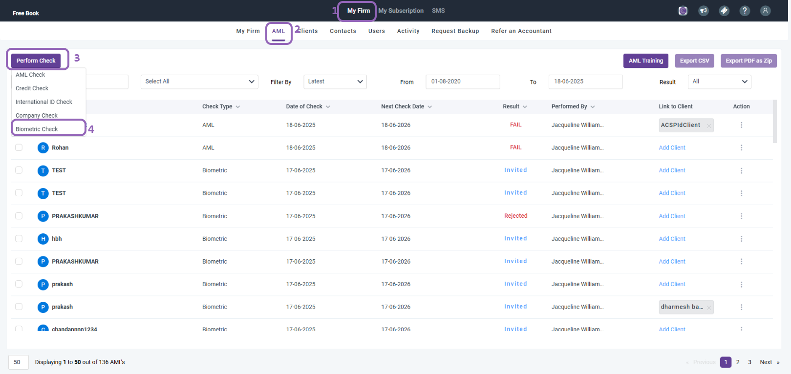
  - 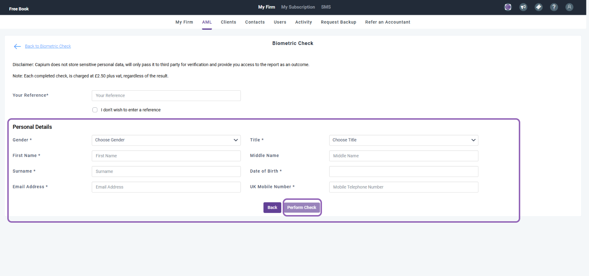
  - 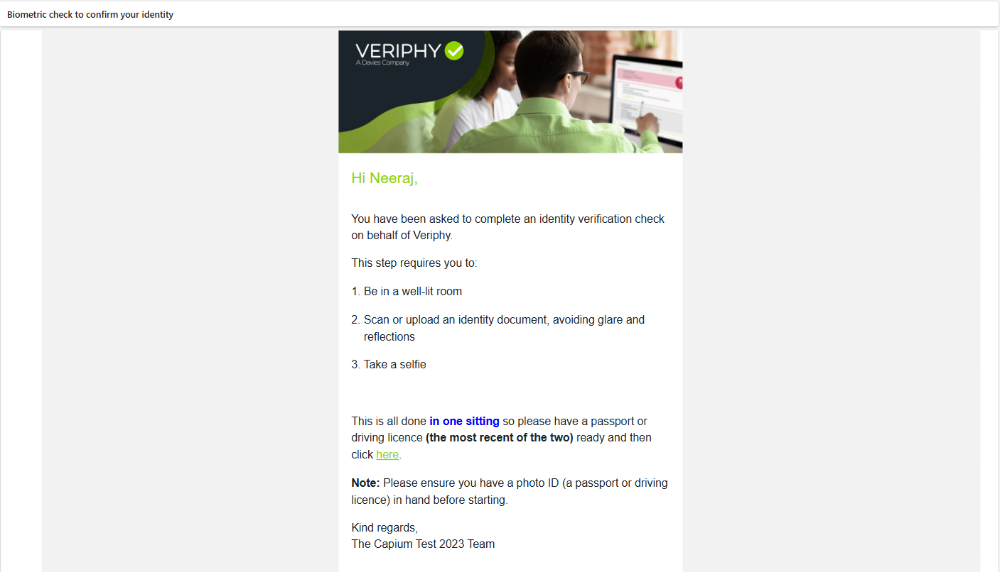
  - 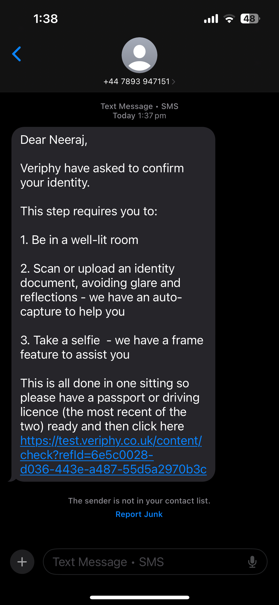
  - 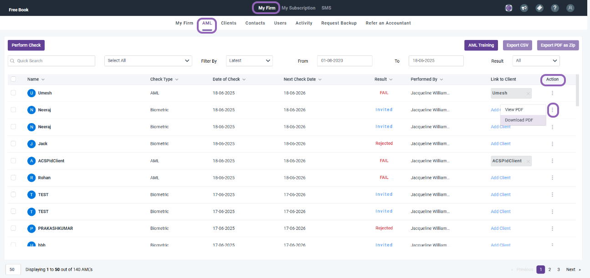

---

### 11. Biometric AML Checks
- **Folder:** Capium AML
- **Article ID:** `9000269007` | **Slug:** `biometric-aml-checks`
- **Markdown File:** [raw_articles/9000269007_biometric-aml-checks.md](../raw_articles/9000269007_biometric-aml-checks.md)
- **Images Count:** 0

---

### 12. Biometric checks &amp; Entering the information into Companies House (ACSP)
- **Folder:** Capium AML
- **Article ID:** `9000269284` | **Slug:** `biometric-checks-entering-the-information-into-companies-house-acsp-`
- **Markdown File:** [raw_articles/9000269284_biometric-checks-entering-the-information-into-companies-house-acsp-.md](../raw_articles/9000269284_biometric-checks-entering-the-information-into-companies-house-acsp-.md)
- **Images Count:** 7
- **Screenshots:**
  - 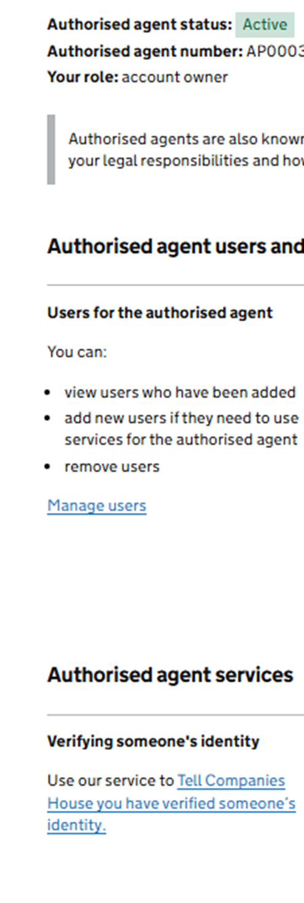
  - 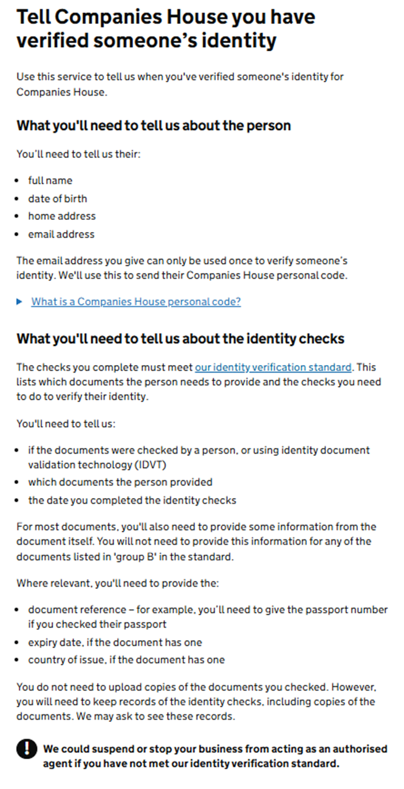
  - 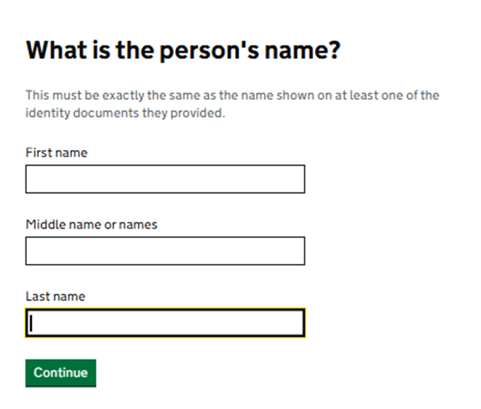
  - 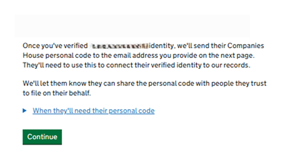
  - 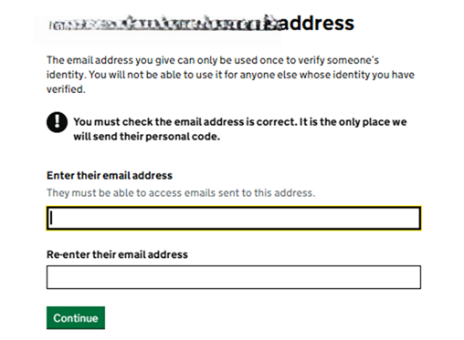
  - 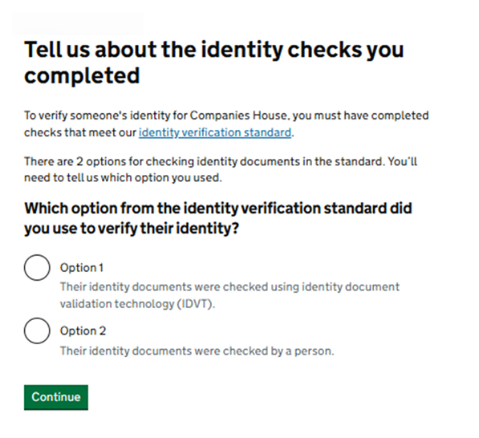
  - 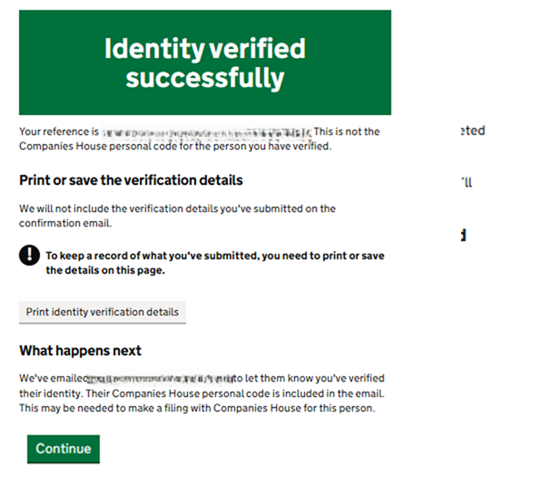

---

### 13. How to add in your ACSP ID and IDV details
- **Folder:** Capium AML
- **Article ID:** `9000269295` | **Slug:** `how-to-add-in-your-acsp-id-and-idv-details`
- **Markdown File:** [raw_articles/9000269295_how-to-add-in-your-acsp-id-and-idv-details.md](../raw_articles/9000269295_how-to-add-in-your-acsp-id-and-idv-details.md)
- **Images Count:** 11
- **Screenshots:**
  - 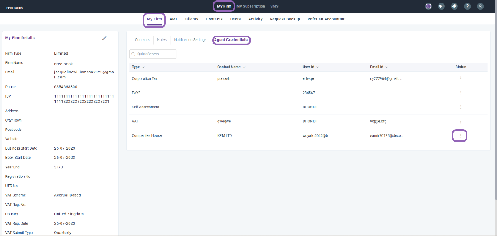
  - 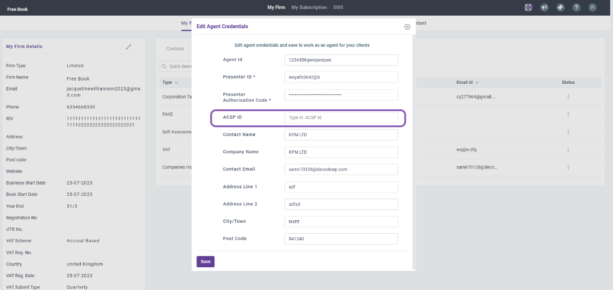
  - 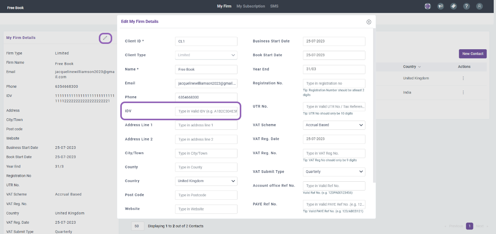
  - 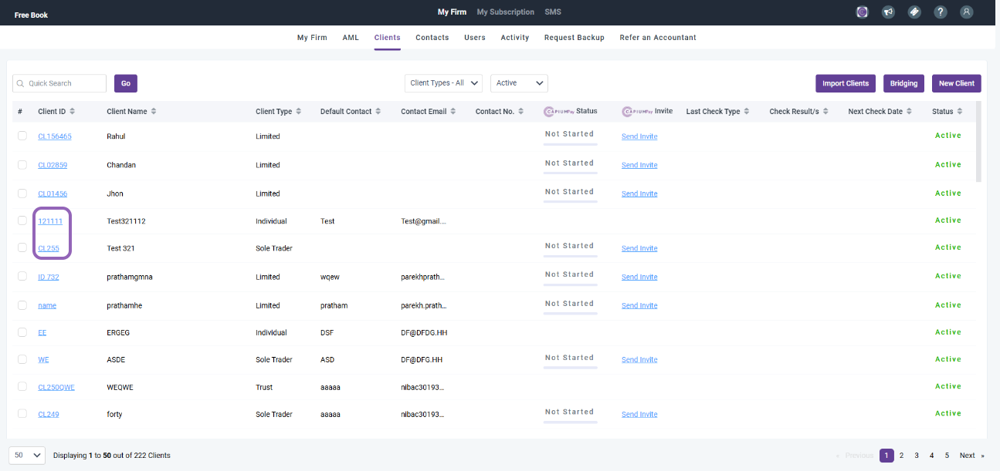
  - 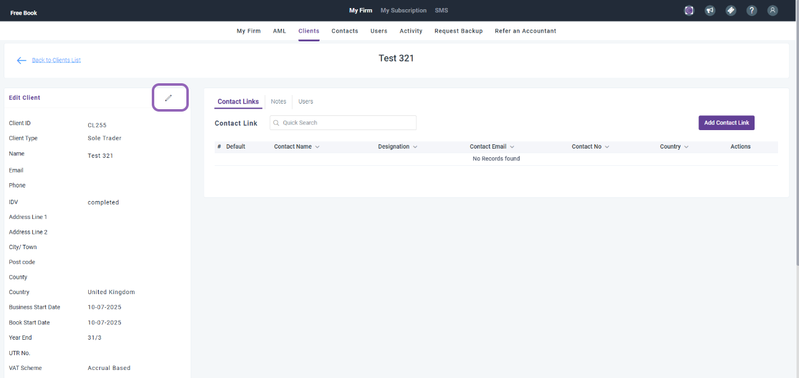
  - 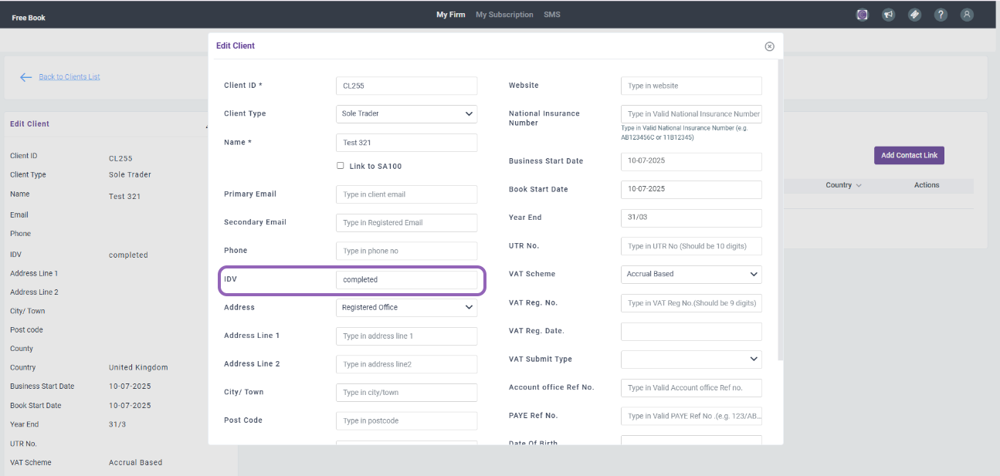
  - 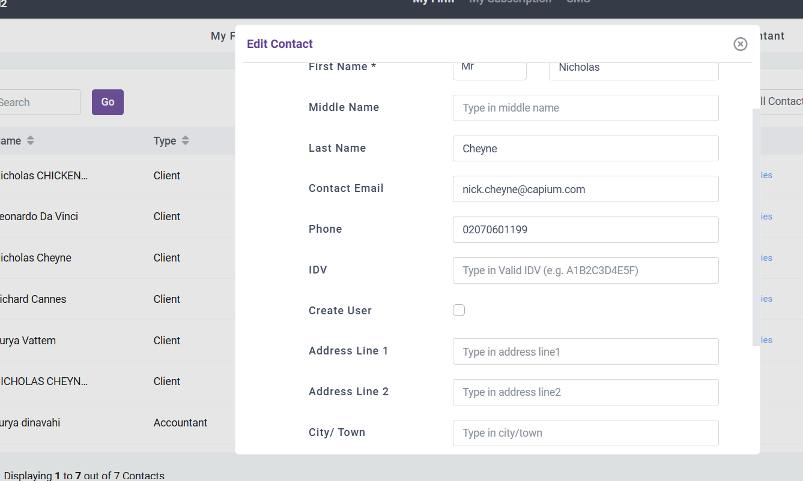
  - 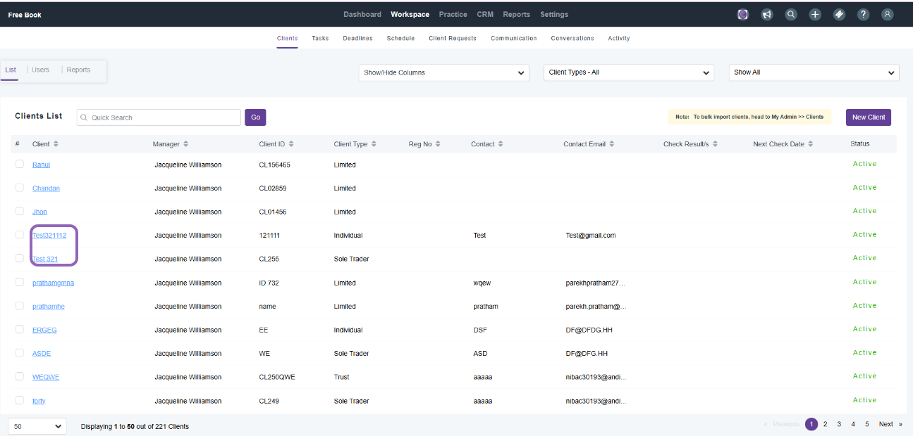
  - 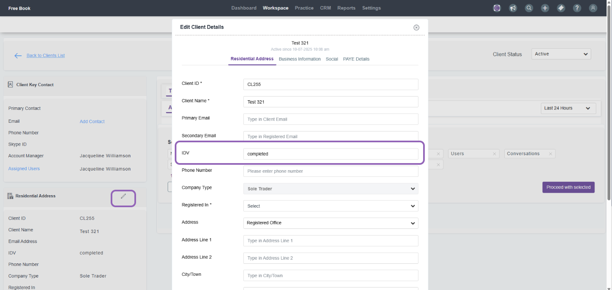
  - 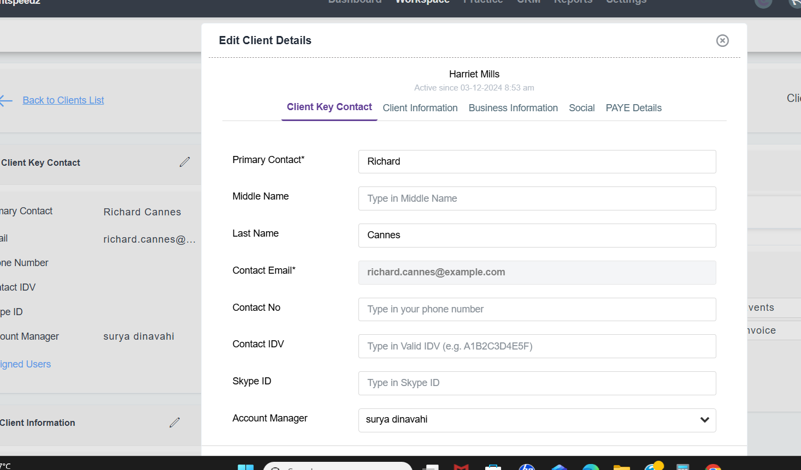
  - 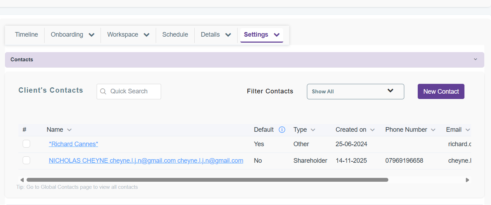

---

