# Bookkeeping Module - Knowledge Base & Feature Index

> Total Articles: **139** | Module Directory: `d:/sansuite/Bookkeeping`

## Articles List & Local Assets

### 1. Bookkeeping Dashboard Overview
- **Folder:** Bookkeeping Help Guide
- **Article ID:** `9000150604` | **Slug:** `bookkeeping-dashboard-overview`
- **Markdown File:** [raw_articles/9000150604_bookkeeping-dashboard-overview.md](../raw_articles/9000150604_bookkeeping-dashboard-overview.md)
- **Images Count:** 3
- **Screenshots:**
  - 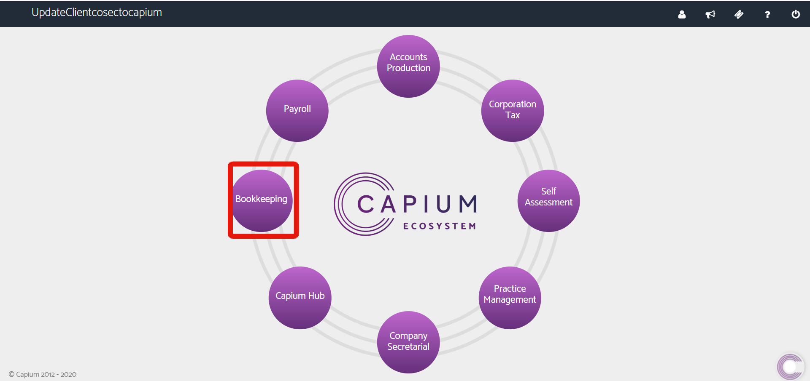
  - 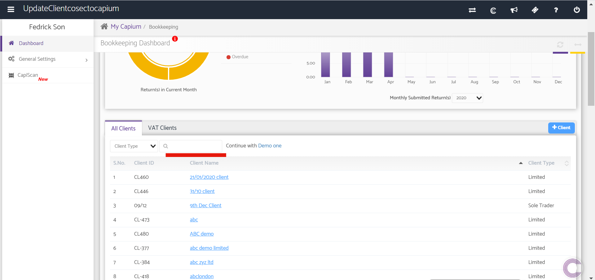
  - 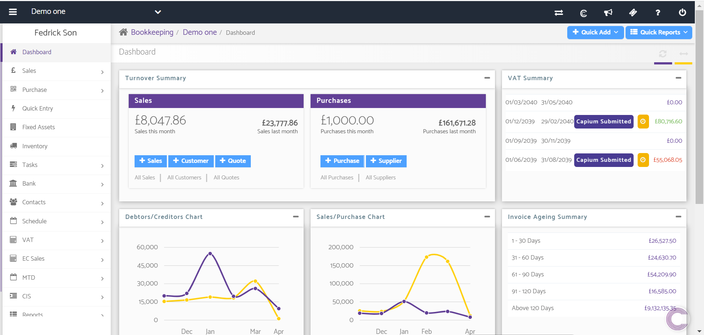

---

### 2. Adding an Accounting Period
- **Folder:** Bookkeeping Help Guide
- **Article ID:** `9000165221` | **Slug:** `adding-an-accounting-period`
- **Markdown File:** [raw_articles/9000165221_adding-an-accounting-period.md](../raw_articles/9000165221_adding-an-accounting-period.md)
- **Images Count:** 2
- **Screenshots:**
  - 
  - 

---

### 3. Adding an Opening Balance
- **Folder:** Bookkeeping Help Guide
- **Article ID:** `9000165213` | **Slug:** `adding-an-opening-balance`
- **Markdown File:** [raw_articles/9000165213_adding-an-opening-balance.md](../raw_articles/9000165213_adding-an-opening-balance.md)
- **Images Count:** 1
- **Screenshots:**
  - 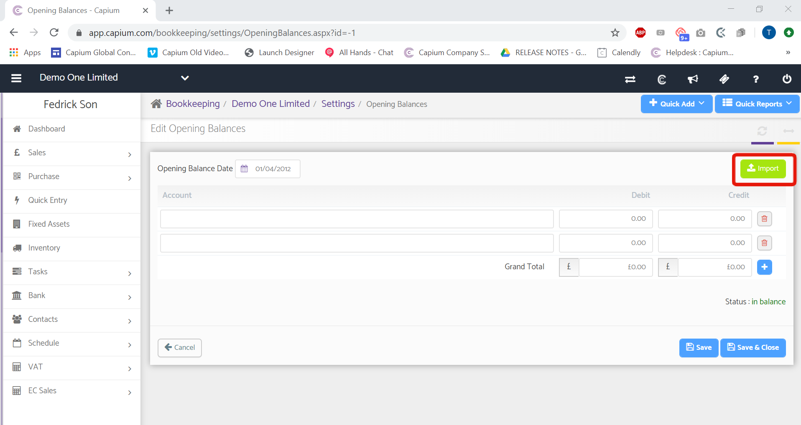

---

### 4. Chart of Accounts (COA)
- **Folder:** Bookkeeping Help Guide
- **Article ID:** `9000165220` | **Slug:** `chart-of-accounts-coa-`
- **Markdown File:** [raw_articles/9000165220_chart-of-accounts-coa-.md](../raw_articles/9000165220_chart-of-accounts-coa-.md)
- **Images Count:** 3
- **Screenshots:**
  - 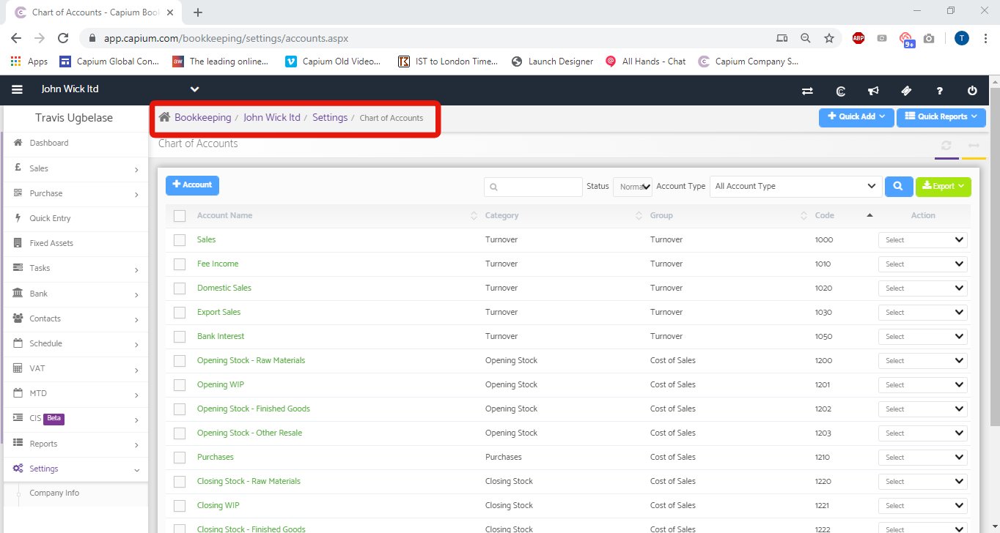
  - 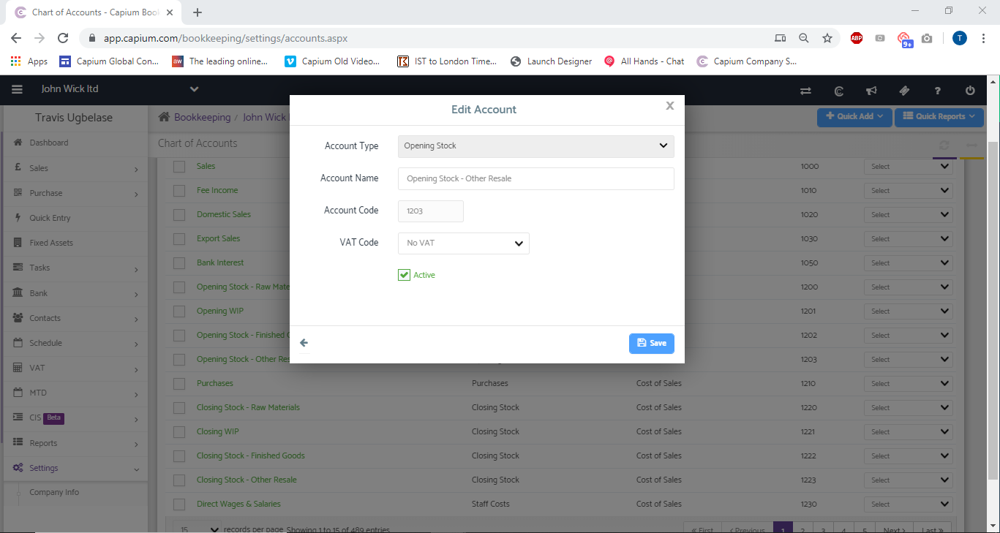
  - 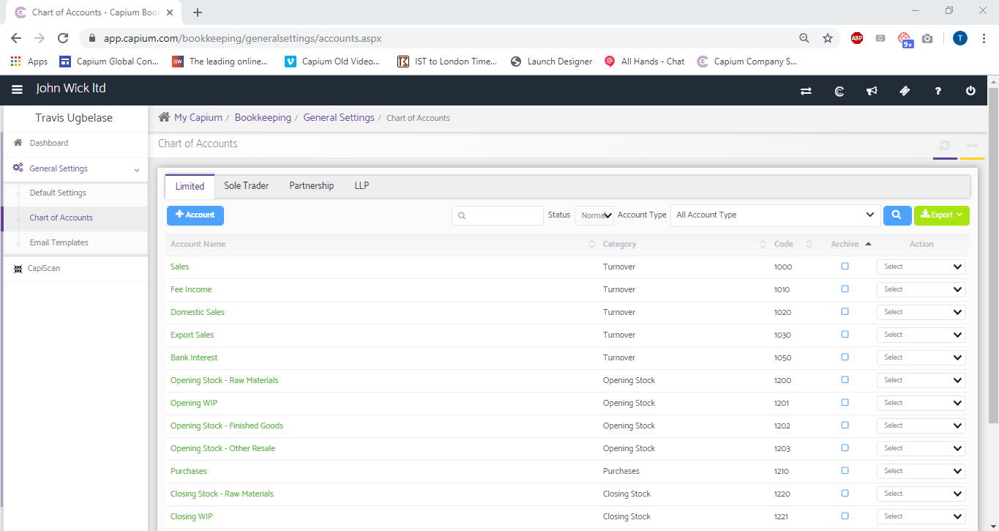

---

### 5. Sales Dashboard
- **Folder:** Bookkeeping Help Guide
- **Article ID:** `9000165179` | **Slug:** `sales-dashboard`
- **Markdown File:** [raw_articles/9000165179_sales-dashboard.md](../raw_articles/9000165179_sales-dashboard.md)
- **Images Count:** 4
- **Screenshots:**
  - 
  - 
  - 
  - 

---

### 6. Viewing and Creating Recurring Invoices
- **Folder:** Bookkeeping Help Guide
- **Article ID:** `9000150607` | **Slug:** `viewing-and-creating-recurring-invoices`
- **Markdown File:** [raw_articles/9000150607_viewing-and-creating-recurring-invoices.md](../raw_articles/9000150607_viewing-and-creating-recurring-invoices.md)
- **Images Count:** 2
- **Screenshots:**
  - 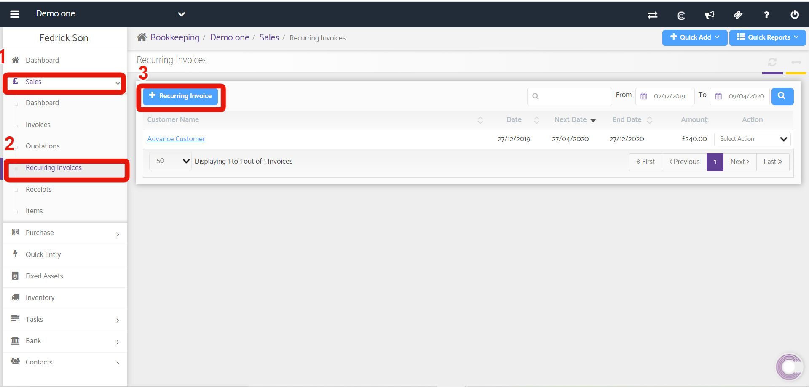
  - 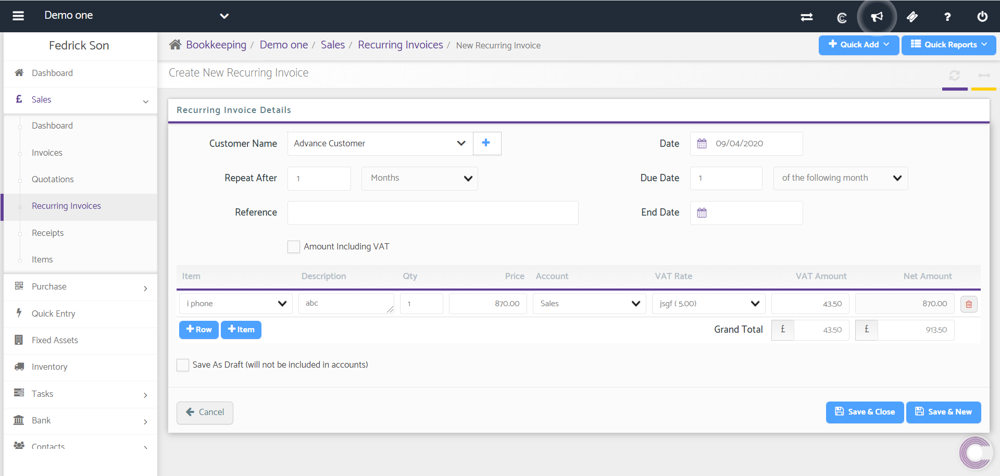

---

### 7. Purchase Dashboard
- **Folder:** Bookkeeping Help Guide
- **Article ID:** `9000165180` | **Slug:** `purchase-dashboard`
- **Markdown File:** [raw_articles/9000165180_purchase-dashboard.md](../raw_articles/9000165180_purchase-dashboard.md)
- **Images Count:** 1
- **Screenshots:**
  - 

---

### 8. Adding and Creating Purchase Invoices
- **Folder:** Bookkeeping Help Guide
- **Article ID:** `9000165216` | **Slug:** `adding-and-creating-purchase-invoices`
- **Markdown File:** [raw_articles/9000165216_adding-and-creating-purchase-invoices.md](../raw_articles/9000165216_adding-and-creating-purchase-invoices.md)
- **Images Count:** 3
- **Screenshots:**
  - 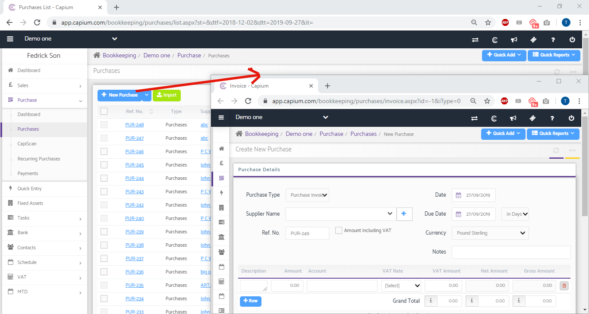
  - 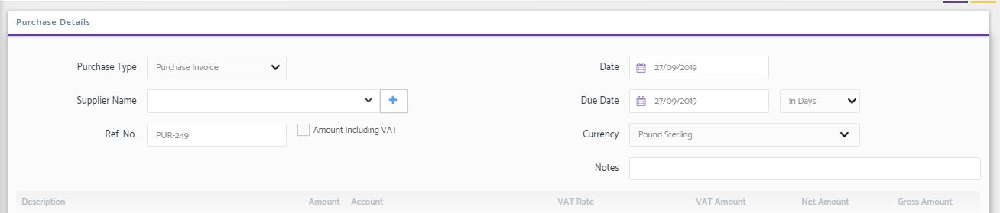
  - 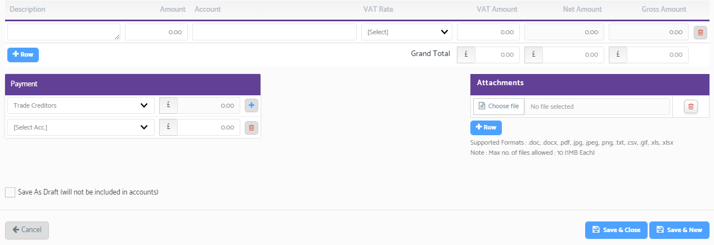

---

### 9. Recurring Purchases
- **Folder:** Bookkeeping Help Guide
- **Article ID:** `9000165218` | **Slug:** `recurring-purchases`
- **Markdown File:** [raw_articles/9000165218_recurring-purchases.md](../raw_articles/9000165218_recurring-purchases.md)
- **Images Count:** 1
- **Screenshots:**
  - 

---

### 10. Adding and Creating Sales Quotations 
- **Folder:** Bookkeeping Help Guide
- **Article ID:** `9000150606` | **Slug:** `adding-and-creating-sales-quotations-`
- **Markdown File:** [raw_articles/9000150606_adding-and-creating-sales-quotations-.md](../raw_articles/9000150606_adding-and-creating-sales-quotations-.md)
- **Images Count:** 2
- **Screenshots:**
  - 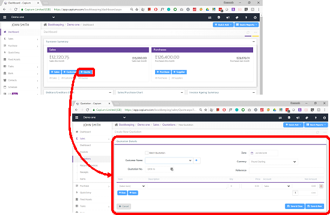
  - 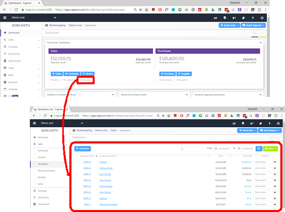

---

### 11. Quick Entry Section
- **Folder:** Bookkeeping Help Guide
- **Article ID:** `9000165186` | **Slug:** `quick-entry-section`
- **Markdown File:** [raw_articles/9000165186_quick-entry-section.md](../raw_articles/9000165186_quick-entry-section.md)
- **Images Count:** 3
- **Screenshots:**
  - 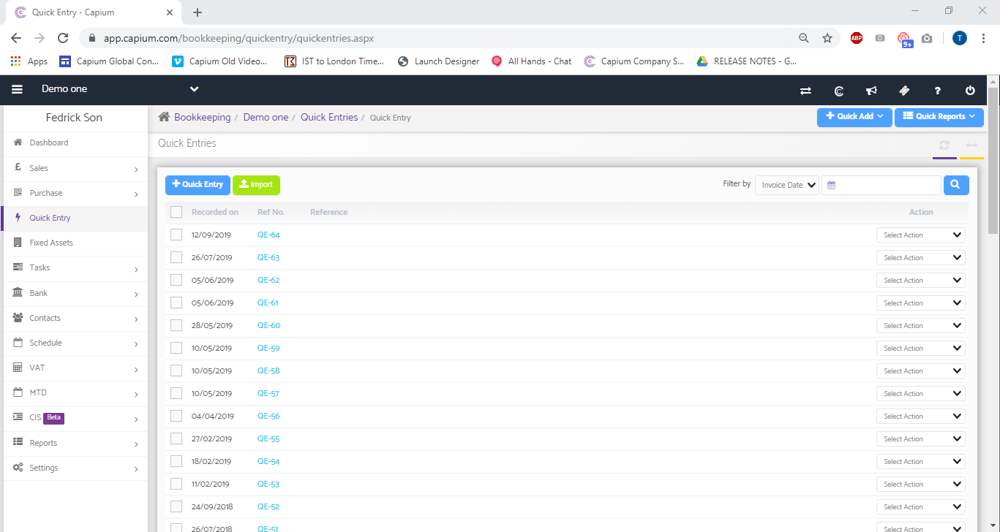
  - 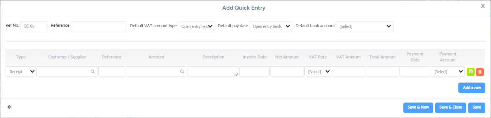
  - 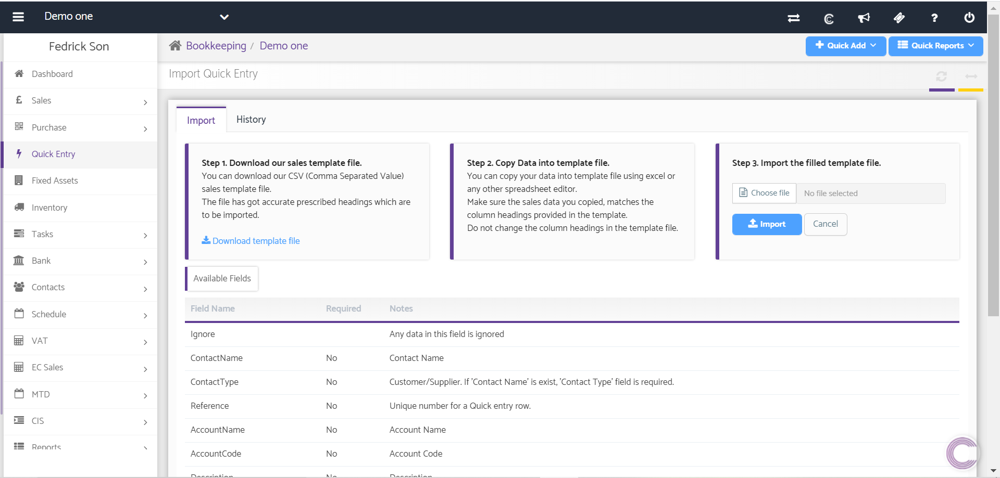

---

### 12. Viewing and allocating sales receipts
- **Folder:** Bookkeeping Help Guide
- **Article ID:** `9000150608` | **Slug:** `viewing-and-allocating-sales-receipts`
- **Markdown File:** [raw_articles/9000150608_viewing-and-allocating-sales-receipts.md](../raw_articles/9000150608_viewing-and-allocating-sales-receipts.md)
- **Images Count:** 2
- **Screenshots:**
  - 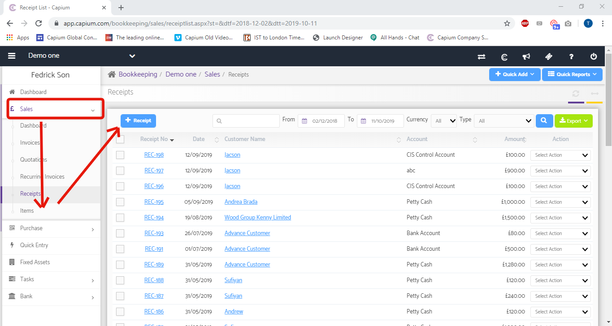
  - 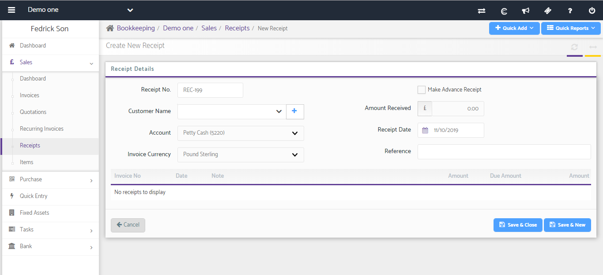

---

### 13. Viewing and Creating Sale Items
- **Folder:** Bookkeeping Help Guide
- **Article ID:** `9000150609` | **Slug:** `viewing-and-creating-sale-items`
- **Markdown File:** [raw_articles/9000150609_viewing-and-creating-sale-items.md](../raw_articles/9000150609_viewing-and-creating-sale-items.md)
- **Images Count:** 2
- **Screenshots:**
  - 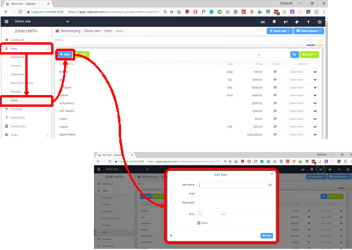
  - 

---

### 14. Multi-currency
- **Folder:** Bookkeeping Help Guide
- **Article ID:** `9000165209` | **Slug:** `multi-currency`
- **Markdown File:** [raw_articles/9000165209_multi-currency.md](../raw_articles/9000165209_multi-currency.md)
- **Images Count:** 1
- **Screenshots:**
  - 

---

### 15. Customising invoice sequence numbers
- **Folder:** Bookkeeping Help Guide
- **Article ID:** `9000165202` | **Slug:** `customising-invoice-sequence-numbers`
- **Markdown File:** [raw_articles/9000165202_customising-invoice-sequence-numbers.md](../raw_articles/9000165202_customising-invoice-sequence-numbers.md)
- **Images Count:** 1
- **Screenshots:**
  - 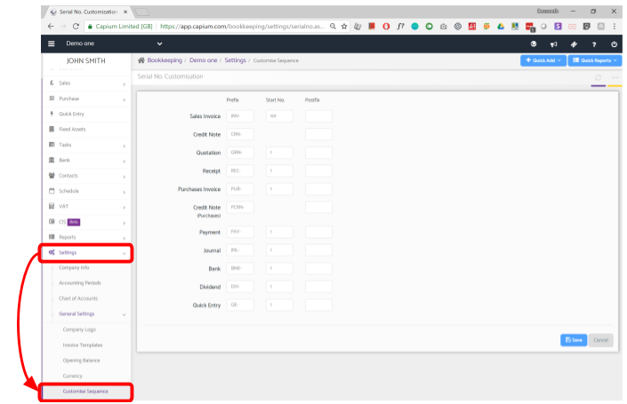

---

### 16. Bookkeeping Invoice Templates
- **Folder:** Bookkeeping Help Guide
- **Article ID:** `9000165215` | **Slug:** `bookkeeping-invoice-templates`
- **Markdown File:** [raw_articles/9000165215_bookkeeping-invoice-templates.md](../raw_articles/9000165215_bookkeeping-invoice-templates.md)
- **Images Count:** 1
- **Screenshots:**
  - 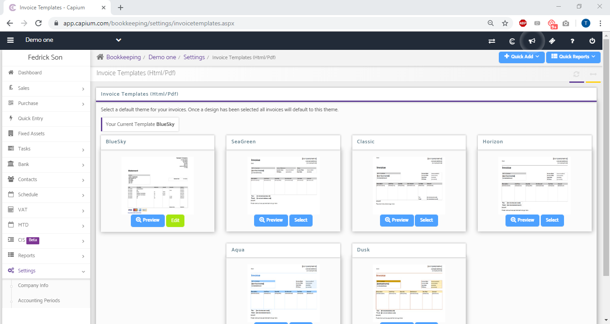

---

### 17. Adding a company logo
- **Folder:** Bookkeeping Help Guide
- **Article ID:** `9000165217` | **Slug:** `adding-a-company-logo`
- **Markdown File:** [raw_articles/9000165217_adding-a-company-logo.md](../raw_articles/9000165217_adding-a-company-logo.md)
- **Images Count:** 1
- **Screenshots:**
  - 

---

### 18. Adding payments to purchase invoices
- **Folder:** Bookkeeping Help Guide
- **Article ID:** `9000165219` | **Slug:** `adding-payments-to-purchase-invoices`
- **Markdown File:** [raw_articles/9000165219_adding-payments-to-purchase-invoices.md](../raw_articles/9000165219_adding-payments-to-purchase-invoices.md)
- **Images Count:** 2
- **Screenshots:**
  - 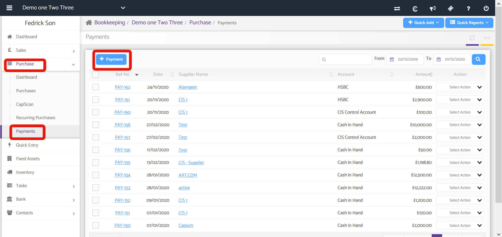
  - 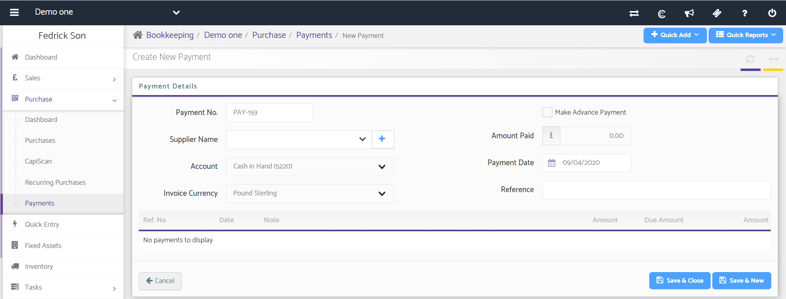

---

### 19. Adding a journal entry
- **Folder:** Bookkeeping Help Guide
- **Article ID:** `9000165222` | **Slug:** `adding-a-journal-entry`
- **Markdown File:** [raw_articles/9000165222_adding-a-journal-entry.md](../raw_articles/9000165222_adding-a-journal-entry.md)
- **Images Count:** 2
- **Screenshots:**
  - 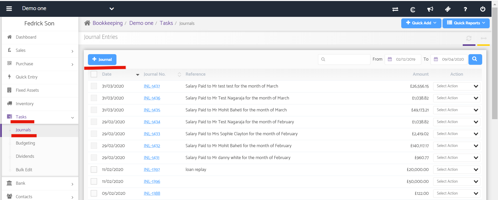
  - 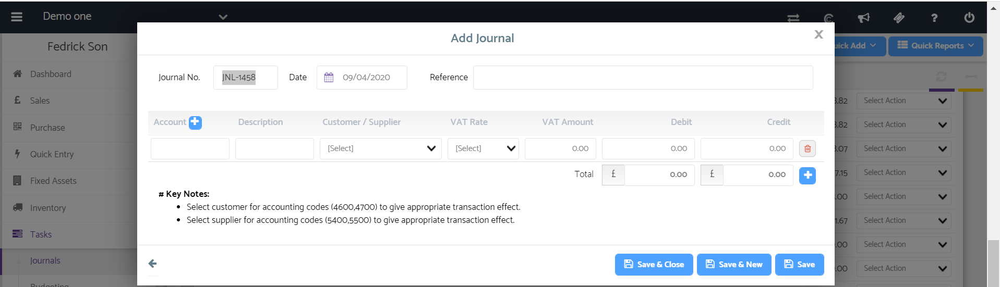

---

### 20. Budget Section
- **Folder:** Bookkeeping Help Guide
- **Article ID:** `9000165223` | **Slug:** `budget-section`
- **Markdown File:** [raw_articles/9000165223_budget-section.md](../raw_articles/9000165223_budget-section.md)
- **Images Count:** 3
- **Screenshots:**
  - 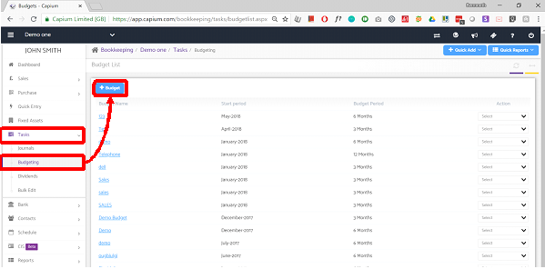
  - 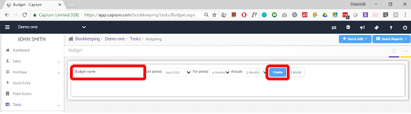
  - 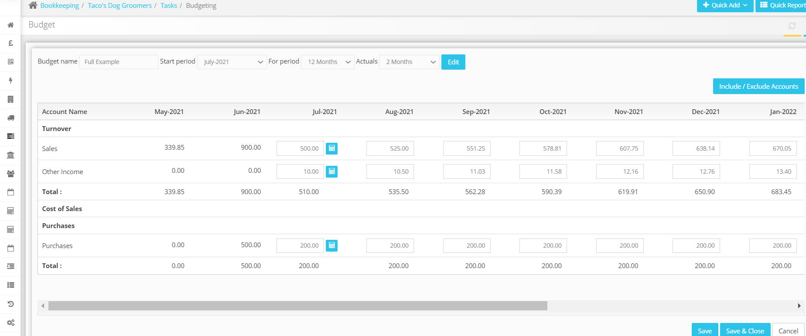

---

### 21. Dividends
- **Folder:** Bookkeeping Help Guide
- **Article ID:** `9000165224` | **Slug:** `dividends`
- **Markdown File:** [raw_articles/9000165224_dividends.md](../raw_articles/9000165224_dividends.md)
- **Images Count:** 2
- **Screenshots:**
  - 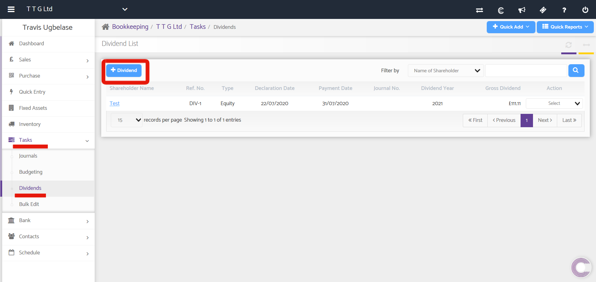
  - 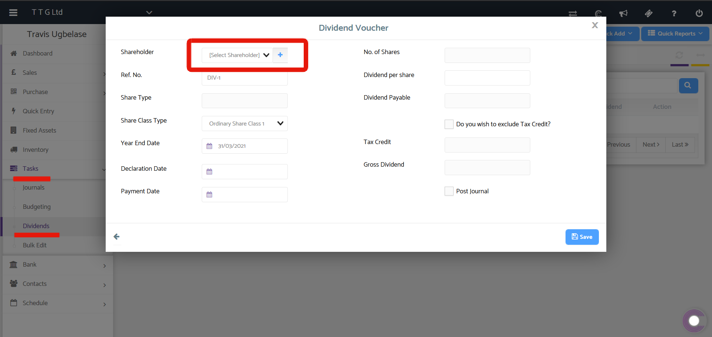

---

### 22. How to use the Bulk Edit feature
- **Folder:** Bookkeeping Help Guide
- **Article ID:** `9000165226` | **Slug:** `how-to-use-the-bulk-edit-feature`
- **Markdown File:** [raw_articles/9000165226_how-to-use-the-bulk-edit-feature.md](../raw_articles/9000165226_how-to-use-the-bulk-edit-feature.md)
- **Images Count:** 1
- **Screenshots:**
  - 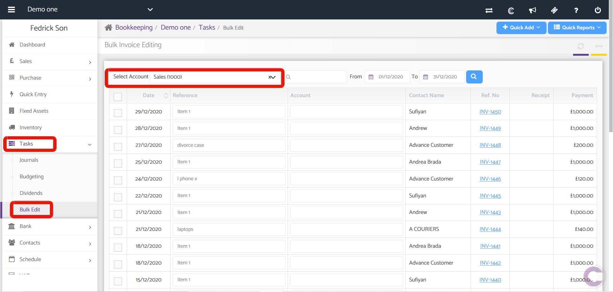

---

### 23. Bank Dashboard
- **Folder:** Bookkeeping Help Guide
- **Article ID:** `9000165227` | **Slug:** `bank-dashboard`
- **Markdown File:** [raw_articles/9000165227_bank-dashboard.md](../raw_articles/9000165227_bank-dashboard.md)
- **Images Count:** 1
- **Screenshots:**
  - 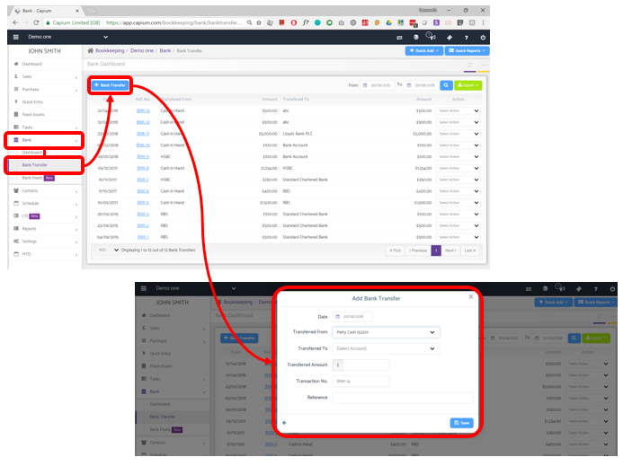

---

### 24. Setting up Bank Feeds
- **Folder:** Bookkeeping Help Guide
- **Article ID:** `9000165353` | **Slug:** `setting-up-bank-feeds`
- **Markdown File:** [raw_articles/9000165353_setting-up-bank-feeds.md](../raw_articles/9000165353_setting-up-bank-feeds.md)
- **Images Count:** 8
- **Screenshots:**
  - 
  - 
  - 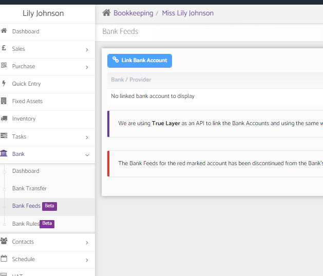
  - 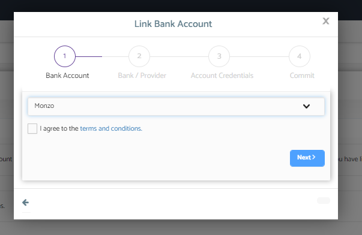
  - 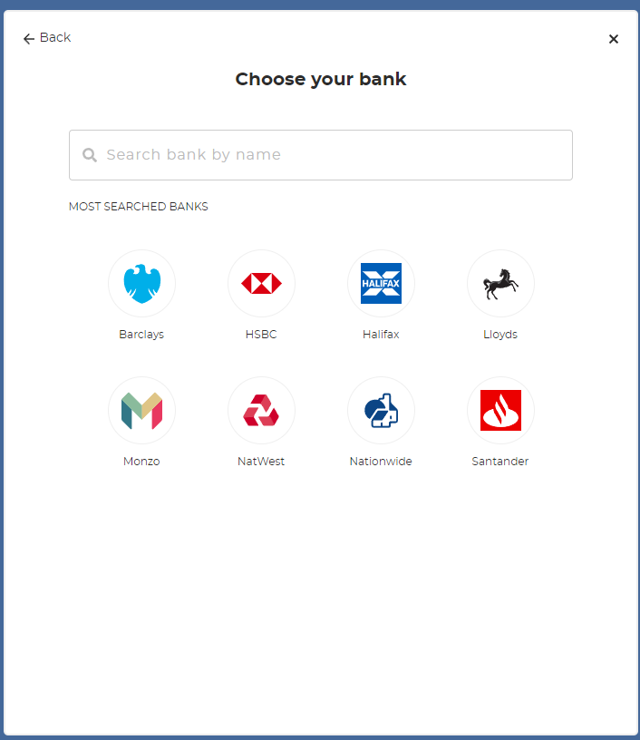
  - 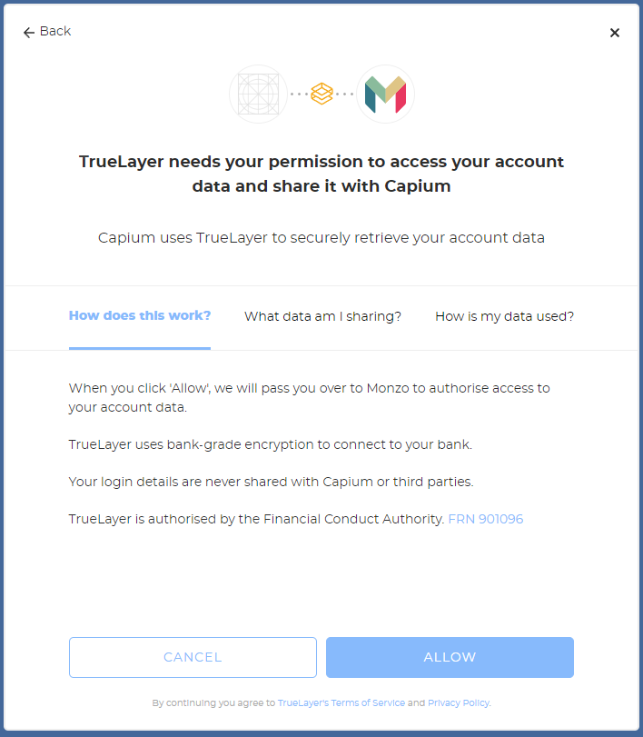
  - 
  - 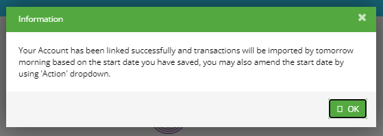

---

### 25. Cash Coding
- **Folder:** Bookkeeping Help Guide
- **Article ID:** `9000185322` | **Slug:** `cash-coding`
- **Markdown File:** [raw_articles/9000185322_cash-coding.md](../raw_articles/9000185322_cash-coding.md)
- **Images Count:** 1
- **Screenshots:**
  - 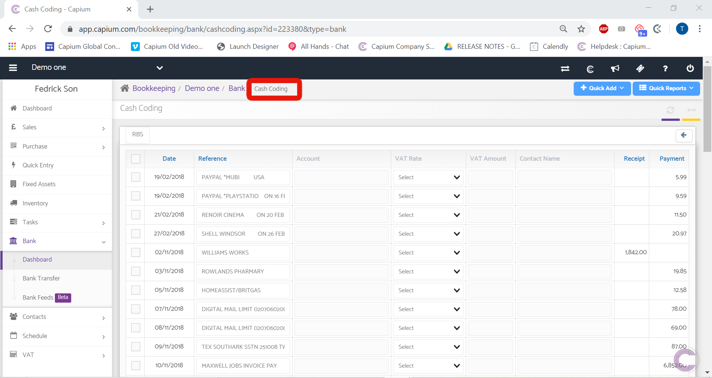

---

### 26. Auto Bank Reconciliation
- **Folder:** Bookkeeping Help Guide
- **Article ID:** `9000195198` | **Slug:** `auto-bank-reconciliation`
- **Markdown File:** [raw_articles/9000195198_auto-bank-reconciliation.md](../raw_articles/9000195198_auto-bank-reconciliation.md)
- **Images Count:** 8
- **Screenshots:**
  - 
  - 
  - 
  - 
  - 
  - 
  - 
  - 

---

### 27. How to delete a bank transaction
- **Folder:** Bookkeeping Help Guide
- **Article ID:** `9000204223` | **Slug:** `how-to-delete-a-bank-transaction`
- **Markdown File:** [raw_articles/9000204223_how-to-delete-a-bank-transaction.md](../raw_articles/9000204223_how-to-delete-a-bank-transaction.md)
- **Images Count:** 3
- **Screenshots:**
  - 
  - 
  - 

---

### 28. Bank Account Search Tool
- **Folder:** Bookkeeping Help Guide
- **Article ID:** `9000202684` | **Slug:** `bank-account-search-tool`
- **Markdown File:** [raw_articles/9000202684_bank-account-search-tool.md](../raw_articles/9000202684_bank-account-search-tool.md)
- **Images Count:** 1
- **Screenshots:**
  - 

---

### 29. How to Create Bank Rules
- **Folder:** Bookkeeping Help Guide
- **Article ID:** `9000204283` | **Slug:** `how-to-create-bank-rules`
- **Markdown File:** [raw_articles/9000204283_how-to-create-bank-rules.md](../raw_articles/9000204283_how-to-create-bank-rules.md)
- **Images Count:** 4
- **Screenshots:**
  - 
  - 
  - 
  - 

---

### 30. Contacts - Customer
- **Folder:** Bookkeeping Help Guide
- **Article ID:** `9000165228` | **Slug:** `contacts-customer`
- **Markdown File:** [raw_articles/9000165228_contacts-customer.md](../raw_articles/9000165228_contacts-customer.md)
- **Images Count:** 3
- **Screenshots:**
  - 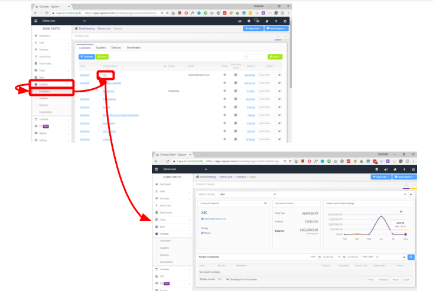
  - 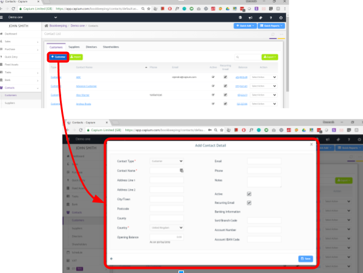
  - 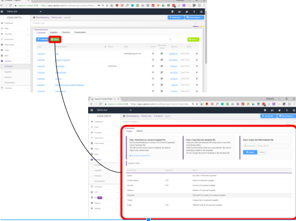

---

### 31. Contacts - Suppliers
- **Folder:** Bookkeeping Help Guide
- **Article ID:** `9000165229` | **Slug:** `contacts-suppliers`
- **Markdown File:** [raw_articles/9000165229_contacts-suppliers.md](../raw_articles/9000165229_contacts-suppliers.md)
- **Images Count:** 3
- **Screenshots:**
  - 
  - 
  - 

---

### 32. Contacts - Shareholders
- **Folder:** Bookkeeping Help Guide
- **Article ID:** `9000165231` | **Slug:** `contacts-shareholders`
- **Markdown File:** [raw_articles/9000165231_contacts-shareholders.md](../raw_articles/9000165231_contacts-shareholders.md)
- **Images Count:** 2
- **Screenshots:**
  - 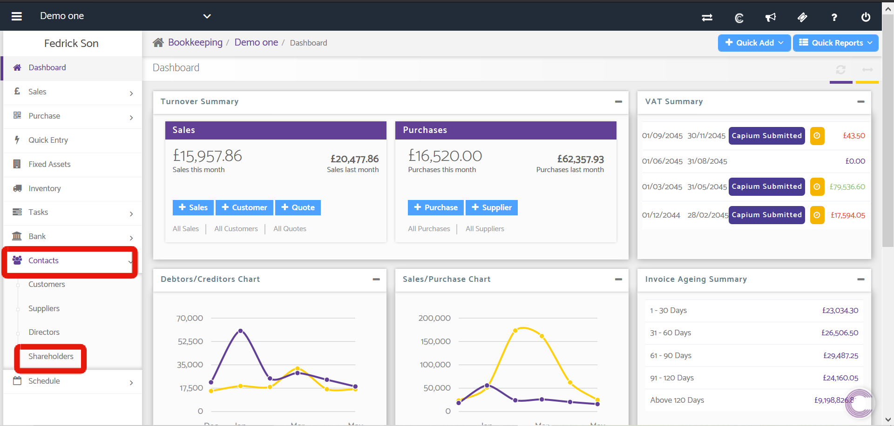
  - 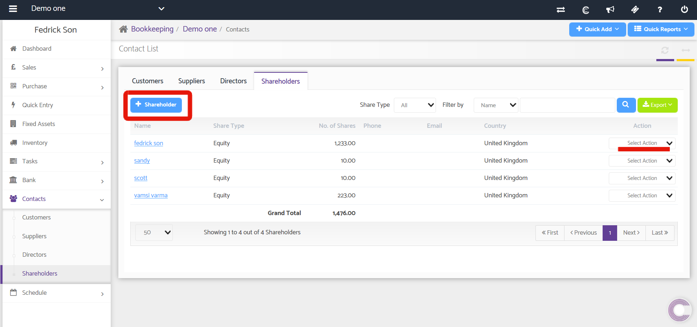

---

### 33. Schedule - Minutes of Meeting Notes
- **Folder:** Bookkeeping Help Guide
- **Article ID:** `9000165232` | **Slug:** `schedule-minutes-of-meeting-notes`
- **Markdown File:** [raw_articles/9000165232_schedule-minutes-of-meeting-notes.md](../raw_articles/9000165232_schedule-minutes-of-meeting-notes.md)
- **Images Count:** 2
- **Screenshots:**
  - 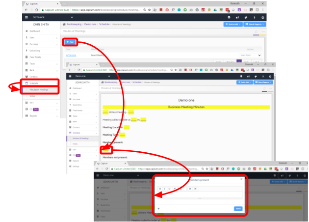
  - 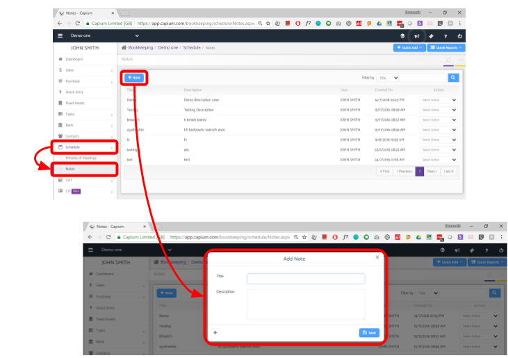

---

### 34. VAT Codes in Capium
- **Folder:** Bookkeeping Help Guide
- **Article ID:** `9000202087` | **Slug:** `vat-codes-in-capium`
- **Markdown File:** [raw_articles/9000202087_vat-codes-in-capium.md](../raw_articles/9000202087_vat-codes-in-capium.md)
- **Images Count:** 3
- **Screenshots:**
  - 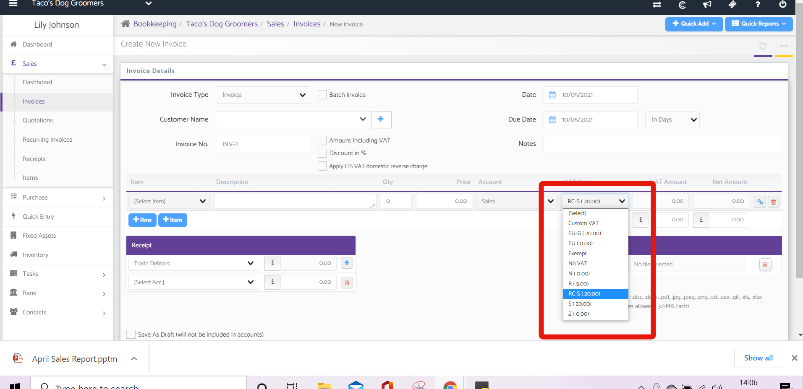
  - 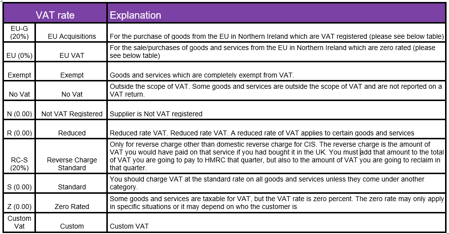
  - 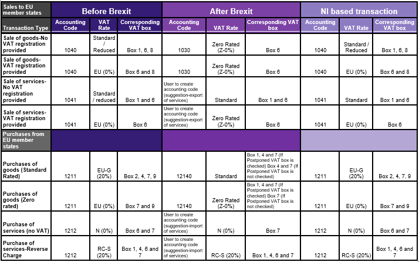

---

### 35. VAT Settings
- **Folder:** Bookkeeping Help Guide
- **Article ID:** `9000165233` | **Slug:** `vat-settings`
- **Markdown File:** [raw_articles/9000165233_vat-settings.md](../raw_articles/9000165233_vat-settings.md)
- **Images Count:** 1
- **Screenshots:**
  - 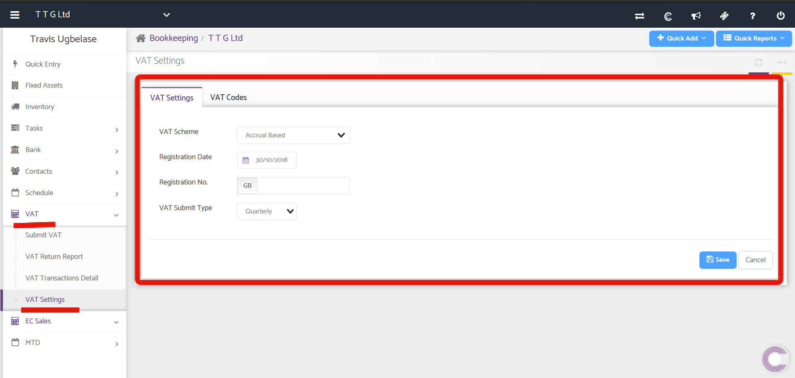

---

### 36. How to Submit VAT
- **Folder:** Bookkeeping Help Guide
- **Article ID:** `9000165234` | **Slug:** `how-to-submit-vat`
- **Markdown File:** [raw_articles/9000165234_how-to-submit-vat.md](../raw_articles/9000165234_how-to-submit-vat.md)
- **Images Count:** 6
- **Screenshots:**
  - 
  - 
  - 
  - 
  - 
  - 

---

### 37. View VAT Return Report
- **Folder:** Bookkeeping Help Guide
- **Article ID:** `9000165235` | **Slug:** `view-vat-return-report`
- **Markdown File:** [raw_articles/9000165235_view-vat-return-report.md](../raw_articles/9000165235_view-vat-return-report.md)
- **Images Count:** 1
- **Screenshots:**
  - 

---

### 38. View VAT Transaction Detail
- **Folder:** Bookkeeping Help Guide
- **Article ID:** `9000165236` | **Slug:** `view-vat-transaction-detail`
- **Markdown File:** [raw_articles/9000165236_view-vat-transaction-detail.md](../raw_articles/9000165236_view-vat-transaction-detail.md)
- **Images Count:** 1
- **Screenshots:**
  - 

---

### 39. Postponed VAT Accounting (Latest as at 28/01/2021)
- **Folder:** Bookkeeping Help Guide
- **Article ID:** `9000197371` | **Slug:** `postponed-vat-accounting-latest-as-at-28-01-2021-`
- **Markdown File:** [raw_articles/9000197371_postponed-vat-accounting-latest-as-at-28-01-2021-.md](../raw_articles/9000197371_postponed-vat-accounting-latest-as-at-28-01-2021-.md)
- **Images Count:** 3
- **Screenshots:**
  - 
  - 
  - 

---

### 40. CIS for Construction Industry
- **Folder:** Bookkeeping Help Guide
- **Article ID:** `9000165238` | **Slug:** `cis-for-construction-industry`
- **Markdown File:** [raw_articles/9000165238_cis-for-construction-industry.md](../raw_articles/9000165238_cis-for-construction-industry.md)
- **Images Count:** 4
- **Screenshots:**
  - 
  - 
  - 
  - 

---

### 41. CIS Sub-contractor Invoices
- **Folder:** Bookkeeping Help Guide
- **Article ID:** `9000180788` | **Slug:** `cis-sub-contractor-invoices`
- **Markdown File:** [raw_articles/9000180788_cis-sub-contractor-invoices.md](../raw_articles/9000180788_cis-sub-contractor-invoices.md)
- **Images Count:** 3
- **Screenshots:**
  - 
  - 
  - 

---

### 42. CIS Bank Integration
- **Folder:** Bookkeeping Help Guide
- **Article ID:** `9000180354` | **Slug:** `cis-bank-integration`
- **Markdown File:** [raw_articles/9000180354_cis-bank-integration.md](../raw_articles/9000180354_cis-bank-integration.md)
- **Images Count:** 2
- **Screenshots:**
  - 
  - 

---

### 43. Domestic Reverse Charge - CIS
- **Folder:** Bookkeeping Help Guide
- **Article ID:** `9000199378` | **Slug:** `domestic-reverse-charge-cis`
- **Markdown File:** [raw_articles/9000199378_domestic-reverse-charge-cis.md](../raw_articles/9000199378_domestic-reverse-charge-cis.md)
- **Images Count:** 2
- **Screenshots:**
  - 
  - 

---

### 44. Customer Segment Report
- **Folder:** Bookkeeping Help Guide
- **Article ID:** `9000165239` | **Slug:** `customer-segment-report`
- **Markdown File:** [raw_articles/9000165239_customer-segment-report.md](../raw_articles/9000165239_customer-segment-report.md)
- **Images Count:** 1
- **Screenshots:**
  - 

---

### 45. Supplier Segment Report
- **Folder:** Bookkeeping Help Guide
- **Article ID:** `9000165240` | **Slug:** `supplier-segment-report`
- **Markdown File:** [raw_articles/9000165240_supplier-segment-report.md](../raw_articles/9000165240_supplier-segment-report.md)
- **Images Count:** 1
- **Screenshots:**
  - 

---

### 46. Financial Reports Section
- **Folder:** Bookkeeping Help Guide
- **Article ID:** `9000165241` | **Slug:** `financial-reports-section`
- **Markdown File:** [raw_articles/9000165241_financial-reports-section.md](../raw_articles/9000165241_financial-reports-section.md)
- **Images Count:** 1
- **Screenshots:**
  - 

---

### 47. Additional Reports
- **Folder:** Bookkeeping Help Guide
- **Article ID:** `9000165242` | **Slug:** `additional-reports`
- **Markdown File:** [raw_articles/9000165242_additional-reports.md](../raw_articles/9000165242_additional-reports.md)
- **Images Count:** 0

---

### 48. Settings Section
- **Folder:** Bookkeeping Help Guide
- **Article ID:** `9000165243` | **Slug:** `settings-section`
- **Markdown File:** [raw_articles/9000165243_settings-section.md](../raw_articles/9000165243_settings-section.md)
- **Images Count:** 0

---

### 49. Company Info
- **Folder:** Bookkeeping Help Guide
- **Article ID:** `9000165244` | **Slug:** `company-info`
- **Markdown File:** [raw_articles/9000165244_company-info.md](../raw_articles/9000165244_company-info.md)
- **Images Count:** 1
- **Screenshots:**
  - 

---

### 50. Bulk Delete Transactions (Sales, Purchase &amp; Journals)
- **Folder:** Bookkeeping Help Guide
- **Article ID:** `9000172241` | **Slug:** `bulk-delete-transactions-sales-purchase-journals-`
- **Markdown File:** [raw_articles/9000172241_bulk-delete-transactions-sales-purchase-journals-.md](../raw_articles/9000172241_bulk-delete-transactions-sales-purchase-journals-.md)
- **Images Count:** 1
- **Screenshots:**
  - 

---

### 51. Bulk Delete Transactions (Receipts, Payments, Quick Entry &amp; Bank Transactions)
- **Folder:** Bookkeeping Help Guide
- **Article ID:** `9000172377` | **Slug:** `bulk-delete-transactions-receipts-payments-quick-entry-bank-transactions-`
- **Markdown File:** [raw_articles/9000172377_bulk-delete-transactions-receipts-payments-quick-entry-bank-transactions-.md](../raw_articles/9000172377_bulk-delete-transactions-receipts-payments-quick-entry-bank-transactions-.md)
- **Images Count:** 1
- **Screenshots:**
  - 

---

### 52. How to Create Advance Receipts
- **Folder:** Bookkeeping Help Guide
- **Article ID:** `9000172894` | **Slug:** `how-to-create-advance-receipts`
- **Markdown File:** [raw_articles/9000172894_how-to-create-advance-receipts.md](../raw_articles/9000172894_how-to-create-advance-receipts.md)
- **Images Count:** 2
- **Screenshots:**
  - 
  - 

---

### 53. Bulk Approval of Receipts from DocScan
- **Folder:** Bookkeeping Help Guide
- **Article ID:** `9000173185` | **Slug:** `bulk-approval-of-receipts-from-Docscan`
- **Markdown File:** [raw_articles/9000173185_bulk-approval-of-receipts-from-Docscan.md](../raw_articles/9000173185_bulk-approval-of-receipts-from-Docscan.md)
- **Images Count:** 2
- **Screenshots:**
  - 
  - 

---

### 54. How to add transactions to the Bank manually?
- **Folder:** Bookkeeping Help Guide
- **Article ID:** `9000205558` | **Slug:** `how-to-add-transactions-to-the-bank-manually-`
- **Markdown File:** [raw_articles/9000205558_how-to-add-transactions-to-the-bank-manually-.md](../raw_articles/9000205558_how-to-add-transactions-to-the-bank-manually-.md)
- **Images Count:** 6
- **Screenshots:**
  - 
  - 
  - 
  - 
  - 
  - 

---

### 55. Domestic Reverse Charge - Non CIS Entities
- **Folder:** Bookkeeping Help Guide
- **Article ID:** `9000213925` | **Slug:** `domestic-reverse-charge-non-cis-entities`
- **Markdown File:** [raw_articles/9000213925_domestic-reverse-charge-non-cis-entities.md](../raw_articles/9000213925_domestic-reverse-charge-non-cis-entities.md)
- **Images Count:** 5
- **Screenshots:**
  - 
  - 
  - 
  - 
  - 

---

### 56. Bulk Delete Transactions (Sales, Purchases &amp; Journals)
- **Folder:** Bookkeeping Help Guide
- **Article ID:** `9000221938` | **Slug:** `bulk-delete-transactions-sales-purchases-journals-`
- **Markdown File:** [raw_articles/9000221938_bulk-delete-transactions-sales-purchases-journals-.md](../raw_articles/9000221938_bulk-delete-transactions-sales-purchases-journals-.md)
- **Images Count:** 3
- **Screenshots:**
  - 
  - 
  - 

---

### 57. What Banks are supported by Capium&#39;s bank feeds
- **Folder:** Bookkeeping Help Guide
- **Article ID:** `9000224251` | **Slug:** `what-banks-are-supported-by-capium-s-bank-feeds`
- **Markdown File:** [raw_articles/9000224251_what-banks-are-supported-by-capium-s-bank-feeds.md](../raw_articles/9000224251_what-banks-are-supported-by-capium-s-bank-feeds.md)
- **Images Count:** 0

---

### 58. How to send VAT Audit Report to Capisign?
- **Folder:** Bookkeeping Help Guide
- **Article ID:** `9000227162` | **Slug:** `how-to-send-vat-audit-report-to-capisign-`
- **Markdown File:** [raw_articles/9000227162_how-to-send-vat-audit-report-to-capisign-.md](../raw_articles/9000227162_how-to-send-vat-audit-report-to-capisign-.md)
- **Images Count:** 2
- **Screenshots:**
  - 
  - 

---

### 59. CIS Bulk Emails
- **Folder:** Bookkeeping Help Guide
- **Article ID:** `9000230936` | **Slug:** `cis-bulk-emails`
- **Markdown File:** [raw_articles/9000230936_cis-bulk-emails.md](../raw_articles/9000230936_cis-bulk-emails.md)
- **Images Count:** 3
- **Screenshots:**
  - 
  - 
  - 

---

### 60. Editing Purchase Invoices
- **Folder:** Bookkeeping Help Guide
- **Article ID:** `9000236609` | **Slug:** `editing-purchase-invoices`
- **Markdown File:** [raw_articles/9000236609_editing-purchase-invoices.md](../raw_articles/9000236609_editing-purchase-invoices.md)
- **Images Count:** 3
- **Screenshots:**
  - 
  - 
  - 

---

### 61. CIS Process
- **Folder:** Bookkeeping Help Guide
- **Article ID:** `9000236616` | **Slug:** `cis-process`
- **Markdown File:** [raw_articles/9000236616_cis-process.md](../raw_articles/9000236616_cis-process.md)
- **Images Count:** 8
- **Screenshots:**
  - 
  - 
  - 
  - 
  - 
  - 
  - 
  - 

---

### 62. Purchasing a Bank feed -  New Dashbaord
- **Folder:** Bookkeeping Help Guide
- **Article ID:** `9000236777` | **Slug:** `purchasing-a-bank-feed-new-dashbaord`
- **Markdown File:** [raw_articles/9000236777_purchasing-a-bank-feed-new-dashbaord.md](../raw_articles/9000236777_purchasing-a-bank-feed-new-dashbaord.md)
- **Images Count:** 8
- **Screenshots:**
  - 
  - 
  - 
  - 
  - 
  - 
  - 
  - 

---

### 63. Foreign Currency Adjustment Journals
- **Folder:** Bookkeeping Help Guide
- **Article ID:** `9000238408` | **Slug:** `foreign-currency-adjustment-journals`
- **Markdown File:** [raw_articles/9000238408_foreign-currency-adjustment-journals.md](../raw_articles/9000238408_foreign-currency-adjustment-journals.md)
- **Images Count:** 0

---

### 64. INVALID_REQUEST - Invalid request PERIOD_KEY_INVALID - period key should be a 4 character string -/periodKey
- **Folder:** Bookkeeping Help Guide
- **Article ID:** `9000271599` | **Slug:** `invalid-request-invalid-request-period-key-invalid-period-key-should-be-a-4-character-string-pe`
- **Markdown File:** [raw_articles/9000271599_invalid-request-invalid-request-period-key-invalid-period-key-should-be-a-4-character-string-pe.md](../raw_articles/9000271599_invalid-request-invalid-request-period-key-invalid-period-key-should-be-a-4-character-string-pe.md)
- **Images Count:** 4
- **Screenshots:**
  - 
  - 
  - 
  - 

---

### 65. Add logo to invoices
- **Folder:** Bookkeeping Help Guide
- **Article ID:** `9000271602` | **Slug:** `add-logo-to-invoices`
- **Markdown File:** [raw_articles/9000271602_add-logo-to-invoices.md](../raw_articles/9000271602_add-logo-to-invoices.md)
- **Images Count:** 2
- **Screenshots:**
  - 
  - 

---

### 66. Add the Company Reg. No at the top of the invoice
- **Folder:** Bookkeeping Help Guide
- **Article ID:** `9000271604` | **Slug:** `add-the-company-reg-no-at-the-top-of-the-invoice`
- **Markdown File:** [raw_articles/9000271604_add-the-company-reg-no-at-the-top-of-the-invoice.md](../raw_articles/9000271604_add-the-company-reg-no-at-the-top-of-the-invoice.md)
- **Images Count:** 3
- **Screenshots:**
  - 
  - 
  - 

---

### 67. Recurring Email - Recurring invoices
- **Folder:** Bookkeeping Help Guide
- **Article ID:** `9000271620` | **Slug:** `recurring-email-recurring-invoices`
- **Markdown File:** [raw_articles/9000271620_recurring-email-recurring-invoices.md](../raw_articles/9000271620_recurring-email-recurring-invoices.md)
- **Images Count:** 1
- **Screenshots:**
  - 

---

### 68. VAT Error: INVALID_REQUEST - Invalid request VAT_NET_VALUE - netVatDue should be the difference between the largest and the smallest values among totalVatDue and vatReclaimedCurrPeriod -/netVatDue
- **Folder:** Bookkeeping Help Guide
- **Article ID:** `9000271506` | **Slug:** `vat-error-invalid-request-invalid-request-vat-net-value-netvatdue-should-be-the-difference-betwe`
- **Markdown File:** [raw_articles/9000271506_vat-error-invalid-request-invalid-request-vat-net-value-netvatdue-should-be-the-difference-betwe.md](../raw_articles/9000271506_vat-error-invalid-request-invalid-request-vat-net-value-netvatdue-should-be-the-difference-betwe.md)
- **Images Count:** 0

---

### 69. Bank feed Error  (401) Unauthorised
- **Folder:** Bookkeeping Help Guide
- **Article ID:** `9000271629` | **Slug:** `bank-feed-error-401-unauthorised`
- **Markdown File:** [raw_articles/9000271629_bank-feed-error-401-unauthorised.md](../raw_articles/9000271629_bank-feed-error-401-unauthorised.md)
- **Images Count:** 0

---

### 70. How to delete the bank explained transactions in Bulk
- **Folder:** Bookkeeping Help Guide
- **Article ID:** `9000271750` | **Slug:** `how-to-delete-the-bank-explained-transactions-in-bulk`
- **Markdown File:** [raw_articles/9000271750_how-to-delete-the-bank-explained-transactions-in-bulk.md](../raw_articles/9000271750_how-to-delete-the-bank-explained-transactions-in-bulk.md)
- **Images Count:** 0

---

### 71. Retrieving Historical Bank Transactions via Bank Feeds
- **Folder:** Bookkeeping Help Guide
- **Article ID:** `9000271714` | **Slug:** `retrieving-historical-bank-transactions-via-bank-feeds`
- **Markdown File:** [raw_articles/9000271714_retrieving-historical-bank-transactions-via-bank-feeds.md](../raw_articles/9000271714_retrieving-historical-bank-transactions-via-bank-feeds.md)
- **Images Count:** 0

---

### 72. VAT AUTHORISATION PROBLEM
- **Folder:** Bookkeeping Help Guide
- **Article ID:** `9000271565` | **Slug:** `vat-authorisation-problem`
- **Markdown File:** [raw_articles/9000271565_vat-authorisation-problem.md](../raw_articles/9000271565_vat-authorisation-problem.md)
- **Images Count:** 0

---

### 73. How do we enter bad debts?
- **Folder:** Bookkeeping Help Guide
- **Article ID:** `9000272182` | **Slug:** `how-do-we-enter-bad-debts-`
- **Markdown File:** [raw_articles/9000272182_how-do-we-enter-bad-debts-.md](../raw_articles/9000272182_how-do-we-enter-bad-debts-.md)
- **Images Count:** 2
- **Screenshots:**
  - 
  - 

---

### 74. Fixed Asset
- **Folder:** Bookkeeping Help Guide
- **Article ID:** `9000272185` | **Slug:** `fixed-asset`
- **Markdown File:** [raw_articles/9000272185_fixed-asset.md](../raw_articles/9000272185_fixed-asset.md)
- **Images Count:** 7
- **Screenshots:**
  - 
  - 
  - 
  - 
  - 
  - 
  - 

---

### 75. Unable to select customer while creating invoice
- **Folder:** Bookkeeping Help Guide
- **Article ID:** `9000272314` | **Slug:** `unable-to-select-customer-while-creating-invoice`
- **Markdown File:** [raw_articles/9000272314_unable-to-select-customer-while-creating-invoice.md](../raw_articles/9000272314_unable-to-select-customer-while-creating-invoice.md)
- **Images Count:** 1
- **Screenshots:**
  - 

---

### 76. How do I create VAT Reverse charges?
- **Folder:** Bookkeeping FAQs
- **Article ID:** `9000176372` | **Slug:** `how-do-i-create-vat-reverse-charges-`
- **Markdown File:** [raw_articles/9000176372_how-do-i-create-vat-reverse-charges-.md](../raw_articles/9000176372_how-do-i-create-vat-reverse-charges-.md)
- **Images Count:** 1
- **Screenshots:**
  - 

---

### 77. How do I delete or amend a sales invoice that has been entered in error? (SALES)
- **Folder:** Bookkeeping FAQs
- **Article ID:** `9000165278` | **Slug:** `how-do-i-delete-or-amend-a-sales-invoice-that-has-been-entered-in-error-sales-`
- **Markdown File:** [raw_articles/9000165278_how-do-i-delete-or-amend-a-sales-invoice-that-has-been-entered-in-error-sales-.md](../raw_articles/9000165278_how-do-i-delete-or-amend-a-sales-invoice-that-has-been-entered-in-error-sales-.md)
- **Images Count:** 1
- **Screenshots:**
  - 

---

### 78. How can we import created invoices from a different software onto Capium?
- **Folder:** Bookkeeping FAQs
- **Article ID:** `9000165286` | **Slug:** `how-can-we-import-created-invoices-from-a-different-software-onto-capium-`
- **Markdown File:** [raw_articles/9000165286_how-can-we-import-created-invoices-from-a-different-software-onto-capium-.md](../raw_articles/9000165286_how-can-we-import-created-invoices-from-a-different-software-onto-capium-.md)
- **Images Count:** 1
- **Screenshots:**
  - 

---

### 79. I want to edit the invoice date and VAT treatment for a partly or fully paid invoice.
- **Folder:** Bookkeeping FAQs
- **Article ID:** `9000165288` | **Slug:** `i-want-to-edit-the-invoice-date-and-vat-treatment-for-a-partly-or-fully-paid-invoice-`
- **Markdown File:** [raw_articles/9000165288_i-want-to-edit-the-invoice-date-and-vat-treatment-for-a-partly-or-fully-paid-invoice-.md](../raw_articles/9000165288_i-want-to-edit-the-invoice-date-and-vat-treatment-for-a-partly-or-fully-paid-invoice-.md)
- **Images Count:** 0

---

### 80. How do I input a credit note to sales and allocate it to a balance outstanding.
- **Folder:** Bookkeeping FAQs
- **Article ID:** `9000165289` | **Slug:** `how-do-i-input-a-credit-note-to-sales-and-allocate-it-to-a-balance-outstanding-`
- **Markdown File:** [raw_articles/9000165289_how-do-i-input-a-credit-note-to-sales-and-allocate-it-to-a-balance-outstanding-.md](../raw_articles/9000165289_how-do-i-input-a-credit-note-to-sales-and-allocate-it-to-a-balance-outstanding-.md)
- **Images Count:** 2
- **Screenshots:**
  - 
  - 

---

### 81. Can sales invoices be sent automatically?
- **Folder:** Bookkeeping FAQs
- **Article ID:** `9000165290` | **Slug:** `can-sales-invoices-be-sent-automatically-`
- **Markdown File:** [raw_articles/9000165290_can-sales-invoices-be-sent-automatically-.md](../raw_articles/9000165290_can-sales-invoices-be-sent-automatically-.md)
- **Images Count:** 3
- **Screenshots:**
  - 
  - 
  - 

---

### 82. Can we have automated recurring invoices?
- **Folder:** Bookkeeping FAQs
- **Article ID:** `9000165292` | **Slug:** `can-we-have-automated-recurring-invoices-`
- **Markdown File:** [raw_articles/9000165292_can-we-have-automated-recurring-invoices-.md](../raw_articles/9000165292_can-we-have-automated-recurring-invoices-.md)
- **Images Count:** 3
- **Screenshots:**
  - 
  - 
  - 

---

### 83. How can I show a trading name on my invoices which I sent out to clients?
- **Folder:** Bookkeeping FAQs
- **Article ID:** `9000165293` | **Slug:** `how-can-i-show-a-trading-name-on-my-invoices-which-i-sent-out-to-clients-`
- **Markdown File:** [raw_articles/9000165293_how-can-i-show-a-trading-name-on-my-invoices-which-i-sent-out-to-clients-.md](../raw_articles/9000165293_how-can-i-show-a-trading-name-on-my-invoices-which-i-sent-out-to-clients-.md)
- **Images Count:** 2
- **Screenshots:**
  - 
  - 

---

### 84. Is it possible to add receipts for a number of invoices at once without doing them individually.
- **Folder:** Bookkeeping FAQs
- **Article ID:** `9000165294` | **Slug:** `is-it-possible-to-add-receipts-for-a-number-of-invoices-at-once-without-doing-them-individually-`
- **Markdown File:** [raw_articles/9000165294_is-it-possible-to-add-receipts-for-a-number-of-invoices-at-once-without-doing-them-individually-.md](../raw_articles/9000165294_is-it-possible-to-add-receipts-for-a-number-of-invoices-at-once-without-doing-them-individually-.md)
- **Images Count:** 2
- **Screenshots:**
  - 
  - 

---

### 85. Where in the bookkeeping module do we enter the CIS deductions?
- **Folder:** Bookkeeping FAQs
- **Article ID:** `9000165313` | **Slug:** `where-in-the-bookkeeping-module-do-we-enter-the-cis-deductions-`
- **Markdown File:** [raw_articles/9000165313_where-in-the-bookkeeping-module-do-we-enter-the-cis-deductions-.md](../raw_articles/9000165313_where-in-the-bookkeeping-module-do-we-enter-the-cis-deductions-.md)
- **Images Count:** 2
- **Screenshots:**
  - 
  - 

---

### 86. Error 7912: Getting the error while verifying the subcontractor
- **Folder:** Bookkeeping FAQs
- **Article ID:** `9000165314` | **Slug:** `error-7912-getting-the-error-while-verifying-the-subcontractor`
- **Markdown File:** [raw_articles/9000165314_error-7912-getting-the-error-while-verifying-the-subcontractor.md](../raw_articles/9000165314_error-7912-getting-the-error-while-verifying-the-subcontractor.md)
- **Images Count:** 2
- **Screenshots:**
  - 
  - 

---

### 87. How to generate a CIS Report?
- **Folder:** Bookkeeping FAQs
- **Article ID:** `9000165315` | **Slug:** `how-to-generate-a-cis-report-`
- **Markdown File:** [raw_articles/9000165315_how-to-generate-a-cis-report-.md](../raw_articles/9000165315_how-to-generate-a-cis-report-.md)
- **Images Count:** 2
- **Screenshots:**
  - 
  - 

---

### 88. Can I submit an amended CIS return?
- **Folder:** Bookkeeping FAQs
- **Article ID:** `9000165316` | **Slug:** `can-i-submit-an-amended-cis-return-`
- **Markdown File:** [raw_articles/9000165316_can-i-submit-an-amended-cis-return-.md](../raw_articles/9000165316_can-i-submit-an-amended-cis-return-.md)
- **Images Count:** 1
- **Screenshots:**
  - 

---

### 89. Can I file CIS return on behalf of clients?
- **Folder:** Bookkeeping FAQs
- **Article ID:** `9000165317` | **Slug:** `can-i-file-cis-return-on-behalf-of-clients-`
- **Markdown File:** [raw_articles/9000165317_can-i-file-cis-return-on-behalf-of-clients-.md](../raw_articles/9000165317_can-i-file-cis-return-on-behalf-of-clients-.md)
- **Images Count:** 0

---

### 90. How can we show CIS deducted amount while raising an Invoice?
- **Folder:** Bookkeeping FAQs
- **Article ID:** `9000165318` | **Slug:** `how-can-we-show-cis-deducted-amount-while-raising-an-invoice-`
- **Markdown File:** [raw_articles/9000165318_how-can-we-show-cis-deducted-amount-while-raising-an-invoice-.md](../raw_articles/9000165318_how-can-we-show-cis-deducted-amount-while-raising-an-invoice-.md)
- **Images Count:** 2
- **Screenshots:**
  - 
  - 

---

### 91. How to dispose an asset after running the depreciation?
- **Folder:** Bookkeeping FAQs
- **Article ID:** `9000165322` | **Slug:** `how-to-dispose-an-asset-after-running-the-depreciation-`
- **Markdown File:** [raw_articles/9000165322_how-to-dispose-an-asset-after-running-the-depreciation-.md](../raw_articles/9000165322_how-to-dispose-an-asset-after-running-the-depreciation-.md)
- **Images Count:** 2
- **Screenshots:**
  - 
  - 

---

### 92. Can I Create a Depreciation Journal?
- **Folder:** Bookkeeping FAQs
- **Article ID:** `9000165323` | **Slug:** `can-i-create-a-depreciation-journal-`
- **Markdown File:** [raw_articles/9000165323_can-i-create-a-depreciation-journal-.md](../raw_articles/9000165323_can-i-create-a-depreciation-journal-.md)
- **Images Count:** 2
- **Screenshots:**
  - 
  - 

---

### 93. Is it possible to set up a general chart of accounts?
- **Folder:** Bookkeeping FAQs
- **Article ID:** `9000165324` | **Slug:** `is-it-possible-to-set-up-a-general-chart-of-accounts-`
- **Markdown File:** [raw_articles/9000165324_is-it-possible-to-set-up-a-general-chart-of-accounts-.md](../raw_articles/9000165324_is-it-possible-to-set-up-a-general-chart-of-accounts-.md)
- **Images Count:** 1
- **Screenshots:**
  - 

---

### 94. How do I process a manual bank reconciliation?
- **Folder:** Bookkeeping FAQs
- **Article ID:** `9000165325` | **Slug:** `how-do-i-process-a-manual-bank-reconciliation-`
- **Markdown File:** [raw_articles/9000165325_how-do-i-process-a-manual-bank-reconciliation-.md](../raw_articles/9000165325_how-do-i-process-a-manual-bank-reconciliation-.md)
- **Images Count:** 4
- **Screenshots:**
  - 
  - 
  - 
  - 

---

### 95. How to create an accounting period?
- **Folder:** Bookkeeping FAQs
- **Article ID:** `9000165326` | **Slug:** `how-to-create-an-accounting-period-`
- **Markdown File:** [raw_articles/9000165326_how-to-create-an-accounting-period-.md](../raw_articles/9000165326_how-to-create-an-accounting-period-.md)
- **Images Count:** 1
- **Screenshots:**
  - 

---

### 96. How can I continue raising sales invoices using my existing invoice numbering system?
- **Folder:** Bookkeeping FAQs
- **Article ID:** `9000165328` | **Slug:** `how-can-i-continue-raising-sales-invoices-using-my-existing-invoice-numbering-system-`
- **Markdown File:** [raw_articles/9000165328_how-can-i-continue-raising-sales-invoices-using-my-existing-invoice-numbering-system-.md](../raw_articles/9000165328_how-can-i-continue-raising-sales-invoices-using-my-existing-invoice-numbering-system-.md)
- **Images Count:** 1
- **Screenshots:**
  - 

---

### 97. How to deal with different currencies?
- **Folder:** Bookkeeping FAQs
- **Article ID:** `9000165329` | **Slug:** `how-to-deal-with-different-currencies-`
- **Markdown File:** [raw_articles/9000165329_how-to-deal-with-different-currencies-.md](../raw_articles/9000165329_how-to-deal-with-different-currencies-.md)
- **Images Count:** 1
- **Screenshots:**
  - 

---

### 98. How can I change my business start date?
- **Folder:** Bookkeeping FAQs
- **Article ID:** `9000165330` | **Slug:** `how-can-i-change-my-business-start-date-`
- **Markdown File:** [raw_articles/9000165330_how-can-i-change-my-business-start-date-.md](../raw_articles/9000165330_how-can-i-change-my-business-start-date-.md)
- **Images Count:** 3
- **Screenshots:**
  - 
  - 
  - 

---

### 99. How can I download my sales invoices in Microsoft Word format?
- **Folder:** Bookkeeping FAQs
- **Article ID:** `9000165331` | **Slug:** `how-can-i-download-my-sales-invoices-in-microsoft-word-format-`
- **Markdown File:** [raw_articles/9000165331_how-can-i-download-my-sales-invoices-in-microsoft-word-format-.md](../raw_articles/9000165331_how-can-i-download-my-sales-invoices-in-microsoft-word-format-.md)
- **Images Count:** 1
- **Screenshots:**
  - 

---

### 100. How to input an UTR number in bookkeeping?
- **Folder:** Bookkeeping FAQs
- **Article ID:** `9000165332` | **Slug:** `how-to-input-an-utr-number-in-bookkeeping-`
- **Markdown File:** [raw_articles/9000165332_how-to-input-an-utr-number-in-bookkeeping-.md](../raw_articles/9000165332_how-to-input-an-utr-number-in-bookkeeping-.md)
- **Images Count:** 1
- **Screenshots:**
  - 

---

### 101. How to upload bulk transactions in Quick Entry?
- **Folder:** Bookkeeping FAQs
- **Article ID:** `9000165337` | **Slug:** `how-to-upload-bulk-transactions-in-quick-entry-`
- **Markdown File:** [raw_articles/9000165337_how-to-upload-bulk-transactions-in-quick-entry-.md](../raw_articles/9000165337_how-to-upload-bulk-transactions-in-quick-entry-.md)
- **Images Count:** 2
- **Screenshots:**
  - 
  - 

---

### 102. How can we delete a Journal?
- **Folder:** Bookkeeping FAQs
- **Article ID:** `9000165340` | **Slug:** `how-can-we-delete-a-journal-`
- **Markdown File:** [raw_articles/9000165340_how-can-we-delete-a-journal-.md](../raw_articles/9000165340_how-can-we-delete-a-journal-.md)
- **Images Count:** 1
- **Screenshots:**
  - 

---

### 103. How can we record Daily Shop Sales (Cards and Cash Sales)
- **Folder:** Bookkeeping FAQs
- **Article ID:** `9000165343` | **Slug:** `how-can-we-record-daily-shop-sales-cards-and-cash-sales-`
- **Markdown File:** [raw_articles/9000165343_how-can-we-record-daily-shop-sales-cards-and-cash-sales-.md](../raw_articles/9000165343_how-can-we-record-daily-shop-sales-cards-and-cash-sales-.md)
- **Images Count:** 2
- **Screenshots:**
  - 
  - 

---

### 104. How do I view the journal entries that are saved as draft?
- **Folder:** Bookkeeping FAQs
- **Article ID:** `9000165345` | **Slug:** `how-do-i-view-the-journal-entries-that-are-saved-as-draft-`
- **Markdown File:** [raw_articles/9000165345_how-do-i-view-the-journal-entries-that-are-saved-as-draft-.md](../raw_articles/9000165345_how-do-i-view-the-journal-entries-that-are-saved-as-draft-.md)
- **Images Count:** 1
- **Screenshots:**
  - 

---

### 105. Why am I not able to edit a journal posted?
- **Folder:** Bookkeeping FAQs
- **Article ID:** `9000165346` | **Slug:** `why-am-i-not-able-to-edit-a-journal-posted-`
- **Markdown File:** [raw_articles/9000165346_why-am-i-not-able-to-edit-a-journal-posted-.md](../raw_articles/9000165346_why-am-i-not-able-to-edit-a-journal-posted-.md)
- **Images Count:** 1
- **Screenshots:**
  - 

---

### 106. How do I modify bank details entered incorrectly?
- **Folder:** Bookkeeping FAQs
- **Article ID:** `9000165348` | **Slug:** `how-do-i-modify-bank-details-entered-incorrectly-`
- **Markdown File:** [raw_articles/9000165348_how-do-i-modify-bank-details-entered-incorrectly-.md](../raw_articles/9000165348_how-do-i-modify-bank-details-entered-incorrectly-.md)
- **Images Count:** 1
- **Screenshots:**
  - 

---

### 107. Getting an error while importing bank transactions
- **Folder:** Bookkeeping FAQs
- **Article ID:** `9000165352` | **Slug:** `getting-an-error-while-importing-bank-transactions`
- **Markdown File:** [raw_articles/9000165352_getting-an-error-while-importing-bank-transactions.md](../raw_articles/9000165352_getting-an-error-while-importing-bank-transactions.md)
- **Images Count:** 0

---

### 108. How to stop recurring payments?
- **Folder:** Bookkeeping FAQs
- **Article ID:** `9000165355` | **Slug:** `how-to-stop-recurring-payments-`
- **Markdown File:** [raw_articles/9000165355_how-to-stop-recurring-payments-.md](../raw_articles/9000165355_how-to-stop-recurring-payments-.md)
- **Images Count:** 1
- **Screenshots:**
  - 

---

### 109. Can we edit a purchase invoice?
- **Folder:** Bookkeeping FAQs
- **Article ID:** `9000165359` | **Slug:** `can-we-edit-a-purchase-invoice-`
- **Markdown File:** [raw_articles/9000165359_can-we-edit-a-purchase-invoice-.md](../raw_articles/9000165359_can-we-edit-a-purchase-invoice-.md)
- **Images Count:** 2
- **Screenshots:**
  - 
  - 

---

### 110. How to enter a supplier refund that was paid into the bank account?
- **Folder:** Bookkeeping FAQs
- **Article ID:** `9000165360` | **Slug:** `how-to-enter-a-supplier-refund-that-was-paid-into-the-bank-account-`
- **Markdown File:** [raw_articles/9000165360_how-to-enter-a-supplier-refund-that-was-paid-into-the-bank-account-.md](../raw_articles/9000165360_how-to-enter-a-supplier-refund-that-was-paid-into-the-bank-account-.md)
- **Images Count:** 3
- **Screenshots:**
  - 
  - 
  - 

---

### 111. How to delete an Advance Payment?
- **Folder:** Bookkeeping FAQs
- **Article ID:** `9000165361` | **Slug:** `how-to-delete-an-advance-payment-`
- **Markdown File:** [raw_articles/9000165361_how-to-delete-an-advance-payment-.md](../raw_articles/9000165361_how-to-delete-an-advance-payment-.md)
- **Images Count:** 1
- **Screenshots:**
  - 

---

### 112. Is there a way to see all customers together on the ageing list?
- **Folder:** Bookkeeping FAQs
- **Article ID:** `9000165363` | **Slug:** `is-there-a-way-to-see-all-customers-together-on-the-ageing-list-`
- **Markdown File:** [raw_articles/9000165363_is-there-a-way-to-see-all-customers-together-on-the-ageing-list-.md](../raw_articles/9000165363_is-there-a-way-to-see-all-customers-together-on-the-ageing-list-.md)
- **Images Count:** 1
- **Screenshots:**
  - 

---

### 113. How to track the information of Journal posted?
- **Folder:** Bookkeeping FAQs
- **Article ID:** `9000165364` | **Slug:** `how-to-track-the-information-of-journal-posted-`
- **Markdown File:** [raw_articles/9000165364_how-to-track-the-information-of-journal-posted-.md](../raw_articles/9000165364_how-to-track-the-information-of-journal-posted-.md)
- **Images Count:** 1
- **Screenshots:**
  - 

---

### 114. How to add a customized VAT code?
- **Folder:** Bookkeeping FAQs
- **Article ID:** `9000165365` | **Slug:** `how-to-add-a-customized-vat-code-`
- **Markdown File:** [raw_articles/9000165365_how-to-add-a-customized-vat-code-.md](../raw_articles/9000165365_how-to-add-a-customized-vat-code-.md)
- **Images Count:** 1
- **Screenshots:**
  - 

---

### 115. How to delete a VAT period for submission? (Applies to MTD)
- **Folder:** Bookkeeping FAQs
- **Article ID:** `9000165366` | **Slug:** `how-to-delete-a-vat-period-for-submission-applies-to-mtd-`
- **Markdown File:** [raw_articles/9000165366_how-to-delete-a-vat-period-for-submission-applies-to-mtd-.md](../raw_articles/9000165366_how-to-delete-a-vat-period-for-submission-applies-to-mtd-.md)
- **Images Count:** 1
- **Screenshots:**
  - 

---

### 116. How to include late claims in a VAT Return?
- **Folder:** Bookkeeping FAQs
- **Article ID:** `9000165367` | **Slug:** `how-to-include-late-claims-in-a-vat-return-`
- **Markdown File:** [raw_articles/9000165367_how-to-include-late-claims-in-a-vat-return-.md](../raw_articles/9000165367_how-to-include-late-claims-in-a-vat-return-.md)
- **Images Count:** 2
- **Screenshots:**
  - 
  - 

---

### 117. How to add a backdated VAT?
- **Folder:** Bookkeeping FAQs
- **Article ID:** `9000165368` | **Slug:** `how-to-add-a-backdated-vat-`
- **Markdown File:** [raw_articles/9000165368_how-to-add-a-backdated-vat-.md](../raw_articles/9000165368_how-to-add-a-backdated-vat-.md)
- **Images Count:** 0

---

### 118. How to create CIS Suppliers in Bookkeeping
- **Folder:** Bookkeeping FAQs
- **Article ID:** `9000176595` | **Slug:** `how-to-create-cis-suppliers-in-bookkeeping`
- **Markdown File:** [raw_articles/9000176595_how-to-create-cis-suppliers-in-bookkeeping.md](../raw_articles/9000176595_how-to-create-cis-suppliers-in-bookkeeping.md)
- **Images Count:** 3
- **Screenshots:**
  - 
  - 
  - 

---

### 119. How to Automate CT600 Journals in Bookkeeping
- **Folder:** Bookkeeping FAQs
- **Article ID:** `9000201869` | **Slug:** `how-to-automate-ct600-journals-in-bookkeeping`
- **Markdown File:** [raw_articles/9000201869_how-to-automate-ct600-journals-in-bookkeeping.md](../raw_articles/9000201869_how-to-automate-ct600-journals-in-bookkeeping.md)
- **Images Count:** 3
- **Screenshots:**
  - 
  - 
  - 

---

### 120. How to reconcile multiple transactions
- **Folder:** Bookkeeping FAQs
- **Article ID:** `9000204503` | **Slug:** `how-to-reconcile-multiple-transactions`
- **Markdown File:** [raw_articles/9000204503_how-to-reconcile-multiple-transactions.md](../raw_articles/9000204503_how-to-reconcile-multiple-transactions.md)
- **Images Count:** 5
- **Screenshots:**
  - 
  - 
  - 
  - 
  - 

---

### 121. How to do a bulk sales/purchase import with &#39;No VAT&#39;
- **Folder:** Bookkeeping FAQs
- **Article ID:** `9000204508` | **Slug:** `how-to-do-a-bulk-sales-purchase-import-with-no-vat-`
- **Markdown File:** [raw_articles/9000204508_how-to-do-a-bulk-sales-purchase-import-with-no-vat-.md](../raw_articles/9000204508_how-to-do-a-bulk-sales-purchase-import-with-no-vat-.md)
- **Images Count:** 3
- **Screenshots:**
  - 
  - 
  - 

---

### 122. How to allocate advance receipts
- **Folder:** Bookkeeping FAQs
- **Article ID:** `9000204518` | **Slug:** `how-to-allocate-advance-receipts`
- **Markdown File:** [raw_articles/9000204518_how-to-allocate-advance-receipts.md](../raw_articles/9000204518_how-to-allocate-advance-receipts.md)
- **Images Count:** 5
- **Screenshots:**
  - 
  - 
  - 
  - 
  - 

---

### 123. How to deallocate a receipt
- **Folder:** Bookkeeping FAQs
- **Article ID:** `9000204574` | **Slug:** `how-to-deallocate-a-receipt`
- **Markdown File:** [raw_articles/9000204574_how-to-deallocate-a-receipt.md](../raw_articles/9000204574_how-to-deallocate-a-receipt.md)
- **Images Count:** 4
- **Screenshots:**
  - 
  - 
  - 
  - 

---

### 124. How to manage opening and closing stock
- **Folder:** Bookkeeping FAQs
- **Article ID:** `9000204640` | **Slug:** `how-to-manage-opening-and-closing-stock`
- **Markdown File:** [raw_articles/9000204640_how-to-manage-opening-and-closing-stock.md](../raw_articles/9000204640_how-to-manage-opening-and-closing-stock.md)
- **Images Count:** 7
- **Screenshots:**
  - 
  - 
  - 
  - 
  - 
  - 
  - 

---

### 125. How to update Import VAT (C79)
- **Folder:** Bookkeeping FAQs
- **Article ID:** `9000213722` | **Slug:** `how-to-update-import-vat-c79-`
- **Markdown File:** [raw_articles/9000213722_how-to-update-import-vat-c79-.md](../raw_articles/9000213722_how-to-update-import-vat-c79-.md)
- **Images Count:** 4
- **Screenshots:**
  - 
  - 
  - 
  - 

---

### 126. Re-consent / Re-confirm Bank feeds
- **Folder:** Bookkeeping FAQs
- **Article ID:** `9000230029` | **Slug:** `re-consent-re-confirm-bank-feeds`
- **Markdown File:** [raw_articles/9000230029_re-consent-re-confirm-bank-feeds.md](../raw_articles/9000230029_re-consent-re-confirm-bank-feeds.md)
- **Images Count:** 1
- **Screenshots:**
  - 

---

### 127. How to delete a Capium submitted VAT return?
- **Folder:** Bookkeeping FAQs
- **Article ID:** `9000236577` | **Slug:** `how-to-delete-a-capium-submitted-vat-return-`
- **Markdown File:** [raw_articles/9000236577_how-to-delete-a-capium-submitted-vat-return-.md](../raw_articles/9000236577_how-to-delete-a-capium-submitted-vat-return-.md)
- **Images Count:** 1
- **Screenshots:**
  - 

---

### 128. How to setup and download a BACS file
- **Folder:** Bookkeeping FAQs
- **Article ID:** `9000236605` | **Slug:** `how-to-setup-and-download-a-bacs-file`
- **Markdown File:** [raw_articles/9000236605_how-to-setup-and-download-a-bacs-file.md](../raw_articles/9000236605_how-to-setup-and-download-a-bacs-file.md)
- **Images Count:** 3
- **Screenshots:**
  - 
  - 
  - 

---

### 129. How to add bank details to the invoices
- **Folder:** Bookkeeping FAQs
- **Article ID:** `9000237168` | **Slug:** `how-to-add-bank-details-to-the-invoices`
- **Markdown File:** [raw_articles/9000237168_how-to-add-bank-details-to-the-invoices.md](../raw_articles/9000237168_how-to-add-bank-details-to-the-invoices.md)
- **Images Count:** 3
- **Screenshots:**
  - 
  - 
  - 

---

### 130. Customize invoice template
- **Folder:** Bookkeeping FAQs
- **Article ID:** `9000271477` | **Slug:** `customize-invoice-template`
- **Markdown File:** [raw_articles/9000271477_customize-invoice-template.md](../raw_articles/9000271477_customize-invoice-template.md)
- **Images Count:** 1
- **Screenshots:**
  - 

---

### 131. Recurring invoices
- **Folder:** Bookkeeping FAQs
- **Article ID:** `9000271481` | **Slug:** `recurring-invoices`
- **Markdown File:** [raw_articles/9000271481_recurring-invoices.md](../raw_articles/9000271481_recurring-invoices.md)
- **Images Count:** 2
- **Screenshots:**
  - 
  - 

---

### 132. How to Update Reporting currency
- **Folder:** Bookkeeping FAQs
- **Article ID:** `9000271674` | **Slug:** `how-to-update-reporting-currency`
- **Markdown File:** [raw_articles/9000271674_how-to-update-reporting-currency.md](../raw_articles/9000271674_how-to-update-reporting-currency.md)
- **Images Count:** 2
- **Screenshots:**
  - 
  - 

---

### 133. CIS submission amendment
- **Folder:** Bookkeeping FAQs
- **Article ID:** `9000271511` | **Slug:** `cis-submission-amendment`
- **Markdown File:** [raw_articles/9000271511_cis-submission-amendment.md](../raw_articles/9000271511_cis-submission-amendment.md)
- **Images Count:** 0

---

### 134. MTD - Authorise Capium to do your clients&#39; VAT Return
- **Folder:** MTD
- **Article ID:** `9000165404` | **Slug:** `mtd-authorise-capium-to-do-your-clients-vat-return`
- **Markdown File:** [raw_articles/9000165404_mtd-authorise-capium-to-do-your-clients-vat-return.md](../raw_articles/9000165404_mtd-authorise-capium-to-do-your-clients-vat-return.md)
- **Images Count:** 1
- **Screenshots:**
  - 

---

### 135. MTD  - Signing Up A Client for MTD VAT
- **Folder:** MTD
- **Article ID:** `9000200993` | **Slug:** `mtd-signing-up-a-client-for-mtd-vat`
- **Markdown File:** [raw_articles/9000200993_mtd-signing-up-a-client-for-mtd-vat.md](../raw_articles/9000200993_mtd-signing-up-a-client-for-mtd-vat.md)
- **Images Count:** 0

---

### 136. MTD- Making Tax Digital - Bridging
- **Folder:** MTD
- **Article ID:** `9000165402` | **Slug:** `mtd-making-tax-digital-bridging`
- **Markdown File:** [raw_articles/9000165402_mtd-making-tax-digital-bridging.md](../raw_articles/9000165402_mtd-making-tax-digital-bridging.md)
- **Images Count:** 5
- **Screenshots:**
  - 
  - 
  - 
  - 
  - 

---

### 137. MTD - How to setup your Agent Services Account and link your Clients
- **Folder:** MTD
- **Article ID:** `9000165401` | **Slug:** `mtd-how-to-setup-your-agent-services-account-and-link-your-clients`
- **Markdown File:** [raw_articles/9000165401_mtd-how-to-setup-your-agent-services-account-and-link-your-clients.md](../raw_articles/9000165401_mtd-how-to-setup-your-agent-services-account-and-link-your-clients.md)
- **Images Count:** 0

---

### 138. Making Tax Digital for VAT - Authorise Capium to submit your client’s VAT returns
- **Folder:** MTD
- **Article ID:** `9000236944` | **Slug:** `making-tax-digital-for-vat-authorise-capium-to-submit-your-client-s-vat-returns`
- **Markdown File:** [raw_articles/9000236944_making-tax-digital-for-vat-authorise-capium-to-submit-your-client-s-vat-returns.md](../raw_articles/9000236944_making-tax-digital-for-vat-authorise-capium-to-submit-your-client-s-vat-returns.md)
- **Images Count:** 1
- **Screenshots:**
  - 

---

### 139. MTD - Making Tax Digital - How to submit your VAT return through Capium
- **Folder:** MTD
- **Article ID:** `9000267979` | **Slug:** `mtd-making-tax-digital-how-to-submit-your-vat-return-through-capium`
- **Markdown File:** [raw_articles/9000267979_mtd-making-tax-digital-how-to-submit-your-vat-return-through-capium.md](../raw_articles/9000267979_mtd-making-tax-digital-how-to-submit-your-vat-return-through-capium.md)
- **Images Count:** 7
- **Screenshots:**
  - 
  - 
  - 
  - 
  - 
  - 
  - 

---

